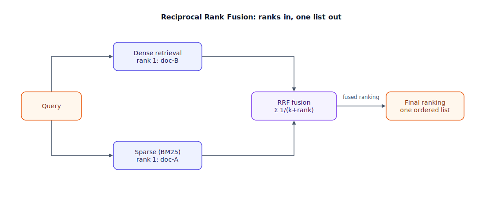

## The 30-second version

Hybrid search runs two retrieval methods on the same query at once — dense vector search for meaning, and BM25 (Best Match 25, the standard keyword-ranking algorithm) for exact terms — and merges the two ranked lists into one. Neither method is universally better: dense search understands that "how to make AI faster" and "LLM optimization" mean roughly the same thing, but can quietly miss an exact string like an error code or environment variable name, because embeddings weren't trained to spell things back verbatim. The merge step is where the engineering lives, and the industry's answer is Reciprocal Rank Fusion (RRF): a simple, tuning-free formula that combines rankings by position, not raw score, because dense similarity and BM25 scores live on incomparable scales. Hybrid is the production baseline for a reason — but it isn't free, and a corpus with no vocabulary problem doesn't need it.

## The analogy

Picture two witnesses describing the same suspect to a police sketch artist.

The first witness has a great sense of the person's *vibe* — build, mannerisms, general look — but is fuzzy on specifics: "medium height, maybe brownish hair, business-casual." That's dense search: excellent at gist and paraphrase, weak on exact detail. The second witness barely registers the vibe but locked onto one hard fact: "I clearly saw the badge number, 4471." That's sparse (BM25) search: it nails an exact token every time, but has no opinion on whether two differently worded descriptions mean the same suspect.

A competent detective doesn't pick one witness and dismiss the other — dismissing witness two loses the badge number forever; dismissing witness one loses anyone whose vibe-description never mentions a number. The detective merges both statements into one composite description instead. But merging isn't "average their confidence" — witness two, brimming with confidence about one detail, would numerically overwhelm witness one's more tentative read if you crudely added their confidence scores. What works is asking: *where did each witness rank this suspect among their own candidates?* Witness one had this person as their #1 guess; witness two also had them at #1, from a totally different angle. Two independent #1 rankings, regardless of how confident each witness sounded, is a strong signal — the logic Reciprocal Rank Fusion formalizes.

| Detective scenario | Technical element |
|---|---|
| Witness with a strong sense of overall vibe | Dense (semantic/vector) retrieval |
| Witness who nailed one exact fact (badge number) | Sparse (BM25/keyword) retrieval |
| Vibe description missing the badge number entirely | Dense search's blind spot on exact terms |
| Badge number with no sense of overall look | Sparse search's blind spot on paraphrase/meaning |
| Composite description assembled from both | The hybrid search pipeline |
| Averaging raw confidence levels (risky) | Naive score-averaging fusion (scales don't match) |
| "Where did each witness rank this candidate?" | Reciprocal Rank Fusion — rank, not raw score |
| Two independent #1 rankings agreeing | A document appearing near the top of both lists |

## How it actually works



Follow the diagram: one query branches into two independent retrieval calls that run in parallel, not sequentially — that parallelism matters because hybrid search's total latency is roughly the *slower* of the two, not the sum. Dense retrieval embeds the query and returns its own ranked list (here, doc-B is its top pick). Sparse retrieval tokenizes the query and returns BM25's own ranked list (here, doc-A tops it). Both lists converge on the fusion step.

RRF's formula, for each document across all the ranked lists it appears in:

```
score(doc) = Σ  1 / (k + rank)
```

summed over every list the document shows up in, where `rank` is that document's position (0-indexed or 1-indexed depending on convention) in a given list, and `k` is a small constant — the original paper and most production systems use **k ≈ 60**. A document ranked #1 in both lists scores `1/(60+1) + 1/(60+1) ≈ 0.0328`; a document ranked #1 in only one list and absent from the other scores about half that. Sort by this summed score, and you get the fused ranking that feeds the final list — and typically a reranker downstream (see [reranking](./reranking.mdx)).

Why rank instead of raw score? Cosine similarity from dense search lives on roughly a [0, 1] (or [-1, 1]) scale; BM25 scores are unbounded and swing wildly with term rarity. Add them directly and one lucky, rare keyword match can produce a BM25 score that numerically drowns out ten genuinely relevant semantic matches. RRF sidesteps the problem by discarding the score and keeping only *where* each engine placed a document relative to its own list — which is also why `k` is close to the only knob: a larger `k` flattens the curve, treating rank 1 vs. 2 as less consequential; a smaller `k` sharpens it. Weighted-score fusion (an explicit alpha blending normalized dense and sparse scores) is the alternative when you want a tunable dial instead of RRF's fixed, robust default — at the cost of careful score normalization to avoid the exact drowning problem RRF avoids by design.

## A concrete example

A user searches internal engineering docs for: **"how to fix CUDA_VISIBLE_DEVICES not being respected."**

- **Dense retrieval, top 5:** mostly conceptual GPU-memory-management pages — relevant in spirit, but none actually contains the literal string `CUDA_VISIBLE_DEVICES`, because the embedding model tokenized it into generic subword fragments and lost the exact signal.
- **Sparse (BM25) retrieval, top 5:** a runbook page containing the literal environment variable ranks #1 — exact token match, found instantly, zero semantic reasoning required.
- **Without hybrid:** a dense-only system serves five plausible-sounding but wrong pages. The one page that actually answers the question never surfaces.
- **With RRF, k = 60:** the runbook page (rank 1 in sparse, unranked or low in dense) still scores at least `1/(60+1) ≈ 0.0164` from the sparse list alone — usually enough to place it near the top of the fused list, since most competing documents only score from one list or rank poorly in both.
- **Retrieval depth matters:** a common rule of thumb is fetching 3–5x your final k from each engine before fusing — e.g., fetch 20 from each side to fuse down to a final top 5, so a document strong in only one list still has room to surface.
- **Latency:** dense embedding + search typically runs 60–100ms combined; BM25 typically runs 20–40ms; run in parallel, total latency is close to the slower path (~100ms) plus a few milliseconds for fusion itself — not the sum of both.

## The tradeoffs that matter

| Approach | Catches paraphrase | Catches exact terms/codes | Latency | Complexity |
|---|---|---|---|---|
| Dense only | Yes | Weak | Fastest of the two alone | Simplest |
| Sparse (BM25) only | No | Strong | Fastest, cheapest | Simplest |
| Hybrid + RRF | Yes | Yes | ~slower of the two, run in parallel | Two systems (or one with native support) to run and monitor |
| Hybrid + weighted score fusion | Yes | Yes | Similar to RRF | Extra tuning: score normalization, alpha |

The honest framing: hybrid rarely performs *worse* than either method alone, but it isn't free — you're maintaining two retrieval paths (or leaning on a database with native hybrid support), and fusion is one more moving part to monitor and evaluate. If your queries are purely conceptual, your embedding model is well-tuned for the domain, and your documents carry no meaningful codes, IDs, or rare proper nouns, pure dense search with a simpler architecture is a defensible, and cheaper, choice. Hybrid earns its keep specifically where vocabulary — codes, acronyms, names, versions — carries real information density.

## Where people go wrong

1. **Adding raw scores instead of fusing by rank.** Cosine similarity and BM25 live on incompatible scales; naive addition lets whichever engine happens to produce bigger numbers dominate, regardless of actual relevance.
2. **Treating hybrid as mandatory everywhere.** A corpus of conversational, jargon-free text with a well-matched embedding model may see negligible gains from hybrid — measure before adding a second retrieval path.
3. **Under-fetching before fusion.** Pulling only your final top-k from each engine before fusing starves RRF of the depth it needs; fetch several times your target count from each side first.
4. **Ignoring the parallelism requirement.** Running dense and sparse retrieval sequentially instead of concurrently silently doubles your latency budget for no quality gain.
5. **Never tuning the query mix.** Technical, code-heavy queries typically want the sparse arm weighted higher (or a smaller RRF `k`); conversational queries typically want the dense arm weighted higher. A single fixed setting across all query types leaves quality on the table.

## The interview lens

Interviewers reach for hybrid search to check whether you understand retrieval failure modes at a mechanical level — not whether you can name three vendors that support it.

A strong sound bite: *"Dense and sparse retrieval fail in opposite, complementary ways, so I run both and fuse by rank with RRF rather than raw score — because a BM25 score and a cosine similarity aren't measured in the same units, and adding them directly lets whichever engine has bigger numbers win regardless of actual relevance."*

Likely follow-ups:

- Why does RRF use rank instead of the underlying similarity or BM25 score?
- Walk me through what `k` controls in the RRF formula, and what happens at very small or very large values.
- When would you skip hybrid search entirely, and how would you validate that decision empirically?

## Go deeper

- [Vector Databases](./vector-databases.mdx) — several ship native hybrid search, fusing dense and sparse in a single query.
- [Reranking](./reranking.mdx) — the precision pass that typically runs on hybrid search's fused output.
- [Embedding Models](./embedding-models.mdx) — why dense search misses vocabulary the embedding model never learned.
- Upstream reference: [Hybrid Search — AI System Design Guide](https://github.com/ombharatiya/ai-system-design-guide/blob/main/06-retrieval-systems/05-hybrid-search.md) (MIT; see [CREDITS](../../../CREDITS.md)).
