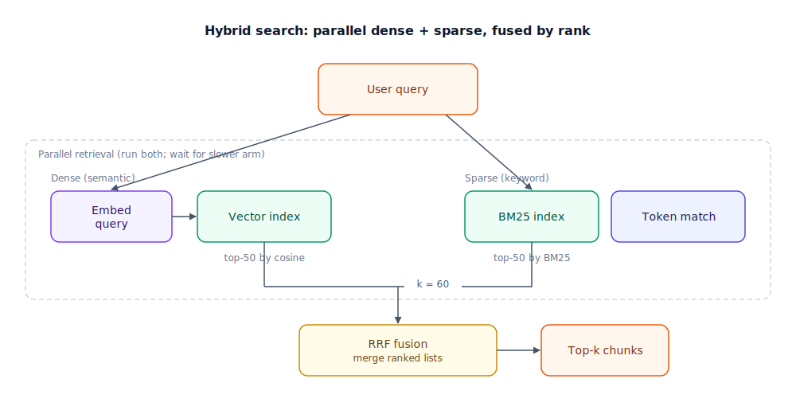

## The 30-second version

Hybrid search runs **dense** retrieval (embeddings that match meaning) and **sparse** retrieval (BM25 — Best Match 25, classic keyword ranking) in parallel, then **fuses** the two ranked lists into one. You need it because neither arm wins every query: dense search nails paraphrases but whiffs on error codes, API names, and rare tokens; sparse search nails exact strings but misses synonyms. Production RAG (Retrieval-Augmented Generation) almost always hybridizes before reranking — Elasticsearch, OpenSearch, Weaviate, Qdrant, and Azure AI Search all ship native hybrid pipelines. The usual fusion method is **RRF** (Reciprocal Rank Fusion), which merges by rank position, not raw score, so incomparable scales cannot drown each other out.

## The analogy

Imagine a hospital librarian helping a doctor find a protocol.

The **dense** librarian understands intent. Ask "how do we cool an overheating GPU during training?" and they walk you to the right *section* on thermal management, even if your words differ from the manual's.

The **sparse** librarian reads literally. Ask for `NVIDIA_VISIBLE_DEVICES` or `HTTP 429` and they go straight to the page where that exact string appears — no paraphrase, no guesswork.

A hybrid desk sends **both** librarians out at once, then merges their shortlists: any document both librarians ranked highly rises to the top; a document only one found still gets a fair shot. You are not picking one librarian forever — you are combining two retrieval instincts that fail in opposite directions.

| Hospital library | Hybrid retrieval |
|---|---|
| Intent-based search | Dense / semantic (vector) search |
| Exact-string lookup | Sparse / BM25 keyword search |
| Two parallel lookups | Parallel retrieval arms |
| Merged shortlist | RRF or weighted fusion |
| Final chart handed to the doctor | Top-k chunks sent to the LLM (large language model) |

## How it actually works

Follow the diagram top to bottom.

The **user query** fans out to two paths inside the parallel retrieval box. On the **dense** side (left), the query is embedded with the same model used at index time, then the vector index returns its top-50 neighbors by cosine similarity. On the **sparse** side (right), the query is tokenized and BM25 scores every document that shares at least one term — excellent for SKUs, function names, version numbers, and acronyms the embedding model may never have seen.

Both arms return **ranked lists**, not comparable scores. Cosine similarity lives on 0–1; BM25 is unbounded. That is why the fusion box uses **RRF**: for each document, add `1 / (k + rank)` from each list (typical `k = 60`), then sort by the sum. RRF ignores absolute scores — a lucky BM25 spike cannot swamp ten solid semantic matches.

From the fused list you usually keep 20–50 candidates and hand them to a **cross-encoder reranker** (see [Reranking Strategies](./reranking-strategies.mdx)) before stuffing context into the LLM. Hybrid search fixes recall; reranking fixes precision.

**Native hybrid** databases (Weaviate's `alpha` parameter, Qdrant sparse+dense vectors, SPLADE stored beside dense in one index) collapse the two arms into one system. **Split-stack** hybrid keeps Pinecone + Elasticsearch and fuses in application code — more moving parts, but best-in-class per engine.

## A concrete example

Internal docs corpus: 80,000 pages, average 1,200 tokens. You index with `text-embedding-3-small` (1,536 dimensions) plus a BM25 inverted index.

Query: `"Configure NVIDIA_VISIBLE_DEVICES for multi-GPU training"`

| Arm | What happens | Top hit quality |
|---|---|---|
| Dense only | Embedding may treat `NVIDIA_VISIBLE_DEVICES` as opaque tokens; returns a generic "GPU setup" page ranked above the env-var doc | Miss — wrong page in top 3 |
| Sparse only | BM25 matches the exact env-var string immediately | Hit — correct page at rank 1 |
| Hybrid + RRF | Dense brings related "multi-GPU training" pages; sparse boosts the env-var doc; fused list puts the right page first | Hit — correct page at rank 1 |

Latency budget on a warm index (parallel arms):

- Query embedding: ~35 ms
- Dense top-50: ~40 ms (runs parallel with sparse)
- Sparse top-50: ~25 ms
- RRF merge: ~2 ms
- **Total retrieval:** ~75 ms before reranking

Fetch `4×` the final k from each arm (want top 10 → retrieve 40 per arm) so fusion has overlap to work with.

## The tradeoffs that matter

| Approach | Semantic paraphrase | Exact token / code | Ops complexity | Reach for it when |
|---|---|---|---|---|
| Dense only | Best | Weak | Low (one index) | Chatty Q&A, conceptual docs, tight latency |
| Sparse only | Poor | Best | Low (BM25 / ES) | Log search, SKU lookup, legal clause IDs |
| Hybrid + RRF | Best | Best | Medium (two indexes or native hybrid) | Production RAG default for mixed queries |
| Hybrid + weighted scores | Best | Good | Medium + tuning | You have calibrated score normalization |
| SPLADE sparse + dense in one DB | Very good | Very good | Medium | Want one vector store, neural sparse expansion |

**Alpha tuning** (on engines that expose it): `alpha = 1` is dense-only, `alpha = 0` is sparse-only. Grid-search `alpha ∈ {0.3, 0.4, 0.5, 0.7}` on a labeled query set (NDCG or MRR). Rule of thumb: technical docs and code → `0.3–0.4`; general prose → `0.5`; conversational paraphrase → `0.7–0.8`. Query-adaptive alpha (boost sparse when the query contains `_`, digits, or quoted strings) is a cheap win.

## Where people go wrong

1. **Adding raw BM25 and cosine scores.** Scales differ by orders of magnitude. Use RRF unless you have a proven normalization story.
2. **Retrieving top-10 from each arm.** Too shallow — fusion needs overlap. Retrieve 3–5× your final k per arm.
3. **Skipping hybrid because "embeddings are smart now."** Smart embeddings still tokenize `ERR_CONNECTION_REFUSED` oddly and miss strings absent from training data.
4. **Treating hybrid as the final step.** Hybrid improves recall; a cross-encoder reranker is what separates "in the candidate set" from "in the prompt."
5. **One global alpha forever.** Query mix shifts by product surface — support chat vs API reference vs HR policy need different balances. Measure per cohort.

## The interview lens

Interviewers use hybrid search to see whether you understand **why RAG fails in production** — not whether you can spell BM25.

A strong sound bite: *"I'd run dense and sparse in parallel and fuse with RRF, because vector search finds paraphrases but misses exact codes and entity strings — and you cannot fix that by prompting harder."*

Likely follow-ups:

- Why is RRF safer than weighted score addition? (Rank-based; immune to scale mismatch between engines.)
- When would you skip hybrid entirely? (Small conceptual corpus, sub-50k tokens in prompt, or latency budget that cannot afford two indexes.)
- How do you tune the dense/sparse balance? (Labeled eval set, grid-search alpha, per-query heuristics for code-like queries.)

## Go deeper

- [RAG Fundamentals](./rag-fundamentals.mdx) — where hybrid sits in the full query path.
- [Reranking Strategies](./reranking-strategies.mdx) — the precision stage after fusion.
- [Embedding Models](./embedding-models.mdx) — what the dense arm depends on.
- Upstream reference: [Hybrid Search — AI System Design Guide](https://github.com/ombharatiya/ai-system-design-guide/blob/main/06-retrieval-systems/05-hybrid-search.md) (MIT; see [CREDITS](../../../CREDITS.md)).
