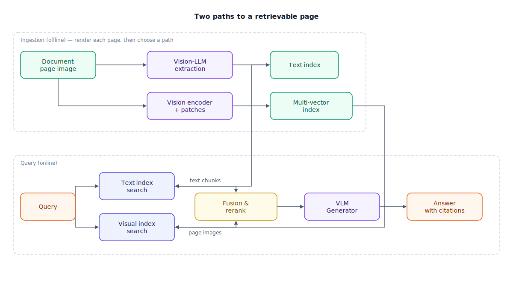

## The 30-second version

A large share of what enterprise documents actually *say* — often 40–60% of it — lives in tables, charts, diagrams, and scanned pages. A text-only Retrieval-Augmented Generation (RAG) pipeline drops all of that on the floor without raising a single error: the parser exits cleanly, the index fills up, and every number in every chart simply never existed. Multimodal RAG closes the gap in one of two main ways. Either a vision-capable LLM describes every visual element as searchable text at ingestion time, or you skip parsing entirely and embed each page *as an image*, matching queries against visual patches (the ColPali-style, late-interaction approach). Whichever path you take, keep the original image: the generator answers better looking at the real chart than at somebody's summary of it.

## The analogy

Think about assembling flat-pack furniture from the printed manual — the kind that is almost entirely wordless. The diagrams *are* the instructions: which panel faces which way, where the dowel goes, which direction the cam lock turns. Now imagine you "digitized" that manual by running it through a text extractor. What survives? "Step 4." "8x." A part code or two. The extraction ran without a hitch, and yet everything that mattered is gone. That is text-only RAG on a visual document: no crash, no warning, just silent amnesia.

There are two sensible fixes. The first: sit a patient friend down and have them write every diagram out as prose — "insert the short dowel into panel A, third hole from the left, then quarter-turn the cam lock clockwise." Now the manual is searchable as text, and when the prose gets ambiguous you flip back to the original picture to be sure. The second fix: photograph every page and organize the album so well that when you ask "which step attaches the drawer rail?", the right page photo surfaces directly — no transcription step at all. Real systems use the first approach, the second, or both at once.

| Assembly manual | Multimodal RAG |
|---|---|
| The manual's diagrams | Charts, tables, and figures in your documents |
| Keeping only the printed words ("Step 4", "8x") | Text-only extraction — parse "succeeds", meaning is lost |
| A friend writing each diagram out as prose steps | Vision-LLM parsing at ingestion (describe, then embed) |
| Photographing every page into a searchable album | Page-as-image embeddings (ColPali-style) |
| The album's filing system that surfaces the right photo | Multi-vector index with late-interaction scoring |
| Flipping back to the picture when prose is ambiguous | Passing the original page image to the generator |

## How it actually works

Both paths start from the same place: render each document page to an image (around 300 DPI). Follow the arrows left to right.

**Path A — vision-LLM parsing ("describe, then embed").** A vision-language model reads each page image with targeted prompts: extract every table as markdown with its headers intact; describe each chart — axes, trends, the actual data points; summarize each diagram as components and relationships. Those outputs land in an ordinary text index next to your regular prose chunks, tagged with metadata like `type=table` and the page number. Two rules make or break this path. First, a table is an atomic retrieval unit — never split one across chunk boundaries, because flattened rows torn from their headers are meaningless (see [chunking strategies](./chunking-strategies.mdx)). Second, store a *dual representation*: the text description makes the chart findable, but the original image is what you hand the generator, because descriptions always lose detail.

**Path B — page-as-image ("late interaction").** Skip OCR (optical character recognition), layout detection, and table parsing entirely. A vision encoder splits the page image into a grid of roughly 1,000 patches; a small language model contextualizes them; each patch is projected down to a compact vector — 128 dimensions in ColPali. At query time, each query token is scored against every patch and the best matches are summed (the MaxSim operation — the same late-interaction trick covered in [ColBERT and late interaction](./colbert-late-interaction.mdx)). The whole messy extraction pipeline collapses into one forward pass, and retrieval quality on infographics, figures, and tables is excellent. The bill arrives as storage: ~1,024 vectors per page instead of one.

**At query time**, the fusion box on the right does what [hybrid search](./hybrid-search.mdx) always does: query both indexes in parallel, merge with reciprocal rank fusion, [rerank](./reranking.mdx), and hand the survivors — text chunks *and* page images — to a vision-capable generator.

A third pattern exists: embed text and images into one shared vector space with a dual encoder like CLIP (Contrastive Language-Image Pretraining) or SigLIP. One index, one query, beautifully simple — but those models were trained mostly on natural photos with captions, so they are the right tool for product shots and photography, and the wrong one for dense document pages.

## A concrete example

You are building a research assistant over 20,000 earnings reports averaging 25 pages each — 500,000 pages, most of whose value sits in revenue tables and trend charts.

- **Vision-LLM extraction pass:** at roughly $0.01–0.05 per page, the one-time parse costs **$5,000–$25,000**. At 2–5 seconds per page, a single worker would grind for 12–29 days — so you run ~50 async workers and finish in under a day.
- **Page-as-image index:** 500,000 pages × ~1,024 patch vectors × 128 dimensions × 4 bytes ≈ **262 GB** of float32 vectors. Binary quantization shrinks that ~32× to about **8 GB**, at a small recall cost.
- **The text-only baseline you avoided:** prose chunks only. A question like "which region's revenue declined quarter-over-quarter?" — answerable only from a bar chart — retrieves adjacent prose and produces a confident answer grounded in nothing relevant.

The extraction cost stings once; it then amortizes over every query. That is the general shape of multimodal RAG economics: pay at ingestion so you do not pay in wrong answers forever.

## The tradeoffs that matter

| Approach | What you gain | What it costs | Breaks down when |
|---|---|---|---|
| Vision-LLM parsing (describe, then embed) | Keeps your existing text stack; precise text search still works | $0.01–0.05 and 2–5 s per page at ingestion; descriptions lose nuance | Visually dense pages where prose can't capture layout |
| Unified embedding space (CLIP/SigLIP) | One index, one query path, simplest ops | Weak on charts, tables, and document pages | Corpus is documents rather than natural photos |
| Page-as-image late interaction (ColPali) | No OCR/layout/table pipeline; best recall on visual documents | ~1,024 vectors per page; multi-vector index complexity | Storage budget is tight, or you need fine-grained text matching |

The narrative version: parsing pays per page, once, and lets everything downstream stay boring. Page-as-image pays continuously in storage and index machinery but wins where layout is the meaning. The unified space is simplest and weakest on documents. Production systems mostly run modality-aware parsing plus fusion as the workhorse, with page-as-image retrieval gaining ground fast for PDF-heavy corpora.

## Where people go wrong

1. **Trusting a parse that "succeeded."** Text extraction on a chart-heavy PDF returns *something*, and nothing errors. The failure is invisible until users ask about a figure. Audit what your parser emits for your ugliest documents before you index a million of them.
2. **Splitting tables across chunks.** A row separated from its header row is noise with numbers in it. Tables travel whole, with caption and page metadata attached.
3. **Assuming CLIP understands your bar charts.** Shared text-image spaces were shaped by natural photos and captions. Document pages, tables, and plots need document-trained retrieval (Path A or B), not photo search.
4. **Retrieving the description but generating without the image.** If the generator only ever sees the text summary of a chart, you have capped answer quality at whatever the ingestion prompt happened to capture. Send the image.
5. **Discovering the multi-vector storage bill late.** A thousand vectors per page means a million pages is on the order of a billion vectors. Quantization and patch pooling are not optional at scale — price this before committing to Path B.

## The interview lens

Interviewers rarely ask "what is multimodal RAG?" They hand you a symptom: *"Users complain your assistant ignores the tables inside PDFs — what do you change, and where in the pipeline?"* They are checking whether you know the failure is at ingestion (the tables never became retrievable), not at generation, and whether you can weigh the two repair paths with numbers.

A strong sound bite: *"Text-only RAG fails silently on visual documents — the parser exits zero, the index fills, and every number in every chart is just gone. So before designing anything I'd ask what fraction of the corpus's meaning lives in tables and figures, because that decides whether I need a vision path at all."*

Likely follow-ups:

- ColPali-style indexing explodes storage — what are your mitigation levers? (Binary quantization ~32×, patch pooling, restricting the visual index to visual-heavy documents.)
- A question needs a chart on page 22 *and* a table on page 14. How does retrieval serve both? (Per-modality quotas in the candidate set, provenance labels in the prompt, an [agentic second hop](./agentic-rag.mdx) when the first pass leaves a gap.)
- When would you ship the simple unified-embedding design anyway? (Natural-image corpora: product catalogs, media libraries — and say why documents differ.)

## Go deeper

- [ColBERT and late interaction](./colbert-late-interaction.mdx) — the MaxSim machinery that page-as-image retrieval borrows.
- [Chunking strategies](./chunking-strategies.mdx) — why tables and figures must stay atomic.
- [Design a production RAG system](../../walkthroughs/design-a-production-rag-system.mdx) — where the visual path fits a full interview answer.
- Upstream reference: [Multi-Modal RAG — AI System Design Guide](https://github.com/ombharatiya/ai-system-design-guide/blob/main/06-retrieval-systems/12-multimodal-rag.md) (MIT; see [CREDITS](../../../CREDITS.md)).
