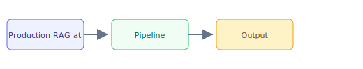

## The 30-second version

Production RAG is no longer a weekend project. It is a distributed system with retrieval pipelines, caching layers, routing logic, self-correction loops, multi-tenant isolation, and cost controls, all operating under strict latency SLAs. When RAG fails in production, the failure is in retrieval roughly 73% of the time, not generation, so the enterprise deployments that succeed treat the knowledge source (not the model) as the primary investment.

## The analogy

Think of **Production RAG at Scale** like running a kitchen during rush hour: you cannot memorize every recipe change, so you keep reference cards (retrieval), a head chef who improvises within guardrails (the model), and a quality check before plates leave the pass (evaluation). The technical system mirrors that flow — separate what you **store**, what you **retrieve**, and what you **generate**.

## How it actually works

Production RAG is no longer a weekend project. It is a distributed system with retrieval pipelines, caching layers, routing logic, self-correction loops, multi-tenant isolation, and cost controls, all operating under strict latency SLAs. When RAG fails in production, the failure is in retrieval roughly 73% of the time, not generation, so the enterprise deployments that succeed treat the knowledge source (not the model) as the primary investment.

## A concrete example

Production RAG is no longer a weekend project. It is a distributed system with retrieval pipelines, caching layers, routing logic, self-correction loops, multi-tenant isolation, and cost controls, all operating under strict latency SLAs. When RAG fails in production, the failure is in retrieval roughly 73% of the time, not generation, so the enterprise deployments that succeed treat the knowledge source (not the model) as the primary investment.

## The tradeoffs that matter

| Choice | Upside | Cost |
|--------|--------|------|
| Simpler design | Faster to ship | Less resilient |
| Heavier retrieval | Better grounding | More latency |
| Bigger model | Higher quality | Higher $/query |

## Where people go wrong

- Skipping evaluation and hoping demos generalize
- Ignoring latency/cost until production traffic arrives
- Treating retrieval quality as a generation problem

## The interview lens

- What tradeoffs would you highlight in an interview?
- How would you measure success in production?
- What failure modes would you design for?

## Go deeper

- [Upstream chapter (Production RAG at Scale)](https://github.com/ombharatiya/ai-system-design-guide/blob/main/06-retrieval-systems/14-production-rag-at-scale.md)
- Related questions in the [question bank](/questions)
- Practice with [SPIDER walkthrough](/practice) or [mock interview](/mock)
