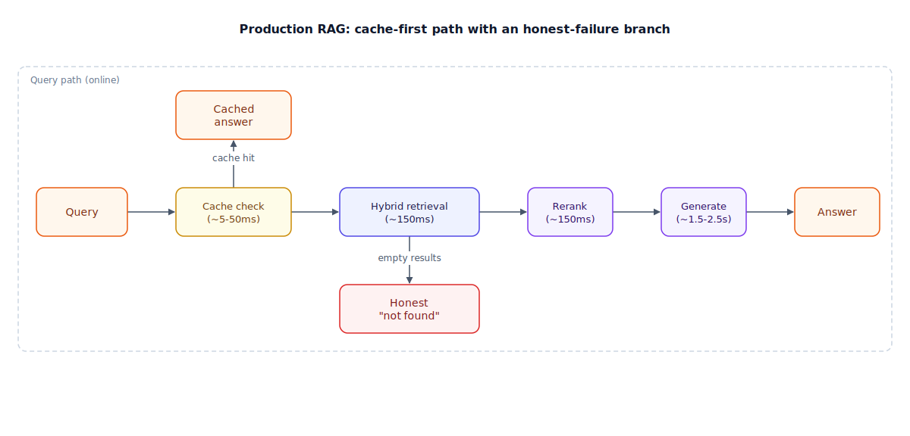

## The 30-second version

A RAG demo is a notebook: embed everything, cosine search, top-k into the prompt, done. Production RAG is a distributed system that has to hit a latency budget on every request, survive a vector store outage without lying to users, serve hundreds of tenants without leaking data between them, and keep a cost curve that doesn't scale linearly with traffic. None of that shows up until you leave the notebook. The failures that matter in production aren't exotic — they're an index that goes stale after a re-embedding migration, a cache that never gets invalidated, a reranker that silently degrades, and a retrieval-empty query that the model answers anyway instead of admitting defeat.

## The analogy

Think about the jump from a lemonade stand to a citywide water utility. A lemonade stand just needs a pitcher and a good recipe — the demo-grade version of "getting water to people." A water utility has to solve completely different problems that only appear at scale.

It needs **local water towers** near each neighborhood so most taps don't have to be served all the way from the treatment plant — that's caching. It needs a **maximum pressure-drop budget** at every junction in the pipe network, because if any one segment takes too long, the tap runs dry before the sink fills — that's a latency budget per stage. It needs **separate metered lines** for different customer classes, so one factory running its machines all night doesn't starve the houses next door of pressure — that's multi-tenant isolation and rate limiting. And when a water main actually breaks, it needs a **real answer, not an improvisation**: shut the valve, post a boil-water advisory, reroute from a backup reservoir — never quietly pipe in untreated water and hope nobody notices. That's the honest-failure path production RAG needs when retrieval comes up empty or the vector store goes down.

Crucially, none of this shows up until the city grows. One house on a well works fine without any of it. The whole utility apparatus — towers, pressure budgets, metering, backup reservoirs — is what "the same water, at scale" actually requires.

| Water utility | Production RAG |
|---|---|
| One house on a well | The demo: embed, cosine search, top-k into the prompt |
| Local water towers near each neighborhood | Caching layers (exact-match, semantic, document) |
| Max pressure-drop budget at every junction | Latency budget assigned per pipeline stage |
| Separate metered lines per customer class | Multi-tenant isolation and per-tenant rate limits |
| Scheduled main replacement without cutting supply | Reindexing and embedding-model migrations |
| Boil-water advisory instead of piping in untreated water | Honest "no evidence" answer instead of hallucinating |
| Backup reservoir cut in automatically | Failover when the vector store or reranker goes down |

## How it actually works

Follow the main row left to right first, then the two branches.

The **main path**: a query hits a **cache check** first — an exact-match layer (hash the query, ~5ms) backed by a semantic layer (embed the query, compare against recent queries above a similarity threshold like 0.95, tens of milliseconds). Only a cache miss continues to **hybrid retrieval**, running vector search and BM25 keyword search in parallel rather than sequentially — running them one after another would blow the latency budget for no accuracy gain. The merged candidates go to **rerank**, a slower, sharper model that re-scores the field, and the survivors go to **generate**, the most expensive and slowest stage by far, so it's the one worth streaming: send the first token as soon as it's ready instead of waiting for the full response.

The **branch up**: on a cache hit, skip the entire pipeline and return the **cached answer** directly — this is where most of the cost and latency savings in a mature system actually come from, not from a faster reranker.

The **branch down**: if hybrid retrieval comes back empty or every candidate scores below a relevance floor, don't hand the model weak context and hope. Return an **honest "not found"** response. This is the single most-skipped step in demo-to-production RAG, and it's the one that stops the system from becoming, in effect, a hallucination machine with citations attached to nothing.

Two failure paths that don't fit cleanly on this diagram but matter just as much: if the vector store itself is unreachable, that's an outage page, not a silent fallback to something worse. If the reranker degrades or times out, serve the fused (unranked) retrieval results directly rather than blocking the whole request — a slightly worse ranking beats no answer.

## A concrete example

You're running a customer-support RAG system at 50,000 queries/day (roughly 35 queries/minute average, bursting higher).

- **Latency budget, p95 target 4 seconds:** cache check ~50ms, hybrid retrieval ~150ms (vector and BM25 run concurrently, so this is the slower of the two, not their sum), rerank ~150ms, generation 1.5–2.5 seconds streamed so the first token lands near the 1-second mark. That adds to roughly 2–3 seconds on a cache miss, leaving headroom before the 4-second p95 ceiling — headroom you'll need the day traffic spikes or a dependency gets slow.
- **Cache economics:** if the semantic cache catches 40% of traffic (a realistic hit rate for a support bot with repetitive questions), that's 20,000 of 50,000 daily queries served from cache and only 30,000 hitting the full pipeline. At roughly $0.01–0.02 per query for the LLM generation step (the dominant cost — embedding, reranking, and index hosting are comparatively small), skipping those 20,000 queries saves about **$200–400/day**, before touching model choice or prompt size.
- **Reindexing cost:** your embedding provider deprecates the model you indexed 2 million chunks with. Re-embedding at $0.02–$0.10 per million tokens, with chunks averaging 512 tokens, is roughly 1 billion tokens total — **$20–$100** in embedding cost, plus the operational work of a blue-green index swap so queries never hit a half-migrated index.
- **Multi-tenant cost shape:** 500 tenants on a shared (pooled) index with per-tenant metadata filtering costs a fraction of what 500 dedicated indexes would, but the 20 largest enterprise tenants get dedicated indexes anyway (a "bridge" model) — isolation where the contractual and security stakes justify the extra infrastructure cost, pooling everywhere else.

## The tradeoffs that matter

| Decision | What you gain | What it costs | Breaks down when |
|---|---|---|---|
| Semantic caching | Cuts cost and p50 latency dramatically on repetitive traffic | Stale answers if invalidation lags a document update | Query distribution is highly unique (low repeat rate) |
| Per-tenant silo indexes | Strongest data isolation, easiest to reason about | Highest infrastructure cost, most operational surface | Hundreds of low-volume tenants — cost per tenant becomes absurd |
| Pooled index + metadata filter | Cheapest, simplest to operate at small-to-medium scale | Isolation now depends on every query filtering correctly | One missed filter is a cross-tenant data leak, not a bug ticket |
| Honest "not found" on empty retrieval | Prevents confident wrong answers | Worse perceived completeness; users may see more "I don't know" | Retrieval is chronically weak — the real fix is retrieval quality, not fallback tuning |
| Streaming generation | First token in ~1s instead of full latency wait | Doesn't reduce total compute or cost at all | Total latency itself is the constraint, not perceived latency |

The honest framing: almost every one of these tradeoffs trades a cost or an edge case for either speed or isolation. There is no configuration that is fast, cheap, and perfectly isolated at once — pick which failure mode you can live with, then instrument for it.

## Where people go wrong

1. **Shipping the demo-grade pipeline as the production pipeline.** Embed everything, cosine search, top-k into the prompt works in a notebook and collapses on acronyms, tables, and permission boundaries the first week it meets real traffic.
2. **Filtering permissions after retrieval instead of inside the query.** If restricted data ever enters the candidate set — even if it gets filtered out one step later — the design is already broken. Tenant and access filters belong in the retrieval query itself.
3. **No honest-failure path.** If retrieval finds nothing relevant and the model answers anyway, you've built a hallucination machine with citations pointing at nothing.
4. **Treating reindexing as a one-off instead of a recurring migration.** Embedding models get deprecated, chunking strategies improve, and corpora grow. If there's no blue-green swap plan, every future migration is a fire drill.
5. **Context stuffing to compensate for weak retrieval.** Sending 20 chunks instead of fixing ranking hurts: models attend poorly to the middle of a long context. Rerank hard, send 5–8, not 20.

## The interview lens

Nobody in a senior-level system design interview asks you to define RAG. They ask what happens when it's serving real traffic: "Your embedding provider deprecates the model you indexed 20 million chunks with — walk through the migration," or "the p95 latency budget just got cut from 4 seconds to 1.5 — what do you drop first, and what evidence do you want before dropping it?"

A strong sound bite: *"Production RAG fails in retrieval and infrastructure long before it fails in generation — so I budget latency per stage, cache aggressively, and make sure every failure mode has an honest answer instead of a silent degradation."*

Likely follow-ups:

- How does this design change for a multi-tenant SaaS product instead of one enterprise deployment? (Isolation model choice — silo, pool, or bridge — driven by tenant size distribution and compliance requirements.)
- How do you detect retrieval quality degrading in production before users complain? (Empty-retrieval rate, similarity-score drift, faithfulness sampling on live traffic — see [RAG evaluation](./rag-evaluation.mdx).)
- Costs tripled with no traffic increase — where do you look first? (Cache hit rate, model-routing distribution, retry/thrash loops in any agentic retrieval path, and whether re-embedding is happening more often than it should.)

## Go deeper

- [RAG evaluation](./rag-evaluation.mdx) — the monitoring signals that catch production drift before users do.
- [Hybrid search](./hybrid-search.mdx) — the parallel vector-plus-keyword retrieval this chapter's request path assumes.
- [Design a production RAG system](../../walkthroughs/design-a-production-rag-system.mdx) — this chapter's concerns worked through as a full interview answer.
- Upstream reference: [Production RAG at Scale — AI System Design Guide](https://github.com/ombharatiya/ai-system-design-guide/blob/main/06-retrieval-systems/14-production-rag-at-scale.md) (MIT; see [CREDITS](../../../CREDITS.md)).
