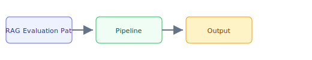

## The 30-second version

Evaluation is the hardest unsolved problem in RAG. You can build a retrieval pipeline in a day; knowing whether it actually works takes weeks. The industry has converged on a layered evaluation strategy: the RAG Triad for correctness, component-level metrics for debugging, and automated regression testing for production safety. Langfuse, LangWatch, Braintrust, and Arize Phoenix all ship native RAG eval recipes; pick by deployment model (self-hosted vs SaaS) and whether you need eval-gated CI/CD blocking.

## The analogy

Think of **RAG Evaluation Patterns** like running a kitchen during rush hour: you cannot memorize every recipe change, so you keep reference cards (retrieval), a head chef who improvises within guardrails (the model), and a quality check before plates leave the pass (evaluation). The technical system mirrors that flow — separate what you **store**, what you **retrieve**, and what you **generate**.

## How it actually works

Evaluation is the hardest unsolved problem in RAG. You can build a retrieval pipeline in a day; knowing whether it actually works takes weeks. The industry has converged on a layered evaluation strategy: the RAG Triad for correctness, component-level metrics for debugging, and automated regression testing for production safety. Langfuse, LangWatch, Braintrust, and Arize Phoenix all ship native RAG eval recipes; pick by deployment model (self-hosted vs SaaS) and whether you need eval-gated CI/CD blocking.

## A concrete example

Evaluation is the hardest unsolved problem in RAG. You can build a retrieval pipeline in a day; knowing whether it actually works takes weeks. The industry has converged on a layered evaluation strategy: the RAG Triad for correctness, component-level metrics for debugging, and automated regression testing for production safety. Langfuse, LangWatch, Braintrust, and Arize Phoenix all ship native RAG eval recipes; pick by deployment model (self-hosted vs SaaS) and whether you need eval-gated CI/CD blocking.

## The tradeoffs that matter

| Choice | Upside | Cost |
|--------|--------|------|
| Simpler design | Faster to ship | Less resilient |
| Heavier retrieval | Better grounding | More latency |
| Bigger model | Higher quality | Higher $/query |

## Where people go wrong

- Skipping evaluation and hoping demos generalize
- Ignoring latency/cost until production traffic arrives
- Treating retrieval quality as a generation problem

## The interview lens

- What tradeoffs would you highlight in an interview?
- How would you measure success in production?
- What failure modes would you design for?

## Go deeper

- [Upstream chapter (RAG Evaluation Patterns)](https://github.com/ombharatiya/ai-system-design-guide/blob/main/06-retrieval-systems/13-rag-evaluation-patterns.md)
- Related questions in the [question bank](/questions)
- Practice with [SPIDER walkthrough](/practice) or [mock interview](/mock)
