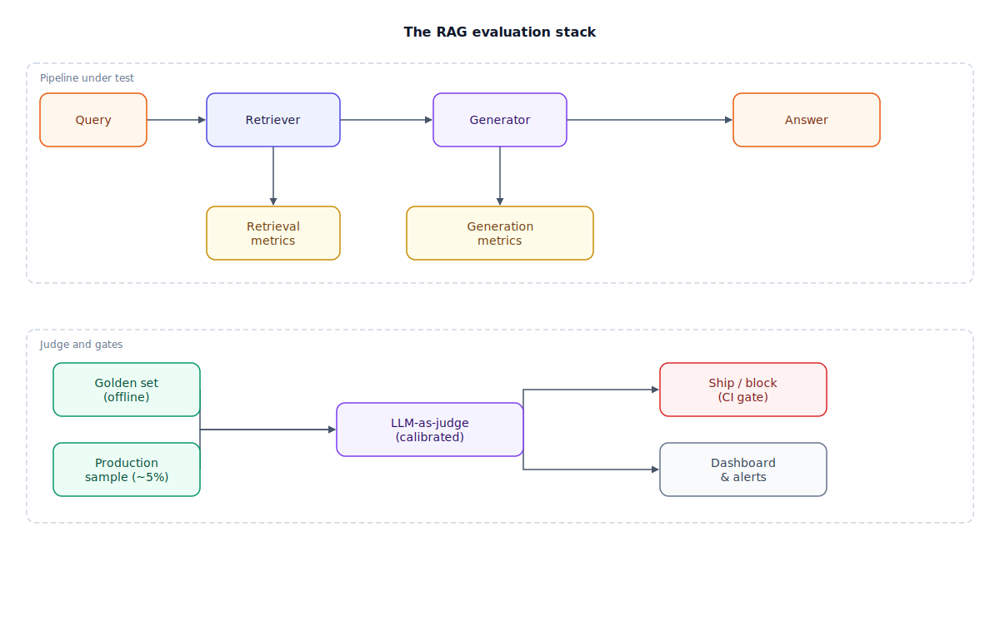

## The 30-second version

You can build a RAG pipeline in an afternoon; knowing whether it actually works takes real evaluation infrastructure. That infrastructure has two halves, scored separately because they fail independently: retrieval metrics (did we fetch the right chunks — recall@k, mean reciprocal rank (MRR), precision@k) and generation metrics (given those chunks, is the answer faithful and on-topic). You measure both offline against a frozen golden set before every deploy, and online against a sample of live traffic afterward, because production queries never quite match your test set. Most of the scoring is done by an LLM acting as judge — cheaper than humans at scale, but trustworthy only once calibrated against real human ratings with its known biases locked down.

## The analogy

Picture a restaurant that gets fresh ingredients delivered every morning and has a kitchen that turns them into plated dishes. Two completely different things can go wrong, and a good kitchen manager checks both separately.

First, the receiving check: does the delivery match what was ordered? Wrong produce, missing items, or spoiled stock is a sourcing failure that no amount of chef skill fixes downstream. That's **context relevance**: did the retriever fetch the right chunks at all?

Second, the tasting check, done at the pass before a dish goes out: does the dish actually match today's ingredients, or did the chef improvise with something that wasn't in the fridge (**faithfulness**)? And separately, does the dish satisfy what the customer actually ordered, or is it a technically excellent dish answering the wrong order (**answer relevance**)? A kitchen manager doesn't run these checks once a year — they run a fixed **tasting menu** of standard test dishes every time a recipe changes, before it reaches a paying customer (the golden set, checked offline, gating the change). And they still send a server table-side some nights to ask real diners how their meal was, because the tasting menu never covers every real order (online sampling of production traffic).

Neither check stays with the head chef forever — that doesn't scale. Trained tasting judges do the day-to-day scoring, but only after their palates are calibrated against the head chef's judgment, and only using strict pass/fail criteria per dish rather than vague star ratings, because vague scales drift toward "everything's a 4."

| Restaurant kitchen | RAG evaluation |
|---|---|
| Receiving check on the morning delivery | Context relevance (retrieval metrics: recall@k, MRR, precision@k) |
| Tasting check: does the dish match the fridge? | Faithfulness — is every claim grounded in retrieved context? |
| Tasting check: does the dish match the order? | Answer relevance — does the answer address the query? |
| The standard tasting menu, run before any recipe ships | Golden test set, scored offline, gating deploys |
| A server checking on real diners some nights | Online sampling of production traffic |
| Trained tasting judges, calibrated against the head chef | LLM-as-judge, calibrated against human ratings |
| Strict pass/fail per dish, not vague star ratings | Binary judge criteria instead of 1–5 Likert scales |

## How it actually works

Read the top container, then the bottom.

**Pipeline under test** (top): the same query → retriever → generator → answer path from [RAG fundamentals](./rag-fundamentals.mdx), now instrumented. The retriever's output feeds a **retrieval metrics** tap: recall@k asks what fraction of all truly relevant chunks made it into the top k; MRR (mean reciprocal rank) asks how high up the first relevant hit landed; precision@k asks what fraction of the top k is relevant at all. The generator's output feeds a **generation metrics** tap covering two distinct questions: faithfulness (decompose the answer into claims, check each against the retrieved context — unsupported claims are hallucinations) and answer relevance (does the answer, even if grounded, actually address what was asked).

**Judge and gates** (bottom): those metrics don't compute themselves — something has to score "is this chunk relevant" or "is this claim supported." That's the **LLM-as-judge**, fed from two sources. A **golden set** — a frozen, versioned collection of 200–500 (query, expected chunks, reference answer) triples — runs offline on every pipeline change and gates the deploy: a faithfulness drop blocks the release before it ships. A **production sample** — a rolling 2–5% slice of live traffic — runs the same judge online, continuously, because real queries drift away from whatever the golden set captured last quarter. Both converge on the same judge for consistent scoring, and both branch out: golden-set results feed a **ship/block gate**, production results feed a **dashboard and alerts** for drift the CI gate will never see.

The judge itself needs quality control: calibrate it against 100+ human-rated examples and track agreement (Cohen's kappa, target above 0.7); use a different, usually stronger model as judge than the one generating answers, to avoid self-preference bias; and prefer binary pass/fail per claim over a 1–5 scale, since LLM judges compress toward the top of Likert scales the way human reviewers compress toward "meets expectations."

## A concrete example

You run a customer-support RAG system and compute the full evaluation stack for one deploy candidate.

- **Golden set:** 300 curated (query, expected chunks, reference answer) triples, frozen as `golden_v4.json`.
- **Retrieval pass:** recall@10 comes back at 0.81 and MRR at 0.68 — just under the "good" thresholds (recall@10 ≥ 0.85, MRR ≥ 0.70) — enough to flag for review, not necessarily to block.
- **Generation pass, cost:** faithfulness scoring needs roughly 3 LLM calls per query (extract claims, verify each) across ~3,000 tokens; at a mid-tier judge price of order $2.50/million tokens, that's ~$0.0075 per query, or **about $2.25 for the full 300-query golden set** — cheap enough to run on every pull request.
- **The gate:** faithfulness below 0.80 blocks the deploy outright; any metric dropping more than 5% from the last baseline triggers a warning. A run scoring faithfulness at 0.76 is blocked regardless of how good the demo looked.
- **Production sampling, cost:** at 50,000 queries/day, a 5% sample is 2,500 queries/day. Running the same triad on a cheaper judge model (~$0.002/query) costs on the order of **$5/day, or about $150/month** — the only signal that catches drift the frozen golden set cannot.

## The tradeoffs that matter

| Approach | Needs ground truth? | Cost profile | Catches | Misses |
|---|---|---|---|---|
| Reference-free metrics (faithfulness, context relevance) | No | Cheapest; run on any query, day one | Hallucination, irrelevant retrieval | Whether the answer matches a specific correct fact |
| Golden-set / ground-truth metrics (context recall, answer correctness) | Yes | Upfront annotation, then reused every run | Drift against a known-correct answer | Anything outside the set's query distribution |
| Offline evaluation (CI gate) | Yes (via golden set) | One run per PR, cheap and fast | Regressions before they ship | Production-only failure patterns |
| Online evaluation (production sampling) | No (reference-free judge) | Ongoing, scales with traffic | Real-world drift, corpus staleness | Cannot block a bad deploy already shipped |

The honest framing: offline evaluation is a gate, online evaluation is a smoke detector. You need both — a golden set frozen last quarter cannot see a new product line launched last week, and production sampling alone would ship every regression straight to users. Reference-free metrics get you moving on day one; ground-truth metrics take weeks to build but make "did this get better or worse" answerable at all.

## Where people go wrong

1. **Grading the system as one blob.** "The answers are wrong" isn't a diagnosis. Separate context relevance from faithfulness from answer relevance — each points at a different broken component.
2. **Trusting a 1–5 LLM-judge scale.** LLM judges rarely score below 3 out of 5, compressing signal into a narrow band. Binary pass/fail per claim is more reliable.
3. **Never calibrating the judge against humans.** An uncalibrated judge is a second opinion with its own blind spots, including favoring its own outputs. Run 100+ examples through both and measure agreement.
4. **Freezing the golden set and never touching production monitoring.** A golden set answers "did we regress against what we tested" — nothing about tomorrow's unanticipated query.
5. **Treating evaluation cost as an afterthought.** Full-triad LLM-as-judge scoring at scale isn't free. Tier your judges: strong for the golden-set gate, cheap for high-volume sampling.

## The interview lens

Interviewers rarely ask you to define RAGAS or name a metric. They hand you a vague complaint — "users say the answers are sometimes wrong" — and watch whether you turn that into a systematic diagnosis instead of guessing at a fix.

A strong sound bite: *"'Wrong answers' isn't one failure mode — I'd run the triad to find which stage broke: low context relevance means bad retrieval, low faithfulness means the generator ignored good context, low answer relevance means both worked but missed the question."*

Likely follow-ups:

- You have no ground-truth answers yet. How do you evaluate on day one? (Reference-free metrics first, then a synthetic golden set, then a production-derived one.)
- Your eval pipeline costs $500/day in judge calls. What do you cut first? (Tiered judge models, stratified sampling, caching repeated tuples, cheap heuristic pre-filters before the expensive call.)
- How do you know your LLM judge itself is any good? (Calibrate against 100+ human-labeled examples, track Cohen's kappa, re-validate after every judge-model swap.)

## Go deeper

- [RAG fundamentals](./rag-fundamentals.mdx) — the pipeline this evaluation stack instruments.
- [Production RAG at scale](./production-rag-at-scale.mdx) — where these metrics turn into live monitoring and alerting.
- [Design a production RAG system](../../walkthroughs/design-a-production-rag-system.mdx) — Step 6 walks through the same eval strategy inside a full interview answer.
- Upstream reference: [RAG Evaluation Patterns — AI System Design Guide](https://github.com/ombharatiya/ai-system-design-guide/blob/main/06-retrieval-systems/13-rag-evaluation-patterns.md) (MIT; see [CREDITS](../../../CREDITS.md)).
