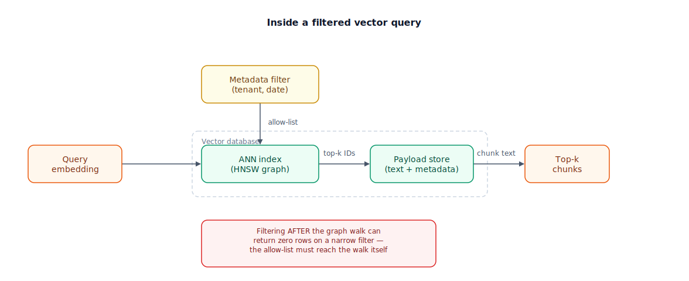

## The 30-second version

A vector database stores embeddings and answers one question fast, over and over: "which of my millions of stored vectors are closest to this query vector?" The naive answer — compare the query to every stored vector — works fine at 10,000 rows and falls over at 10 million, because it's O(n): double the data, double the wait. Approximate Nearest Neighbor (ANN) indexes like HNSW (Hierarchical Navigable Small World) and IVF (Inverted File Index) trade a sliver of accuracy for sub-linear search time — the entire reason "vector database" is a category, not just a column type. Everything else — metadata filtering, namespaces, multi-tenancy — constrains that search to the right subset of rows without breaking the speed the index exists to provide. And the recurring decision isn't "which vendor" — it's whether you need a dedicated engine at all, or whether pgvector inside a database you already run is enough.

## The analogy

A vector database is a warehouse's internal routing system, and the vectors are pallets on the shelves.

Picture a small warehouse where a worker eyeballs every pallet to find the one you need — brute-force search, fine until a few hundred thousand pallets make eyeballing take all day. A real fulfillment center builds routing signage instead: broad highway signs first ("aisles 1–50 this way"), then local aisle signs, then a specific shelf. That layered, always-narrowing signage is HNSW: search starts at a sparse top layer for big jumps, descends through denser layers, and lands near the right shelf in a handful of hops instead of a full walk. IVF zones the warehouse upfront by zip code instead: every pallet is pre-assigned to one of, say, 200 zones by nearest zone center, so a search only walks the zones likely to hold your item.

Now the client cages. This warehouse serves multiple companies, and Acme's forklift driver must never load a Globex pallet — the metadata filter. Here's the trap: "grab any ten pallets, then throw back the ones that aren't Acme's" can come back with two pallets, or zero, if Acme's cage is small and scattered. The competent warehouse instead paints "Acme only" on the routing signage itself, narrowing the search *while* navigating — not after.

And the last decision: build a dedicated, professionally run fulfillment center, or clear out a supply closet in the office you already have? A supply closet (pgvector bolted onto a Postgres you already run) is nearly free and plenty for a few hundred thousand pallets. A dedicated center (Pinecone, Qdrant, Weaviate, Milvus) is built for signage and client cages at a scale a closet was never designed for.

| Warehouse element | Technical element |
|---|---|
| Worker eyeballing every pallet | Brute-force / flat search — exact, O(n) |
| Highway signs, then aisle signs, then shelf | HNSW's layered graph — coarse-to-fine navigation |
| Pre-assigning pallets to zip-code zones | IVF clustering (centroids, `nlist`/`nprobe`) |
| "Acme only" painted on the routing signage | Metadata pre-filtering during the graph walk |
| Grab ten, throw back the wrong ones | Post-filtering — can return too few or zero rows |
| Client cage per company | Namespace / collection per tenant |
| Office supply closet | pgvector inside a Postgres you already operate |
| Dedicated fulfillment center | Purpose-built vector database (Pinecone, Qdrant, Weaviate, Milvus) |

## How it actually works

Follow the diagram left to right. A query embedding arrives from the left and enters the ANN index directly — the geometry problem: find the nearest stored points. A metadata filter (tenant ID, date range, document type) arrives from above and feeds into that *same* index node, not a separate stage before or after it. That's deliberate: a competent vector database narrows the graph walk to allowed rows while navigating, never wasting hops on candidates the filter would reject anyway. Once the index returns a shortlist of top-k IDs, they cross into the payload store — the plain database beside the index holding the actual chunk text, since the index itself typically stores just enough per vector to compare and identify it. The payload store resolves IDs to text, and that becomes your top-k chunks, which feed a reranker in the [reranking chapter](./reranking-strategies.mdx).

The red callout names the classic mistake: filter *after* the graph walk instead of during it. Run an unfiltered search for the top 10 neighbors, then discard anything failing the tenant check, and a narrow filter can leave you with 2 results, or 0 — the nearest neighbors overall were simply never near this tenant's slice of the space. Production-grade indexes fix this with filter-aware traversal: the walk itself only considers nodes satisfying the boolean constraint, at the cost of extra bookkeeping (bitmasks, SIMD-accelerated checks) to keep the filtered walk fast.

Two index families dominate. **HNSW** builds a multi-layer graph — sparse at the top for long jumps, dense at the bottom where every vector lives — and search descends layer by layer, greedily moving to the closest neighbor. No training pass, good update support, excellent recall for its speed — at the cost of holding the whole graph in memory (roughly 1.5–2x raw vector size). **IVF** instead clusters vectors around centroids up front (`nlist` of them, often ~√n as a rule of thumb); a query only searches the `nprobe` nearest clusters — cheaper on memory but needing retraining as data shifts, with slightly lower recall. For disk-scale corpora, DiskANN keeps most of the graph on SSD and only a sliver in RAM, trading a few milliseconds of latency for a 90%+ cut in memory footprint.

## A concrete example

Say you're indexing 20 million support-ticket chunks at 1,024 dimensions.

- **Raw vector storage:** 20M × 1,024 dims × 4 bytes (float32) ≈ 82 GB.
- **HNSW graph overhead:** roughly 1.5–2x raw size, so the index needs around 120–165 GB of RAM to serve comfortably — past what a single mid-size instance offers cheaply.
- **Query latency, well-tuned:** single-digit to low-double-digit milliseconds at 95–99% recall, versus far higher latency for 100%-recall brute force at this scale.
- **Filtered query for one of 500 tenants:** each tenant holds about 40,000 chunks — a needle-in-haystack filter that returns unusable counts under naive post-filtering, but works fine under filter-aware traversal or a per-tenant namespace.
- **pgvector reality check:** brute-force pgvector is comfortable up to roughly a million vectors as a rule of thumb — 20 million rows and a 500-way tenant filter is well past what a Postgres extension without a serious ANN index was built for.

Compare a smaller shop: 300,000 chunks, single tenant, already on Postgres — squarely inside pgvector's comfortable range, no new operational surface.

## The tradeoffs that matter

| Approach | Query speed at scale | Memory / cost | Operational surface | Best fit |
|---|---|---|---|---|
| Flat / brute force | Slow past ~100K–1M vectors | Lowest (no index structure) | None — no index to tune | Small corpora, exact recall required |
| HNSW | Very fast, excellent recall | High (graph lives in RAM) | Moderate — tune `M`, `ef_search` | Most production RAG at moderate-to-large scale |
| IVF / IVF-PQ | Fast | Lower (clusters + quantization) | Higher — retraining as data drifts | Very large corpora, memory-constrained |
| DiskANN | Fast, few ms latency penalty | Very low RAM (SSD-backed) | Specialized ops | Billion-scale, non-real-time acceptable |
| pgvector in existing Postgres | Fine to ~1M rows | Compute-only, no new system | Lowest — one database to run | Small-to-mid scale, team already on Postgres |
| Dedicated vector DB (Pinecone/Qdrant/Weaviate/Milvus) | Fast at any scale, native filtering | Managed pricing or self-host ops | New system, new on-call surface | Scale, heavy metadata filtering, multi-tenancy |

The honest framing: an ANN index always trades a slice of recall (typically 95–99%, not 100%) for speed — a deliberate, tunable choice, not a bug. And pgvector-versus-dedicated-database really asks whether you have enough vectors, filtering complexity, and tenants that a purpose-built engine earns its operational cost. Below roughly a million vectors and modest filtering, the answer is usually no.

## Where people go wrong

1. **Post-filtering instead of pre-filtering.** Fetching top-k and discarding rows that fail a tenant check can silently return too few results, or none, on a narrow filter. Confirm the database filters *during* traversal.
2. **Assuming ANN recall is 100%.** HNSW and IVF are approximate by design — usually 95–99%. For genuinely exact needs (audits, legal holds), a flat index on a small subset beats a "better" ANN configuration.
3. **Reaching for a dedicated vector database by default.** At a few hundred thousand vectors, pgvector on infrastructure you already run is simpler and cheaper than a new stateful service.
4. **Sizing memory only for vectors, forgetting index overhead.** HNSW's graph adds roughly 1.5–2x on top of raw vector storage; a plan accounting only for `dimensions × 4 bytes × count` runs out of RAM in production.
5. **Sharing one index across tenants with no isolation strategy.** Metadata filtering works, but a bug can leak another tenant's data. High-security cases call for a namespace or collection per tenant, not a shared index with hope.

## The interview lens

Interviewers use this topic to check whether you understand *why* the category exists, not whether you've memorized a vendor chart.

A strong sound bite: *"A vector database's job is turning an O(n) exact search into a sub-linear approximate one — I listen for whether a candidate understands the recall they're trading away, and whether metadata filtering happens during that search or bolted on after it."*

Likely follow-ups:

- Walk me through what happens inside an HNSW search, layer by layer.
- How would you support 10,000 tenants in one vector index without leaking data between them?
- At what point would you migrate from pgvector to a dedicated vector database, and how would you do it with zero downtime?

## Go deeper

- [Embedding Models](./embedding-models.mdx) — what actually goes into the vectors this chapter searches over.
- [Hybrid Search](./hybrid-search.mdx) — combining this vector search with keyword search for exact-match queries.
- [Production RAG at Scale](./production-rag-at-scale.mdx) — capacity planning and operations for indexes at this size.
- Upstream reference: [Vector Databases — AI System Design Guide](https://github.com/ombharatiya/ai-system-design-guide/blob/main/06-retrieval-systems/04-vector-databases.md) (MIT; see [CREDITS](../../../CREDITS.md)).
