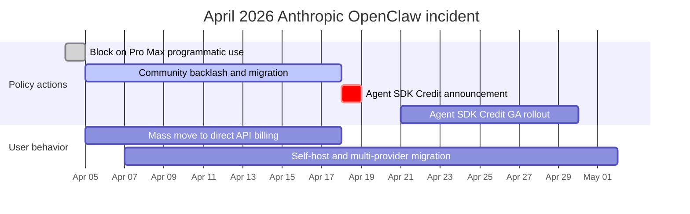

## The 30-second version

OpenClaw is an open-source, self-hosted personal AI agent that executes tasks through LLMs using messaging platforms as its primary interface. You talk to it via WhatsApp, Telegram, Slack, Discord, or Signal, and it talks back -- running shell commands, controlling your browser, managing calendars, processing emails, and orchestrating multi-step workflows.

## How it actually works

OpenClaw is an **open-source, self-hosted personal AI agent** that executes tasks through LLMs using messaging platforms as its primary interface. You talk to it via WhatsApp, Telegram, Slack, Discord, or Signal, and it talks back -- running shell commands, controlling your browser, managing calendars, processing emails, and orchestrating multi-step workflows.


## What Is OpenClaw

OpenClaw is:

- **A personal AI agent**: Not a chatbot -- an autonomous agent that acts on your behalf
- **Self-hosted**: Runs on your machine, VPS, or Raspberry Pi -- you control your data
- **Messaging-native**: Lives in chat apps you already use (WhatsApp, Telegram, Slack, Discord, Signal, iMessage, and 20+ others)
- **LLM-agnostic**: Works with Claude, GPT-4, Gemini, DeepSeek, or local models
- **Skill-extensible**: 100+ pre-configured skills, with a simple format for writing custom ones
- **Open source**: MIT-licensed, 250K+ GitHub stars as of early 2026

```
# The simplest way to start
git clone https://github.com/openclaw/openclaw.git
cd openclaw
docker compose up -d

# Or via npm
npm install -g openclaw
openclaw start
```

**The key difference from chatbots:**
- ChatGPT/Claude.ai: You type, it replies with text
- OpenClaw: You type, it **does things** -- runs commands, edits files, sends emails, controls smart home devices, manages your calendar

## History

### The Naming Timeline

| Date | Name | Event |
|------|------|-------|
| November 2025 | **Clawdbot** | Peter Steinberger publishes first prototype, built in roughly one hour |
| January 2026 | 2,000 stars | Early adopters discover the project |
| January 27, 2026 | **Moltbot** | Renamed after Anthropic trademark complaints (lobster theme preserved) |
| January 30, 2026 | **OpenClaw** | Renamed again -- Steinberger found "Moltbot" awkward to say |
| February 2026 | 145,000+ stars | Explosive growth, surpasses many established open-source projects |
| February 14, 2026 | -- | Steinberger joins OpenAI, citing access to resources needed to scale |
| March 2026 | 250,000+ stars | Overtakes React on GitHub; one of the fastest-growing OSS projects ever |

### The Creator

Peter Steinberger is an Austrian software engineer who previously spent 13 years building PSPDFKit, a PDF toolkit used by developers worldwide, before selling the company in 2024. He describes himself as a "vibe coder" and famously said he ships code he does not read -- embodying the new AI-first development philosophy where the human provides intent and the AI provides implementation.

### Why It Went Viral

OpenClaw hit a nerve because it solved a real problem: LLMs are powerful but stateless. Every conversation starts from zero. OpenClaw gives LLMs **persistence** (memory across sessions), **agency** (the ability to act, not just talk), and **reach** (integration with the apps you already use). The fact that it was self-hosted and open source meant anyone could run it without trusting a third-party service with their data.

## Architecture

### High-Level Overview

```
                         OPENCLAW ARCHITECTURE
 ============================================================

  Messaging Platforms              OpenClaw Gateway           LLM Providers
 ┌──────────────┐              ┌─────────────────────┐     ┌──────────────┐
 │  WhatsApp    │──┐           │                     │     │  Anthropic   │
 │  (Baileys)   │  │           │   GATEWAY            │     │  (Claude)    │
 ├──────────────┤  │  Channel  │   ┌──────────────┐  │     ├──────────────┤
 │  Telegram    │──┼──Adapters─┼──>│  Router      │  │     │  OpenAI      │
 │  (grammY)    │  │           │   │  (sessions,  │  │     │  (GPT-4)     │
 ├──────────────┤  │           │   │   bindings)  │  │     ├──────────────┤
 │  Slack       │──┤           │   └──────┬───────┘  │     │  Google      │
 │  (Bolt)      │  │           │          │          │     │  (Gemini)    │
 ├──────────────┤  │           │   ┌──────▼───────┐  │     ├──────────────┤
 │  Discord     │──┤           │   │ Agent Runtime│──┼────>│  DeepSeek    │
 │  (discord.js)│  │           │   │ (AI loop,    │  │     ├──────────────┤
 ├──────────────┤  │           │   │  tool calls, │  │     │  Local/      │
 │  Signal      │──┤           │   │  memory)     │  │     │  Ollama      │
 │  (signal-cli)│  │           │   └──────┬───────┘  │     └──────────────┘
 ├──────────────┤  │           │          │          │
 │  iMessage    │──┤           │   ┌──────▼───────┐  │     Tools & Skills
 │  (BlueBubbles│  │           │   │  Tool Layer  │  │     ┌──────────────┐
 ├──────────────┤  │           │   │  (skills,    │──┼────>│  Shell exec  │
 │  Teams       │──┘           │   │   browser,   │  │     │  Browser     │
 │  IRC, Matrix │              │   │   files,     │  │     │  File I/O    │
 │  20+ more... │              │   │   cron)      │  │     │  Calendar    │
 └──────────────┘              │   └──────────────┘  │     │  Email       │
                               │                     │     │  100+ more   │
                               │   ┌──────────────┐  │     └──────────────┘
                               │   │  Memory &    │  │
                               │   │  State       │  │     Storage
                               │   │  (sessions,  │──┼────>┌──────────────┐
                               │   │   workspace) │  │     │  ~/.openclaw/│
                               │   └──────────────┘  │     │  (state,     │
                               └─────────────────────┘     │   memory,    │
                                                           │   config)    │
                                localhost:18789             └──────────────┘
```

### Core Components

**1. The Gateway**

The Gateway is a long-running WebSocket server (default: `localhost:18789`) that serves as the single source of truth for sessions, routing, and channel connections. It handles:

- Accepting connections from all messaging platforms via channel adapters
- Routing messages to the correct agent
- Session management and state persistence
- Authentication and access control
- Hot-reloading configuration changes

**2. Channel Adapters**

When a message arrives from any platform, a channel adapter normalizes it into a standard internal format. Each adapter wraps a platform-specific library:

| Platform | Adapter Library | Protocol |
|----------|----------------|----------|
| WhatsApp | Baileys | WebSocket (unofficial) |
| Telegram | grammY | Bot API |
| Slack | Bolt | Events API |
| Discord | discord.js | Gateway API |
| Signal | signal-cli | D-Bus |
| iMessage | BlueBubbles | REST API |
| IRC | irc-framework | IRC protocol |
| Matrix | matrix-js-sdk | Matrix protocol |
| Microsoft Teams | Bot Framework | REST API |

**3. Agent Runtime**

The Agent Runtime is the AI loop. For each incoming message, it:

1. Assembles context from session history, workspace memory, and relevant skills
2. Sends the assembled prompt to the configured LLM
3. Receives tool calls from the model
4. Executes tool calls against the system capabilities
5. Returns results to the model for next iteration
6. Persists updated state (memory, files, session history)

**4. Multi-Agent Routing**

OpenClaw supports running multiple agents inside one Gateway process. Each agent gets its own workspace, agentDir, sessions, and tool configuration. Inbound messages are routed to agents via bindings:

```json
{
  "agents": {
    "list": [
      {
        "name": "work-assistant",
        "agentDir": "./agents/work",
        "channels": ["slack-work"]
      },
      {
        "name": "home-assistant",
        "agentDir": "./agents/home",
        "channels": ["whatsapp-personal", "telegram"]
      },
      {
        "name": "devops-bot",
        "agentDir": "./agents/devops",
        "channels": ["discord-infra"]
      }
    ]
  }
}
```

This means you can have a work assistant on Slack, a personal assistant on WhatsApp, and a DevOps bot on Discord -- all running from one Gateway, with completely isolated memory and permissions.

## The AgentSkills System

### How Skills Work

Skills are the mechanism by which OpenClaw gains capabilities beyond basic conversation. Each skill is a directory containing a `SKILL.md` file with YAML frontmatter (metadata) and markdown instructions (behavior).

```
~/.openclaw/skills/
  weather/
    SKILL.md           # Required: metadata + instructions
    scripts/
      fetch_weather.py # Optional: executable scripts
    references/
      api_docs.md      # Optional: supplementary docs

  email-manager/
    SKILL.md
    scripts/
      process_inbox.py
```

### SKILL.md Format

```yaml
name: weather-lookup
description: >
  Fetch current weather and forecasts for any location.
  Responds to queries about temperature, rain, and conditions.
triggers:
  - weather
  - temperature
  - forecast
  - "is it going to rain"
tools:
  - web_search
  - bash
# Weather Lookup Skill

When the user asks about weather:

1. Use the web_search tool to find current conditions
2. Extract temperature, humidity, wind, and forecast
3. Present in a concise, readable format
4. Include both metric and imperial units

## Example Response Format

"Currently 72F (22C) and partly cloudy in San Francisco.
Forecast: Clear skies through Thursday, rain expected Friday."
```

### Skill Resolution Order

Skills can live in multiple locations. When a name collision occurs, the most local copy wins:

```
Priority (highest first):
  1. <workspace>/skills/        # Project-specific skills
  2. ~/.openclaw/skills/        # User-global skills
  3. <installed-packages>/      # npm-installed skills
  4. <bundled>/skills/          # Ships with OpenClaw
```

### Selective Injection

OpenClaw does **not** inject every skill into every prompt. The runtime selectively injects only the skills relevant to the current turn, based on the skill description and trigger keywords. This prevents prompt bloat and keeps model performance high.

### Creating a Custom Skill

```bash
# Create the skill directory
mkdir -p ~/.openclaw/skills/deploy-checker
cd ~/.openclaw/skills/deploy-checker

# Create the SKILL.md
cat > SKILL.md << 'EOF'
name: deploy-checker
description: >
  Monitor deployment status across staging and production.
  Checks health endpoints, recent commits, and CI status.
triggers:
  - deploy
  - deployment
  - "is staging up"
  - "prod status"
tools:
  - bash
  - web_search
# Deploy Checker

When asked about deployment status:

1. Run `curl -s https://staging.myapp.com/health` to check staging
2. Run `curl -s https://myapp.com/health` to check production
3. Check recent git log: `git log --oneline -5`
4. Report status in a clear format

## Response Format

Staging: [UP/DOWN] - version X.Y.Z - deployed 2h ago
Production: [UP/DOWN] - version X.Y.Z - deployed 1d ago
Last 3 commits: ...
EOF
```

### Community Skills Ecosystem

The OpenClaw skills ecosystem has grown rapidly, with community-maintained collections containing thousands of skills across categories like DevOps, home automation, content creation, data analysis, and more. However, this openness carries risk -- always review third-party skills before installing, as the early catalog had incidents with malicious scripts.

## LLM Provider Configuration

### Configuration File

OpenClaw reads its configuration from `~/.openclaw/openclaw.json` (JSON5 format -- comments and trailing commas allowed). The Gateway watches this file and applies changes automatically via hot reload.

```json5
{
  // Model provider configuration
  "models": {
    "providers": {
      "anthropic": {
        "baseUrl": "https://api.anthropic.com",
        "apiKey": "${ANTHROPIC_API_KEY}",  // env var substitution
        "models": {
          "claude-sonnet-4": {
            "maxTokens": 8192
          }
        }
      },
      "openai": {
        "baseUrl": "https://api.openai.com/v1",
        "apiKey": "${OPENAI_API_KEY}",
        "models": {
          "gpt-4o": {
            "maxTokens": 4096
          }
        }
      },
      "custom-deepseek": {
        "api": "openai",  // OpenAI-compatible API
        "baseUrl": "https://api.deepseek.com/v1",
        "apiKey": "${DEEPSEEK_API_KEY}",
        "models": {
          "deepseek-chat": {
            "maxTokens": 4096
          }
        }
      },
      "local-ollama": {
        "api": "openai",
        "baseUrl": "http://localhost:11434/v1",
        "apiKey": "ollama",  // Ollama accepts any key
        "models": {
          "llama3.1:70b": {
            "maxTokens": 2048
          }
        }
      }
    }
  },

  // Default agent model
  "agents": {
    "defaults": {
      "model": "anthropic/claude-sonnet-4"
    }
  }
}
```

### Provider Selection Strategy

| Provider | Best For | Trade-offs |
|----------|----------|------------|
| Anthropic (Claude) | Complex reasoning, coding tasks, long-context | Higher cost, best quality |
| OpenAI (GPT-4o) | General-purpose, fast responses | Good balance of speed and quality |
| Google (Gemini) | Budget-conscious testing, generous free tier | Lower reasoning quality |
| DeepSeek | Cheapest frontier-class option (V4 Flash $0.14/$0.28 per 1M, V4 Pro $0.435/$0.87 after permanent May 22, 2026 discount); 1M context; best for high-volume cache-friendly workloads | Variable availability; open weights also self-hostable |
| Local (Ollama) | Privacy-critical, offline use | Requires powerful hardware, lower quality |

### Model Routing Within OpenClaw

You can configure different models for different agents, allowing cost optimization:

```json5
{
  "agents": {
    "defaults": {
      "model": "openai/gpt-4o-mini"  // Cheap default
    },
    "list": [
      {
        "name": "coding-agent",
        "model": "anthropic/claude-sonnet-4"  // Premium for code
      },
      {
        "name": "reminder-bot",
        "model": "google/gemini-2.0-flash"  // Cheap for simple tasks
      }
    ]
  }
}
```

## Messaging Platform Integrations

OpenClaw supports 20+ messaging platforms through its channel adapter architecture:

### Supported Platforms

| Platform | Library | Status | Notes |
|----------|---------|--------|-------|
| WhatsApp | Baileys | Stable | Unofficial API; personal account required |
| Telegram | grammY | Stable | Official Bot API; most reliable channel |
| Slack | Bolt | Stable | Workspace app installation required |
| Discord | discord.js | Stable | Bot token required |
| Signal | signal-cli | Stable | Requires linked device |
| iMessage | BlueBubbles | Stable | macOS only; requires BlueBubbles server |
| Google Chat | Chat API | Stable | Workspace admin approval |
| Microsoft Teams | Bot Framework | Beta | Q2 2026 full release |
| IRC | irc-framework | Stable | Classic protocol support |
| Matrix | matrix-js-sdk | Stable | Federated, self-hosted friendly |
| Mattermost | API | Stable | Self-hosted Slack alternative |
| LINE | Messaging API | Stable | Popular in Japan/SE Asia |
| Feishu (Lark) | Open API | Stable | Popular in China |
| Twitch | TMI.js | Stable | Chat-only |
| WeChat | -- | Beta | Requires custom bridge |
| Nostr | -- | Beta | Decentralized protocol |
| WebChat | Built-in | Stable | Browser-based fallback |

### Unified Context Across Channels

A critical architectural decision: the Gateway maintains **one unified memory system** across all channels. If you tell your agent something on WhatsApp, it remembers when you message from Slack. This means your AI agent has consistent context regardless of which app you use to reach it.

```
          WhatsApp ──┐
          Telegram ──┤     ┌─────────────────────┐
          Slack    ──┼────>│  Shared Memory Pool  │
          Discord  ──┤     │  (per-agent, cross-  │
          Signal   ──┘     │   channel sessions)  │
                           └─────────────────────┘
```

## Security Model

### Security Philosophy

OpenClaw's security model assumes a "personal assistant" threat model: one trusted operator, potentially multiple agents. The priorities are:

1. **Identity first**: Who can talk to the bot?
2. **Scope next**: Where is the bot allowed to act?
3. **Model last**: Assume the model can be manipulated, limit blast radius

### Permission Layers

```
 Layer 1: Channel Authentication
 ─────────────────────────────────
 Who can message the bot?
 Configured per-channel with allowlists.

 Layer 2: Agent Tool Allow/Deny
 ─────────────────────────────────
 Which tools can this agent use?
 Configured per-agent in agents.list[].tools.

 Layer 3: Sandbox Tool Policy
 ─────────────────────────────────
 Separate from agent permissions.
 Even if agent allows a tool, sandbox may block it.

 Layer 4: Elevated Access
 ─────────────────────────────────
 Some tools require host-level access.
 Gated per-channel and per-user with allowFrom lists.
```

### Sandbox Isolation

For non-main sessions (sub-agents, cron jobs, isolated tasks), OpenClaw supports Docker sandbox isolation:

```yaml
# docker-compose.sandbox.yml
services:
  openclaw-sandbox:
    image: openclaw/sandbox:latest
    network_mode: "none"        # No network access
    read_only: true             # Read-only root filesystem
    volumes:
      - ./workspace:/workspace  # Restricted workspace only
    security_opt:
      - no-new-privileges:true
```

With `network: "none"`, a sandboxed sub-agent cannot make outbound requests, cannot exfiltrate data, and cannot reach external services -- even if running malicious code.

### Critical Security Warnings

**Default localhost trust**: By default, OpenClaw trusts connections from localhost without authentication. If the Gateway sits behind an improperly configured reverse proxy that forwards all requests to localhost, external attackers get full access. Always configure authentication for remote deployments.

**Skill supply chain**: The community skills catalog has had incidents with malicious packages. Always review third-party skills before installation. Pin skill versions. Use the sandbox for untrusted skills.

### Hardening Checklist

```
[x] Set state directory permissions to 700
[x] Configure channel allowlists (do not leave open)
[x] Enable sandbox for sub-agents and cron jobs
[x] Use environment variables for API keys, never hardcode
[x] Put Gateway behind authenticated reverse proxy for remote access
[x] Review all third-party skills before installation
[x] Set up monitoring for unusual tool invocations
[x] Restrict elevated tool access to specific users
[x] Run Gateway as non-root user
[x] Enable TLS for WebSocket connections
```

## Deployment Patterns

### Option 1: Local Development (Fastest Start)

```bash
# Clone and run
git clone https://github.com/openclaw/openclaw.git
cd openclaw
cp .env.example .env
# Edit .env: add ANTHROPIC_API_KEY or OPENAI_API_KEY

npm install
npm start
```

**Requirements**: Node.js 20+, 512MB RAM, any OS.

### Option 2: Docker (Recommended for Production)

```yaml
# docker-compose.yml
version: "3.8"
services:
  openclaw:
    image: openclaw/openclaw:latest
    container_name: openclaw-gateway
    restart: unless-stopped
    ports:
      - "18789:18789"
    volumes:
      - ./state:/app/state         # Persistent state
      - ./openclaw.json:/app/openclaw.json  # Configuration
    environment:
      - ANTHROPIC_API_KEY=${ANTHROPIC_API_KEY}
      - OPENAI_API_KEY=${OPENAI_API_KEY}
    mem_limit: 2g
    logging:
      driver: json-file
      options:
        max-size: "10m"
        max-file: "3"
```

```bash
docker compose up -d
docker logs -f openclaw-gateway  # Watch logs
```

### Option 3: Cloud VPS (Always-On)

OpenClaw is lightweight -- any machine with 512MB RAM and 1 CPU core is sufficient. A $4-6/month VPS works.

**Quick deploy options:**
- **DigitalOcean**: 1-Click App with security hardening built in
- **Railway**: One-click deploy button from GitHub README (~5 min)
- **Contabo**: Free 1-click OpenClaw add-on for VPS plans
- **AWS Lightsail**: $3.50/month instance runs it comfortably
- **Raspberry Pi**: Runs well on Pi 4 with 4GB RAM

### Production Architecture

```
                    PRODUCTION DEPLOYMENT
 ====================================================

  Internet
     │
     ▼
 ┌───────────────┐
 │  Cloudflare   │     SSL termination
 │  (CDN/WAF)    │     DDoS protection
 └───────┬───────┘
         │
         ▼
 ┌───────────────┐
 │  Nginx        │     Reverse proxy
 │  (with auth)  │     Rate limiting
 └───────┬───────┘     WebSocket upgrade
         │
         ▼
 ┌───────────────────────────────────────┐
 │  Docker                              │
 │  ┌─────────────────────────────────┐ │
 │  │  openclaw-gateway               │ │
 │  │  (main process)                 │ │
 │  └────────────┬────────────────────┘ │
 │               │                      │
 │  ┌────────────▼────────────────────┐ │
 │  │  openclaw-sandbox               │ │
 │  │  (isolated sub-agents)          │ │
 │  │  network: none                  │ │
 │  └─────────────────────────────────┘ │
 │                                      │
 │  Volume: ./state (700 permissions)   │
 └──────────────────────────────────────┘
         │
         ▼
    LLM APIs
    (Anthropic, OpenAI, etc.)
```

### Nginx Configuration for Remote Access

```nginx
# /etc/nginx/sites-available/openclaw
server {
    listen 443 ssl http2;
    server_name openclaw.yourdomain.com;

    ssl_certificate /etc/letsencrypt/live/openclaw.yourdomain.com/fullchain.pem;
    ssl_certificate_key /etc/letsencrypt/live/openclaw.yourdomain.com/privkey.pem;

    location / {
        proxy_pass http://127.0.0.1:18789;
        proxy_http_version 1.1;
        proxy_set_header Upgrade $http_upgrade;
        proxy_set_header Connection "upgrade";
        proxy_set_header Host $host;
        proxy_set_header X-Real-IP $remote_addr;

        # Basic auth for web interface
        auth_basic "OpenClaw";
        auth_basic_user_file /etc/nginx/.htpasswd;
    }
}
```

## Performance Optimization and Scaling

### Memory Guidelines

| Deployment | Recommended RAM | Rationale |
|------------|----------------|-----------|
| Personal, light use | 512MB - 1GB | Few skills, short conversations |
| Personal, daily use | 4GB | Moderate skill count, browser automation |
| Team or high-frequency | 8GB | Multiple agents, concurrent sessions |
| Production standard | 16GB | Full skill suite, heavy automation |

### Context Window Management

LLM attention scales quadratically with context length. When context goes from 50K to 100K tokens, the model does four times the work. Practical optimizations:

- **Limit context window**: 100K tokens is enough for most tasks
- **Start new conversations**: Long history accumulates hundreds of messages; restart periodically
- **Disable unused skills**: Each loaded skill adds to the context budget

### Skill Optimization

```
 DO: Enable only skills you actively use
 DO: Write concise SKILL.md descriptions
 DO: Use specific trigger keywords

 DON'T: Enable everything "just in case"
 DON'T: Write verbose skill instructions
 DON'T: Load 50+ skills simultaneously
```

Each enabled skill adds context the agent must evaluate on every turn. If you have not used a skill in the past week, disable it.

### Latency Reduction

1. **Disable verbose thinking**: The `thinkingDefault` setting controls internal reasoning. For real-time interactions, skip chain-of-thought to cut processing time roughly in half
2. **Use faster models**: Route simple tasks (reminders, lookups) to smaller models
3. **Co-locate providers**: Use an LLM provider and region close to your server
4. **Monitor with Docker**: `docker stats openclaw-gateway` for real-time resource usage

## Real-World Use Cases

### 1. Development Workflow Orchestrator

A supervisor agent named "Patch" coordinates 5-20 parallel Claude Code instances via Telegram. The developer sends high-level instructions from their phone, and the supervisor spins up coding agents, assigns tasks, reviews output, runs tests, and merges code.

```
Developer (phone)
     │
     ▼ Telegram message: "Fix auth bug and add rate limiting"
┌─────────────┐
│  Patch      │ (OpenClaw supervisor agent)
│  Agent      │
└──────┬──────┘
       │ Spawns parallel workers
       ├──> Claude Code instance 1: Fix auth bug
       ├──> Claude Code instance 2: Add rate limiting
       └──> Claude Code instance 3: Update tests
              │
              ▼
       Results merged, tests pass
       PR created automatically
```

### 2. Email Triage at Scale

One developer used the himalaya CLI integration to give OpenClaw access to an email account with 15,000 messages. The agent processed the backlog -- unsubscribing from spam, categorizing by urgency, and drafting replies for review.

### 3. Home Automation Hub

An agent named "Claudette" controls an entire house through Home Assistant, using the ha-mcp skill to access all Home Assistant entities. It controls Philips Hue lights, Elgato devices, and adjusts boiler settings based on weather forecasts -- all via WhatsApp commands.

### 4. Content Production Pipeline

Multi-agent content workflows using parallel Discord-based workers:
- Agent 1: Research and outline
- Agent 2: Write draft
- Agent 3: Generate thumbnails and social media assets
- Supervisor: Review, edit, and publish

### 5. CI/CD Monitoring

An always-on agent watches GitHub Actions, GitLab CI, or Jenkins and alerts via Telegram when builds fail, tests error out, or deployments finish. It can also auto-triage failures and open issues.

### 6. Automated Client Onboarding

When a new client signs on, an agent kicks off a full workflow: creates a project folder, sends a welcome email, schedules a kickoff call, and adds follow-up reminders to the task list.

## Limitations and When NOT to Use OpenClaw

### Known Limitations

**Over-autonomy**: OpenClaw's autonomy can become a liability. You ask it to do one thing, and it may wander through reasoning loops, invoke tools repeatedly, or reinterpret your objective mid-execution. Outcomes require manual review.

**Configuration complexity**: Running OpenClaw well involves managing environments, permissions, tool connectors, and execution sandboxes. Many users report spending more time configuring than using the system.

**Memory fragility**: In-session chat history is temporary and lost on Gateway restart. Workspace files persist only what was explicitly saved. If a conversation never saved to memory files, there is nothing to retrieve later.

**Resource consumption**: The container can use 2GB+ of RAM with many skills loaded. Long conversation history compounds this.

**Unofficial APIs**: WhatsApp integration uses Baileys (unofficial). This can break with WhatsApp updates and may violate terms of service. Similar risks exist for other unofficial adapters.

### When NOT to Use OpenClaw

| Scenario | Why Not | Better Alternative |
|----------|---------|-------------------|
| Multi-tenant SaaS | Not designed for hostile multi-user isolation | Custom agent framework with proper tenant boundaries |
| High-stakes automation | Unpredictable execution paths, hard to audit | Deterministic workflow engines (Temporal, Prefect) |
| Real-time systems | LLM latency (1-5s per turn) is too slow | Event-driven architecture |
| Regulated industries | No compliance certifications, audit trails are basic | Enterprise AI platforms with SOC2/HIPAA |
| Teams > 10 people | Single-operator trust model does not scale | Shared agent platforms with proper RBAC |
| Ambiguous real-world tasks | Works best in tightly scoped environments where mistakes are cheap | Human operators |

## The April 2026 Anthropic Block-and-Reverse Incident

OpenClaw's reliance on Claude Pro and Claude Max subscriptions to power agent work was, until April 2026, treated as a cost-control feature: users could run OpenClaw against their existing personal Claude plan instead of paying API rates. On April 4, 2026, Anthropic changed the policy. A new enforcement clause blocked third-party agent frameworks from acting as a programmatic intermediary for Pro and Max subscriptions. Within hours, OpenClaw instances pointed at Pro and Max accounts began returning errors. Roughly 135,000 active OpenClaw deployments were affected, and a sizeable fraction of those users moved to direct API billing at rates 5x or more above their previous effective cost. Community frustration trended on Hacker News and X for nearly two weeks.

Anthropic reversed the policy mid-April with a new product called Agent SDK Credit, a metered allowance bundled into Pro and Max plans (with a higher allowance for Max) explicitly authorized for programmatic agent use through the Anthropic Agent SDK. Frameworks integrating with the Agent SDK, including OpenClaw, can again drive a personal subscription, but now within a transparent quota and only over the Agent SDK path. Direct Claude.ai web-session scraping remains forbidden.

### Timeline of the Incident



### What It Means Architecturally

The incident was not a security event. It was a product-policy event with security and reliability consequences. Three lessons follow:

**Provider policy is part of your architecture.** A single line in a vendor's Acceptable Use enforcement is functionally identical, from an availability standpoint, to a service outage that lasts however long the policy stays in force. If your agent platform's economics depend on a specific provider plan, the provider's policy team is on your critical path. Treat their Terms of Service as a runtime dependency, not a legal artifact.

**Multi-provider abstraction is operational hygiene, not optimization.** OpenClaw users who had configured both Anthropic and OpenAI providers, with model routing rules per agent, kept working through the block at degraded quality. Users who had hard-coded a single provider in every agent definition were dead in the water. The abstraction layer is cheap to build and the failure mode it covers is real.

**Self-host backstops matter for personal-data agents.** A meaningful subset of OpenClaw deployments switched their default agent over to a local Ollama model (Llama 3.3 70B was the most common choice) for two weeks, accepting lower quality for guaranteed availability. The lesson is not that local models are competitive with frontier models; it is that having a working fallback path, even at degraded quality, is part of a serious deployment.

### Vendor-Risk Checklist

- Every agent definition routes through a provider-abstraction layer; no agent hard-codes a single provider model name.
- The configuration includes a documented fallback provider per agent, with a tested switchover script.
- For personal-data or revenue-critical agents, at least one fallback path uses a self-hostable model (Ollama, vLLM, or a tenant-isolated cloud provider).
- The deployment's runbook treats provider Terms of Service and Acceptable Use as monitored documents, with subscription to provider security advisories and policy update mailing lists.
- Cost budgets in the agent config are set against the realistic worst case (direct API rates), not the optimistic case.
- A weekly canary test invokes each provider through the abstraction layer and alerts on 4xx changes, surfacing policy shifts before they hit production traffic.

**Sources:**
- [Axios: Anthropic blocks OpenClaw third-party agents](https://www.axios.com/2026/04/06/anthropic-openclaw-subscription-openai)
- [VentureBeat: OpenClaw reversal with Agent SDK credit](https://venturebeat.com/technology/anthropic-reinstates-openclaw-and-third-party-agent-usage-on-claude-subscriptions-with-a-catch)

## Comparison with Alternatives

| Feature | OpenClaw | Hermes Agent | Claude Code | Open Interpreter |
|---------|----------|-------------|-------------|-----------------|
| **Primary interface** | Messaging apps | Messaging apps | Terminal/CLI | Terminal/CLI |
| **Architecture** | Gateway + Channel Adapters | Learning loop + Skill memory | Agentic CLI | Simple REPL |
| **LLM support** | Any (Claude, GPT, Gemini, local) | Any | Claude only | Any |
| **Messaging platforms** | 20+ (WhatsApp, Telegram, Slack, etc.) | 6 (Telegram, Discord, Slack, WhatsApp, Signal, email) | None (terminal only) | None (terminal only) |
| **Memory** | Cross-session per assistant | Multi-level (session, persistent, skill) | Session only (CLAUDE.md for context) | Session only |
| **Skills/Plugins** | 100+ bundled, community ecosystem | Self-learning skill system | MCP tools | Limited plugins |
| **Self-hosted** | Yes (required) | Yes (required) | No (Anthropic-hosted) | Yes |
| **GitHub stars** | 250K+ | 22K+ | N/A (closed source) | 55K+ |
| **Best for** | Multi-channel personal AI assistant | Personal agent that learns over time | Software development | Quick local automation |
| **Weakest at** | Predictability, enterprise use | Platform reach | Non-coding tasks | Complex workflows |

### Choosing the Right Tool

```
Need multi-channel messaging?          --> OpenClaw
Need an agent that learns from usage?  --> Hermes Agent
Need autonomous coding specifically?   --> Claude Code
Need quick one-off local automation?   --> Open Interpreter
Need enterprise-grade reliability?     --> Custom solution or commercial platform
```

## Getting Started

### Minimal Setup (5 Minutes)

```bash
# 1. Clone the repository
git clone https://github.com/openclaw/openclaw.git
cd openclaw

# 2. Copy and edit environment file
cp .env.example .env
# Add your LLM API key:
# ANTHROPIC_API_KEY=sk-ant-...
# or OPENAI_API_KEY=sk-...

# 3. Start with Docker
docker compose up -d

# 4. Check logs
docker logs -f openclaw-gateway
```

### Connect Your First Channel (Telegram)

Telegram is the easiest channel to set up:

```json5
// ~/.openclaw/openclaw.json
{
  "channels": {
    "telegram": {
      "enabled": true,
      "token": "${TELEGRAM_BOT_TOKEN}",  // From @BotFather
      "allowedUsers": ["your_telegram_id"]
    }
  },
  "models": {
    "providers": {
      "anthropic": {
        "apiKey": "${ANTHROPIC_API_KEY}"
      }
    }
  },
  "agents": {
    "defaults": {
      "model": "anthropic/claude-sonnet-4"
    }
  }
}
```

### Install Your First Skill

```bash
# Install a community skill
cd ~/.openclaw/skills
git clone https://github.com/example/weather-skill.git weather

# Or create your own (see AgentSkills section above)
mkdir my-skill && cat > my-skill/SKILL.md << 'EOF'
name: my-first-skill
description: A simple greeting skill
When the user says hello, respond warmly and offer to help.
EOF
```

### Verify Everything Works

```bash
# Check Gateway health
curl http://localhost:18789/health

# Check logs for errors
docker logs openclaw-gateway --tail 50

# Send a test message via Telegram to your bot
# It should respond within 2-5 seconds
```

## System Design Interview Angle

### Prompt: "Design a Personal AI Assistant Platform Like OpenClaw"

This is an excellent system design question because it covers messaging systems, agent orchestration, security, multi-tenancy, and real-time communication.

### Requirements Gathering

**Functional:**
- Users interact via messaging platforms (WhatsApp, Slack, Telegram)
- The agent can execute tasks: run commands, manage files, send emails, control devices
- Memory persists across sessions and channels
- Support for multiple isolated agents per user
- Extensible skill/plugin system

**Non-functional:**
- Low latency (&lt; 5s response time including LLM inference)
- Self-hostable (user controls their data)
- Secure (sandboxed execution, permission controls)
- Reliable (24/7 uptime for always-on assistant)

### High-Level Design

```
                     SYSTEM DESIGN

 ┌──────────────────────────────────────────────────────┐
 │                   API Gateway                         │
 │  ┌────────────┐  ┌────────────┐  ┌────────────┐     │
 │  │ WhatsApp   │  │ Telegram   │  │ Slack      │     │
 │  │ Webhook    │  │ Webhook    │  │ Events API │     │
 │  └─────┬──────┘  └─────┬──────┘  └─────┬──────┘     │
 │        └───────────────┼───────────────┘             │
 │                        ▼                              │
 │              ┌─────────────────┐                     │
 │              │ Message Router  │                     │
 │              │ (user lookup,   │                     │
 │              │  agent binding) │                     │
 │              └────────┬────────┘                     │
 └───────────────────────┼──────────────────────────────┘
                         │
          ┌──────────────▼──────────────┐
          │       Agent Orchestrator     │
          │  ┌───────────────────────┐  │
          │  │ Context Assembler     │  │
          │  │ (memory + skills +    │  │
          │  │  session history)     │  │
          │  └───────────┬───────────┘  │
          │              ▼              │
          │  ┌───────────────────────┐  │
          │  │ LLM Router           │  │
          │  │ (model selection,    │  │
          │  │  fallback, caching)  │  │
          │  └───────────┬───────────┘  │
          │              ▼              │
          │  ┌───────────────────────┐  │
          │  │ Tool Executor        │  │
          │  │ (sandboxed, gated,   │  │
          │  │  audited)            │  │
          │  └───────────────────────┘  │
          └─────────────────────────────┘
                         │
          ┌──────────────▼──────────────┐
          │       Storage Layer          │
          │  ┌──────┐ ┌──────┐ ┌─────┐ │
          │  │Memory│ │State │ │Audit│ │
          │  │Store │ │Store │ │ Log │ │
          │  └──────┘ └──────┘ └─────┘ │
          └─────────────────────────────┘
```

### Key Design Decisions

**1. Why a single Gateway process (not microservices)?**

OpenClaw runs as a single process because the personal assistant use case does not need horizontal scaling. One user means one Gateway. This eliminates distributed system complexity (service discovery, inter-service auth, eventual consistency) and keeps deployment simple enough for a Raspberry Pi.

**2. Why channel adapters, not a unified messaging API?**

Each messaging platform has unique constraints (message size limits, media support, typing indicators, read receipts). A thin adapter per platform preserves platform-specific features while normalizing the core message format. This is the Adapter Pattern from Gang of Four.

**3. How to handle tool execution safety?**

The defense-in-depth approach: (a) Agent-level tool allowlists define what tools an agent can theoretically use. (b) Sandbox-level policy separately gates what tools can actually execute. (c) Elevated access requires per-user, per-channel authorization. (d) Docker isolation for sub-agents ensures that even if a malicious prompt tricks the model, the blast radius is contained.

**4. How to manage memory without a vector database?**

OpenClaw uses a simple file-based memory system (markdown files in the state directory) rather than a vector database. For a single-user agent, full-text search over a few hundred memory files is fast enough. This avoids the operational burden of running and maintaining a vector DB.

**5. How to handle multi-channel session continuity?**

All channels route through the same Router, which maps platform-specific user IDs to a unified internal user identity. The memory store is keyed by agent (not channel), so switching from WhatsApp to Slack mid-conversation maintains context. This is conceptually similar to how a CRM links email, phone, and chat to one customer record.

### Scaling Discussion

| Scale | Architecture | Notes |
|-------|-------------|-------|
| 1 user | Single process on VPS | OpenClaw's default design |
| 10 users | Multiple Gateway instances, one per user | Each user self-hosts their own |
| 1,000 users | Managed multi-tenant platform | Requires complete redesign: proper isolation, shared infra, billing |
| 100K+ users | Distributed system with agent pools | Need horizontal scaling, queue-based dispatch, shared skill registry |

The architectural jump from "personal assistant" to "multi-tenant platform" is significant. OpenClaw intentionally does not cross this boundary, which is both a strength (simplicity) and a limitation (does not scale to a SaaS product without major rearchitecting).

### Follow-up Questions an Interviewer Might Ask

**Q: How would you add a vector database for long-term memory?**
Add a RAG pipeline: when the agent saves a memory, embed it and store in a vector DB (Qdrant, Weaviate). On each turn, retrieve the top-K relevant memories and inject them into the context. This trades storage complexity for better long-term recall without ballooning the context window.

**Q: How would you make this multi-tenant?**
Isolate at the container level: each tenant gets their own Gateway container with separate storage volumes, network namespace, and API key configuration. Use Kubernetes with per-tenant namespaces. Add a routing layer in front that maps tenant domains to containers.

**Q: How would you handle rate limiting to control LLM costs?**
Three levels: (a) per-user message rate limiting at the Gateway, (b) per-agent token budget tracked in the orchestrator, (c) model routing that sends simple queries to cheaper models. Alert the user when they approach their budget, and allow configurable daily/monthly caps.

## References

- OpenClaw Official Documentation -- https://docs.openclaw.ai
- OpenClaw GitHub Repository -- https://github.com/openclaw/openclaw
- OpenClaw Wikipedia -- https://en.wikipedia.org/wiki/OpenClaw
- OpenClaw Skills Documentation -- https://docs.openclaw.ai/tools/skills
- OpenClaw Security Architecture -- https://docs.openclaw.ai/gateway/security
- OpenClaw Configuration Reference -- https://docs.openclaw.ai/gateway/configuration
- OpenClaw Multi-Agent Routing -- https://docs.openclaw.ai/concepts/multi-agent
- Milvus Blog: Complete Guide to OpenClaw -- https://milvus.io/blog/openclaw-formerly-clawdbot-moltbot-explained-a-complete-guide-to-the-autonomous-ai-agent.md
- DigitalOcean: What is OpenClaw -- https://www.digitalocean.com/resources/articles/what-is-openclaw
- awesome-openclaw-agents (Community Skills) -- https://github.com/mergisi/awesome-openclaw-agents

*Next: See [Claude Code Deep Dive](../09-frameworks-and-tools/09-claude-code.md) for comparison with Anthropic's coding-focused agent approach.*

## Go deeper

- [Upstream chapter (OpenClaw Deep Dive: The Open-Source Personal AI Agent)](https://github.com/ombharatiya/ai-system-design-guide/blob/main/17-tool-use-and-computer-agents/03-openclaw-deep-dive.md)
- Related questions in the [question bank](/questions)
- Practice with [SPIDER walkthrough](/practice) or [mock interview](/mock)
