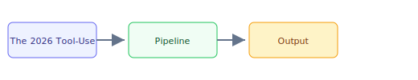

## The 30-second version

The way AI agents interact with the outside world has undergone a dramatic shift. In 2024, "tool use" meant a model emitting a JSON function call that your backend executed. Today we have full-blown autonomous agents that clone repos, run shell commands, control desktops via screenshots, and message you on WhatsApp, all orchestrated through standardized protocols like MCP. This chapter maps the landscape of these tools, their architectures, and the design decisions that differentiate them.

## The analogy

Think of **The 2026 Tool-Use and Computer Agent Landscape** like running a kitchen during rush hour: you cannot memorize every recipe change, so you keep reference cards (retrieval), a head chef who improvises within guardrails (the model), and a quality check before plates leave the pass (evaluation). The technical system mirrors that flow — separate what you **store**, what you **retrieve**, and what you **generate**.

## How it actually works

The way AI agents interact with the outside world has undergone a dramatic shift. In 2024, "tool use" meant a model emitting a JSON function call that your backend executed. Today we have full-blown autonomous agents that clone repos, run shell commands, control desktops via screenshots, and message you on WhatsApp, all orchestrated through standardized protocols like MCP. This chapter maps the landscape of these tools, their architectures, and the design decisions that differentiate them.

## A concrete example

The way AI agents interact with the outside world has undergone a dramatic shift. In 2024, "tool use" meant a model emitting a JSON function call that your backend executed. Today we have full-blown autonomous agents that clone repos, run shell commands, control desktops via screenshots, and message you on WhatsApp, all orchestrated through standardized protocols like MCP. This chapter maps the landscape of these tools, their architectures, and the design decisions that differentiate them.

## The tradeoffs that matter

| Choice | Upside | Cost |
|--------|--------|------|
| Simpler design | Faster to ship | Less resilient |
| Heavier retrieval | Better grounding | More latency |
| Bigger model | Higher quality | Higher $/query |

## Where people go wrong

- Skipping evaluation and hoping demos generalize
- Ignoring latency/cost until production traffic arrives
- Treating retrieval quality as a generation problem

## The interview lens

### Q: Your team wants to build an internal AI assistant. Should you build on OpenClaw, OpenHands, or build custom with Claude Code + MCP?

**Strong answer:**
It depends on the use case and security requirements. OpenClaw is optimized for personal assistants with messaging integrations -- ideal if the goal is a Slack/Teams bot with persistent personality. But its unsandboxed execution and AGPL license create enterprise concerns. OpenHands is better for autonomous development tasks -- its Docker sandboxing and MIT license are enterprise-friendly. For a custom internal tool, Claude Code with MCP servers gives the most control: you define exactly which tools are available, run them in your own infrastructure, and benefit from MCP's standardized discovery and auth. The decision tree is: messaging-first? OpenClaw. Dev automation? OpenHands. Custom enterprise tool? MCP + your own agent loop.

### Q: How would you design a system that lets non-technical users automate desktop tasks using AI?

**Strong answer:**
I would use the vision-based computer-use pattern (Claude Computer Use or similar). The key design decisions: (1) Always run in a sandboxed VM so the agent cannot damage the user's actual machine. (2) Implement a Human-in-the-Loop confirmation step before any destructive action -- file deletion, form submission, purchases. (3) Use the Zoom Action pattern to reduce misclicks on dense UIs. (4) Set token/cost caps to prevent runaway loops. (5) Record all actions as an audit trail. The main tradeoff is latency -- each screenshot-action step takes 1-3 seconds -- but this approach works with any application without needing APIs. For higher-speed workflows, combine computer-use with function calling for applications that have APIs.

### Q: Why did OpenClaw grow faster than any open-source project in history? What does this tell you about the market?

**Strong answer:**
Three factors. (1) **Zero-friction onboarding**: OpenClaw connects to messaging platforms people already use (WhatsApp, Telegram). Users do not need to learn a new interface. (2) **SOUL.md personalization**: The ability to give your agent a custom personality creates emotional attachment and virality -- people share their agents. (3) **Model-agnostic architecture**: Users are not locked into one LLM provider, reducing cost and increasing flexibility. The market signal is that the agent "interface" matters more than the underlying model. People want agents that meet them where they are (messaging apps, not web UIs). The flip side: rapid growth without security investment leads to crises like the 135,000 exposed instances, which is a cautionary tale for any open-source agent project.

### Q: Compare sandboxed vs. unsandboxed execution for AI agents. When would you choose each?

**Strong answer:**
Sandboxed (Docker/VM): Use for untrusted code execution, multi-tenant systems, or any production deployment. OpenHands does this well -- each session gets its own Docker container. The trade-off is setup complexity and performance overhead. Unsandboxed (host access): Use only for single-user, trusted environments where the user is watching. Open Interpreter and OpenClaw take this approach for maximum capability. The risk is that a bad LLM output can damage the host system. The 2026 consensus is sandboxed-by-default with escape hatches for power users. In an interview, always mention that the sandbox boundary is a security decision, not just a convenience decision.

## Go deeper

- [Upstream chapter (The 2026 Tool-Use and Computer Agent Landscape)](https://github.com/ombharatiya/ai-system-design-guide/blob/main/17-tool-use-and-computer-agents/01-tool-use-landscape.md)
- Related questions in the [question bank](/questions)
- Practice with [SPIDER walkthrough](/practice) or [mock interview](/mock)
