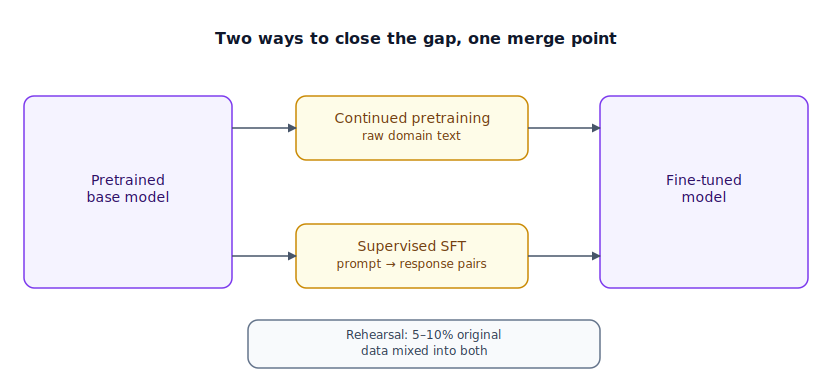

## The 30-second version

Fine-tuning is not primarily about teaching a model new facts — it's about teaching it a new format, tone, or behavior on top of what pretraining already gave it. Two questions matter before you touch a GPU. First: could prompting or retrieval solve this instead? Both are cheaper, reversible, and carry no risk of degrading the model's other abilities. Second, if fine-tuning genuinely is the right call: is the gap "the model doesn't know this domain's vocabulary at all" (continued pretraining, on raw unlabeled text) or "the model knows the domain but won't format or behave the way I need" (supervised fine-tuning, on labeled prompt-response pairs)? Whichever you pick, the deepest risk is catastrophic forgetting — pushing so hard on the new skill that general capability quietly erodes — and the standard defense is rehearsal: keep a slice of the model's original training-style data in the mix.

## The analogy

Picture a general-assignment newspaper reporter — someone who can walk into any story, structure it cleanly, and file clean copy on deadline, because years of varied assignments taught them how to report on anything. Then the editor reassigns them: starting Monday, they're the courthouse reporter, covering nothing but criminal trials.

First stage: the editor doesn't hand them a quiz. They get two weeks in the courthouse archive, reading years of filings, rulings, and transcripts with no grading at all — just soaking in how this world talks: "motion to dismiss," "voir dire," the rhythm of how a verdict gets described. That's pure exposure to raw, unlabeled material, cheap to produce because nobody had to write "correct answers" for it — the archive already existed. This is **continued pretraining**: further next-token-style training on raw domain text, no labels required.

Second stage: the editor hands over real assignments, each paired with the story that actually ran — draft in, published copy out — and walks through precisely how the good version differs from the reporter's first attempt. This is explicit, graded, example-by-example teaching, expensive per example because someone senior had to produce the "right answer." This is **supervised fine-tuning (SFT)**: labeled prompt-response pairs. The editor's rule of thumb: two hundred perfect clippings from the paper's best court reporter beat two hundred thousand mediocre wire clippings — quality has always mattered more than volume.

There's a failure mode every newsroom watches for. A reporter who spends six straight months doing nothing but courthouse copy can start to lose the knack for a lively general-interest feature — the range that made them valuable starts to atrophy. The fix: the editor deliberately keeps assigning one non-court story a week, purely to keep that muscle from going slack. This is **rehearsal**: mixing a slice of the model's original, general-purpose training data back into the fine-tuning set, specifically to fight catastrophic forgetting.

The depth of the reassignment matters too. A brand-new hire with no established voice might get a genuine overhaul — every habit rebuilt around the new beat. A twenty-year veteran instead just gets a one-page style cheat-sheet clipped inside their notebook: a small, removable set of notes on this beat's conventions, layered on top of reporting instincts that don't change at all — cheap to write, easy to swap tomorrow, and never risking the underlying reporter. The first is **full-parameter fine-tuning**; the second is **parameter-efficient fine-tuning** — the subject of the next chapter.

| Newsroom beat reassignment | Fine-tuning |
|---|---|
| A general-assignment reporter with broad reporting skill | The pretrained base model |
| Weeks reading the raw courthouse archive, no grading | Continued pretraining — further training on raw, unlabeled domain text |
| Draft-in/published-out example pairs with editor's notes | Supervised fine-tuning (SFT) — labeled prompt-response pairs |
| 200 gold-standard clippings beating 200,000 mediocre ones | The SFT quality hierarchy — curated examples over raw volume |
| Losing the knack for general-interest writing after total immersion | Catastrophic forgetting |
| One general-interest assignment kept every week | Rehearsal — mixing original training-style data back into the set |
| A full habit-and-voice overhaul for a new hire | Full-parameter fine-tuning |
| A removable style cheat-sheet clipped into a veteran's notebook | Parameter-efficient fine-tuning (PEFT / LoRA) |
| How much red ink the editor marks on a draft | Learning rate |

## How it actually works

Start before the diagram even applies. The first question is always whether fine-tuning is the right tool at all: if the gap is "the model doesn't have this fact" or "this fact changes often," fine-tuning is a poor fit — LLMs are unreliable at memorizing facts this way, and every update means another training run. Retrieval (see [RAG Fundamentals](../retrieval/rag-fundamentals.mdx)) solves that far more cheaply and stays current automatically. Fine-tuning earns its cost on a different class of gap: consistent output format, a specific tone or persona, or cutting a long few-shot prompt down to nothing because the behavior is now baked into the weights — which also cuts latency and per-request token cost.

Once fine-tuning is the right call, the diagram's two branches answer *which* gap you have. If the model genuinely doesn't "speak" the domain — unfamiliar vocabulary, structure, or style — **continued pretraining** goes first: more raw-text training on domain-specific text, at a much lower learning rate than the original pretraining run (roughly a tenth), to avoid overwriting existing capability while the model absorbs the new vocabulary. If the gap is purely behavioral — the model already understands the domain but won't format or act the way you need — skip straight to **SFT**: prompt-response pairs, with learning rates in a narrow, well-tested band (roughly 1e-5 to 5e-5). Push the rate too high and the model doesn't learn faster — it collapses into repetition or gibberish, because the update per step overshoots past a workable minimum.

Both branches merge into a fine-tuned model, and both carry the same forgetting risk, which is why the diagram's rehearsal note applies to both: mixing roughly 5-10% of the model's original, general-purpose training-style data into whichever set you're building, so it keeps practicing the skills you're not actively trying to change.

One more detail for the capacity deep dive next: whether you update every weight (**full-parameter fine-tuning**) or a small trainable overlay while the rest stays frozen (**PEFT**) changes cost, forgetting risk, and how many task variants you can serve cheaply. And at the throughput layer, production SFT runs typically **pack** several short examples into one long sequence to keep GPUs fed, separated by end-of-sequence tokens; without care, self-attention can leak across packed examples, blending two unrelated ones together — the standard fix is block-masking (via FlashAttention) so each packed example only attends to itself.

## A concrete example

Say you're building a customer-support agent that must reply in a strict JSON schema and know your product's specific troubleshooting steps.

**Prompting alone, first.** A detailed system prompt plus five few-shot examples gets JSON-schema compliance to about 92%, but costs roughly 1,200 extra tokens on every single request. At 50,000 requests/day, that's a real, permanent tax on latency and spend.

**Building the fine-tuning set.** You collect 2,000 golden (prompt, response) pairs, hand-reviewed by three senior support engineers, averaging 350 input tokens and 180 output tokens each. You add 150 general-purpose examples — 150 / (2,000 + 150) = 150/2,150 ≈ **7%** of the final set — drawn from broad instruction-following data, specifically as rehearsal so the model doesn't lose the ability to handle an off-topic question gracefully.

**The run.** 2,150 examples for 3 epochs at learning rate 2e-5: (2,150 × 530 tokens/example) × 3 epochs ≈ **3.42M tokens** processed across the whole job — small enough to finish on a single 8-GPU node in a few hours, nowhere near the scale of the pretraining run in the previous chapter.

**The result.** JSON-schema compliance goes from 92% (prompted) to 99.6% (fine-tuned), and the system prompt shrinks from 1,200 tokens to about 80, because the format is now in the weights instead of re-explained every call. At 50,000 requests/day, that's 50,000 × (1,200 − 80) = **56,000,000 fewer input tokens per day** — a savings that compounds every single day the model stays in production, versus a one-time training cost paid once.

## The tradeoffs that matter

| Approach | When it wins | Cost | Breaks down when |
|---|---|---|---|
| Prompting / few-shot / RAG only | Facts change often; you need reversibility and no training infrastructure | Recurring per-request token cost; a ceiling on format reliability | The format or behavior gap is large and consistent enough that no amount of prompting closes it |
| Continued pretraining | The model doesn't "speak" the domain at all — vocabulary and structure are unfamiliar | Needs a large raw corpus and a full training run at a reduced learning rate | The gap is behavioral, not vocabulary — wastes compute relearning a language the model already knows |
| Supervised fine-tuning (SFT) | Consistent output format, tone, or persona; shrinks prompts | Needs curated prompt-response pairs, expensive per example to build well | Facts or knowledge need frequent updates — retraining on every change doesn't scale |
| Full-parameter fine-tuning | Maximum capacity to change behavior | High VRAM, slower, highest forgetting risk, one full model copy per task | You need many task variants — storage and serving cost multiply per copy |
| PEFT (full mechanics next chapter) | Cheap, fast, low forgetting risk, swappable per task | Somewhat less raw capacity to change behavior than full fine-tuning | The required behavior change is large enough that a small adapter can't represent it |

## Where people go wrong

1. **Reaching for fine-tuning to inject facts.** New facts that need regular updates belong in retrieval, not baked into weights — fine-tuning is unreliable at precise fact storage and expensive to update.
2. **Skipping the "can prompting solve this" check.** Many teams jump straight to a training run for a gap that a better system prompt or three good few-shot examples would have closed for free.
3. **Underestimating catastrophic forgetting.** A model fine-tuned hard on one narrow task can quietly get worse at everything else, and teams often don't notice until a user hits an off-task question in production.
4. **Cranking the learning rate to "speed up" training.** Too high a rate collapses the model into repetitive or incoherent output; SFT learning rates live in a narrow, well-tested band for a reason.
5. **Treating full-parameter fine-tuning as the default.** It's the highest-cost, highest-risk option, appropriate mainly when you're building something closer to a new foundation model — not the first thing to reach for.

## The interview lens

Interviewers use this topic to see whether you reach for the cheapest solution that could plausibly work, and whether you know fine-tuning's real job description — behavior and format, not fact injection.

A strong sound bite: *"Before I touch a training run, I check whether prompting or retrieval already gets me there — fine-tuning earns its cost when the gap is format or behavior, not facts, because fine-tuning is expensive to update and retrieval is not."*

Likely follow-ups:

- A team wants to fine-tune a model to "know" this quarter's pricing sheet. What do you tell them?
- How would you detect catastrophic forgetting before it ships to production?
- When is continued pretraining worth its cost versus jumping straight to SFT?

## Go deeper

- [LoRA, QLoRA, and PEFT](./lora-qlora-peft.mdx) — the mechanics behind the cheap, swappable overlay this chapter previews.
- [Pretraining Basics](./pretraining-basics.mdx) — what the base model this chapter starts from actually learned.
- [RAG Fundamentals](../retrieval/rag-fundamentals.mdx) — the usual right answer when the real gap is facts, not behavior.
- Upstream reference: [Fine-Tuning Strategies — AI System Design Guide](https://github.com/ombharatiya/ai-system-design-guide/blob/main/03-training-and-adaptation/02-fine-tuning-strategies.md) (MIT; see [CREDITS](../../../CREDITS.md)).
