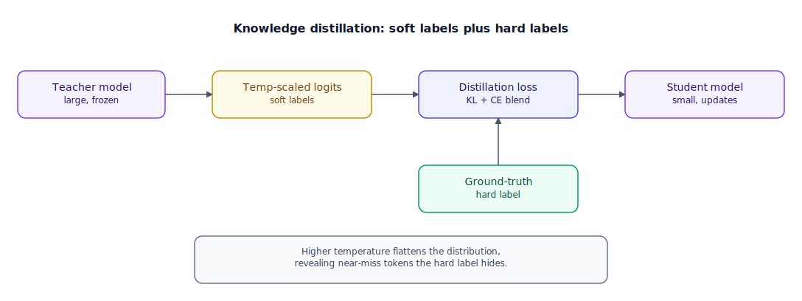

## The 30-second version

Knowledge distillation trains a small "student" model to reproduce what a large "teacher" model knows, and it's the real reason so many compact open-weight models now perform far above what their parameter count alone would predict. The simplest version just copies the teacher's final answers (hard-label distillation); the version that carries most of the signal trains the student to match the teacher's full probability distribution over possible next tokens, softened by a temperature parameter, so the student learns not just what's right but which wrong answers were close calls and which weren't (soft-label distillation). Distillation now also underwrites the reasoning-model wave: a model can generate many candidate solutions to a hard problem, keep only the ones a verifier confirms are correct, and retrain on those — distilling from a filtered version of itself.

## The analogy

A chess grandmaster agrees to coach a promising junior player for a season. The fastest way to teach would be to play out a thousand positions and, at each one, announce the single best move — "here, this is correct" — and let the junior memorize the list. That works, but it throws away almost everything the grandmaster actually knows about the position.

What a serious coach does instead is share the full evaluation. At a tense middlegame position, the grandmaster doesn't just say "knight to f5." They lay out the top four or five candidate moves with how close each one actually was — knight to f5 wins clearly, but a queen trade was nearly as strong, a pawn push a distant third worth knowing about, everything else flatly bad. That ranked, weighted picture — not just the winner, but exactly how close the near-misses were — is a far richer lesson, because it teaches which alternatives were genuinely dangerous and which were never in contention. The coach can even dial how much nuance to reveal: explained sharply, only the best move sounds worth considering; explained more loosely, the near-misses become visible as real contenders instead of buried under the winner's confidence.

There's a deeper way to coach, available only if the grandmaster opens up their actual thought process rather than just their move choices. Instead of watching which moves get played in public games, the junior sits beside them during a private analysis session and studies the calculation itself — which lines got considered and discarded, and why. That requires the grandmaster's actual working notes, not just replays of published games.

For the hardest positions — where even a grandmaster isn't certain of the best line at a glance — there's a third method needing no coach at all: the player analyzes one difficult position sixty-four different ways, and only a handful of those lines demonstrably lead to a won endgame when checked against a tablebase. Every unsuccessful line is discarded; only the verified winners get written into the training notebook.

Finally, every strong player keeps a fast, low-precision "blitz instinct" alongside their full, deep-calculation classical game — an intuition trained to approximate, in five seconds, a judgment their classical self would reach in twenty minutes. That instinct comes from being coached, move after move, by the player's own slower, more careful analysis.

| Chess coaching, grandmaster to junior | Knowledge distillation |
|---|---|
| Announcing only the single winning move | Hard-label distillation — student learns the teacher's top answer only |
| Ranking the top few moves with how close each one was | Soft-label distillation — student learns the teacher's full probability distribution |
| Explaining more sharply vs. more loosely | Temperature — how much the softmax is flattened before comparison |
| Studying the grandmaster's private calculation notes, not just their public games | Feature/hidden-state distillation — needs the teacher's internal weights, not just its output |
| Discarding all but the handful of lines a tablebase actually confirms win | Self-distillation from verified reasoning traces |
| A fast blitz instinct trained by one's own slower, deeper calculation | Quantization-aware distillation — a low-precision model guided by its own full-precision version |

## How it actually works

Follow the diagram left to right. The **teacher model** — large, already trained, frozen for the run — produces, for any input, a full set of raw scores (logits) over every possible next token, not just the one it ultimately picks. Turning those into **temperature-scaled logits** creates the richer signal: each logit is divided by a temperature T (commonly 2 to 5) before the softmax. Dividing by a number greater than 1 compresses the gaps between logits, spreading probability mass from the top answer onto the next few plausible ones — "ranking the top few moves," done mathematically.

That softened distribution feeds the **distillation loss**, where the diagram's second input — the plain **ground-truth hard label** — comes back in. Real pipelines blend a standard cross-entropy loss against the true label with a KL-divergence loss between the teacher's and student's temperature-scaled distributions, weighted by a coefficient α. One detail that trips people up: dividing logits by T shrinks the gradient magnitude from the softened distribution, so the KL term is typically rescaled by T² — skip that and the soft-label signal quietly gets drowned out no matter how large α is set.

The **student model** — often 10 to 50 times fewer parameters — trains against that combined loss. What makes soft labels worth it is exactly what the temperature math reveals: a hard label says "this token, probability 1, everything else 0," while a soft label at T = 3 says "this one's favored, but that one's a real contender too" — signal about the *shape* of the teacher's uncertainty, sometimes called dark knowledge. It's a meaningful part of why a well-distilled small model can outperform an equally-sized model built on raw data alone: the student picks up the teacher's sense of which wrong answers were dangerous, not just which answers were correct.

Standard output distillation only needs API access to the teacher's outputs, which is why most teams use it. **Feature distillation** goes further, matching the teacher's internal hidden-state representations layer by layer — the private-notes version from the analogy — but only works when the teacher's weights are actually available, ruling out any API-only teacher.

For reasoning models, distillation shows up in a third form with little to do with soft labels: **self-distillation from verified reasoning traces**. A model generates many candidate chains of thought, a verifier checks which reach the correct answer, and only verified-correct chains become training data — the model coaching its next version using only its own checker-confirmed work, a large part of what makes reasoning post-training possible without an outside teacher.

**Quantization-aware distillation** applies the same structure to a different goal: a full-precision copy of a model teaches a low-precision copy of the *same* model to make the same decisions despite coarser resolution, closing most of the accuracy gap naive quantization leaves behind — the identical mechanism, applied to precision instead of size.

## A concrete example

Take a single next-token prediction where the teacher's raw logits for the four most relevant candidate tokens are 8.2 (the correct token), 6.9 (a plausible near-miss), 5.1 (a distant third option), and 2.0 (clearly wrong).

**At T = 1** (standard softmax): probabilities work out to roughly 75.8%, 20.6%, 3.4%, and 0.2%. A hard label collapses this to a single 100%-or-0% target on the correct token — every bit of information about the 20.6% near-miss is thrown away.

**At T = 3**, each logit is divided by 3 first: 2.73, 2.30, 1.70, 0.67. Recomputing gives roughly 46.9%, 30.4%, 16.7%, 5.9%. The ranking didn't change — the correct token is still first — but the near-miss moved from a barely-visible 20.6% to a prominent 30.4%, and the third option from invisible (3.4%) to clearly present (16.7%). That's the whole soft-label mechanism in one step: temperature doesn't change the ranking, it changes how much of its texture survives into the training signal.

**Scale, for context.** Distilling a 405-billion-parameter teacher to an 8-billion-parameter student is roughly a 50x reduction (405/8 ≈ 50.6). A typical run — 500,000 prompt-response pairs, averaging 800 combined tokens, 3 epochs — processes 500,000 × 800 × 3 = **1.2 billion tokens** total, a rounding error next to the trillions a pretraining run consumes, which is why distillation is the cheap step teams reach for once the teacher is already trained.

**Self-distillation from proof.** Say the model attempts a hard olympiad problem 64 times. A verifier confirms only 5 of the 64 reach the correct answer with valid steps: 5/64 ≈ **7.8%**. Those 5 chains, and only those 5, become training examples; the other 59 (92.2%) are discarded regardless of how confident they read — the training set is roughly 13x smaller (64/5 ≈ 12.8) than the attempts it took to produce it, which is the entire point of the verifier.

## The tradeoffs that matter

| Method | What it needs | Signal richness | Reach for it when |
|---|---|---|---|
| Hard-label distillation | API access to teacher outputs only | Low — final answer only | A quick baseline, or the teacher only exposes top output |
| Soft-label distillation | Teacher's logits (or top-k logprobs) at some temperature | High — captures near-miss structure | You can get logprobs from the teacher and want the accuracy gain soft labels reliably provide |
| Feature/hidden-state distillation | Teacher's weights and architecture (open-weight only) | Highest — matches internal representations, not just output | Both models are open-weight and you need maximum quality transfer |
| Self-distillation from verified traces | A programmatic verifier for the target domain | High, and self-supervising — no external teacher needed | Reasoning domains with checkable answers (math, code, logic) |
| Quantization-aware distillation | A full-precision copy of the same model | Recovers most of quantization's accuracy loss | Deploying at lower precision and the naive-quantization accuracy gap matters |

The ceiling on any of these methods is the teacher, not the technique — a student can approach but not exceed a teacher's own competence on tasks the teacher genuinely understands. Self-distillation is the one exception, since the "teacher" there is really the model's own verified-correct output, filtered by something more reliable than the model's own confidence.

## Where people go wrong

1. **Using hard labels and wondering why the student underperforms.** Skipping soft labels throws away most of what makes distillation better than training a same-sized model from scratch — it's the single biggest lever in the technique.
2. **Picking a temperature and never revisiting it.** Too low and near-miss information barely shows; too high and the teacher's actual ranking gets buried in noise — a real hyperparameter, not a constant.
3. **Assuming API-only distillation equals feature distillation.** Matching final output is a meaningfully weaker signal than matching internal representations, and may run into terms-of-service restrictions on training a competing model from a provider's outputs.
4. **Treating a distilled student's confident tone as evidence of matching depth.** A student can learn to sound like the teacher well before internalizing the reasoning behind it — confident, fluent, wrong answers later.
5. **Skipping verification on self-distilled reasoning traces.** Training on unverified chains reintroduces the compounding-error risk synthetic data generation warns about — the verifier is the entire reason self-distillation is safe.

## The interview lens

Interviewers use this topic to check whether you understand distillation as a richer training signal, not just "a smaller model copying a bigger one" — and whether you know where the technique's real limits are.

A strong sound bite: *"The value in distillation isn't that the student sees the teacher's answers — it's that soft labels reveal the teacher's full ranking over plausible answers, not just the winner. That's a denser training signal per example than any hard-labeled dataset can give you, which is why a well-distilled small model routinely beats an equally-sized model built on raw data alone, token budget for token budget."*

Likely follow-ups:

- Walk me through what changes in the loss function when you add a soft-label term, and why the T² rescaling matters.
- When would feature distillation be worth the requirement that the teacher be open-weight?
- How does self-distillation from verified traces avoid the model-collapse risk that plain synthetic data generation runs into?

## Go deeper

- [Synthetic Data Generation](./synthetic-data-generation.mdx) — the data-quality problem distillation's soft labels and verifiers both help solve.
- [RLVR and Reasoning Models](./rlvr-and-reasoning-models.mdx) — where self-distillation from verified traces comes from, and why it's the cheaper alternative to running RL directly.
- [Quantization Deep Dive](./quantization-deep-dive.mdx) — the mechanics quantization-aware distillation builds on top of.
- Upstream reference: [Knowledge Distillation — AI System Design Guide](https://github.com/ombharatiya/ai-system-design-guide/blob/main/03-training-and-adaptation/05-knowledge-distillation.md) (MIT; see [CREDITS](../../../CREDITS.md)).
