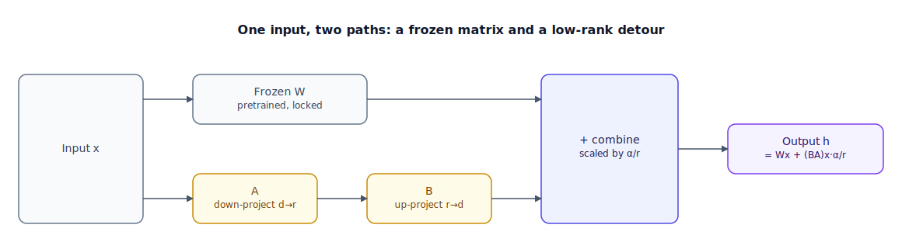

## The 30-second version

Low-Rank Adaptation (LoRA) freezes the entire pretrained weight matrix and learns a tiny additive update instead of touching the original weights at all: the update is represented as the product of two small "thin" matrices whose combined parameter count is a small fraction of the frozen matrix's. QLoRA pushes this further by compressing the frozen base itself down to 4-bit precision while keeping the small trainable update at full precision, which is what lets you fine-tune a large model on a single high-end consumer GPU instead of a datacenter cluster. Because the base weights never move, you can train many different adapters against the exact same frozen model and hot-swap between them per request — one shared, expensive base, many cheap, specialized overlays. This is now the default way production teams adapt large models; full-parameter fine-tuning is reserved for the cases a small adapter genuinely can't represent.

## The analogy

Picture how a car manufacturer actually builds a model lineup. Designing and validating a vehicle platform — the chassis, the crash structure, the drivetrain mounting points — is enormously expensive: years of engineering, wind-tunnel time, safety certification. Once it exists, the manufacturer doesn't re-engineer a new platform for every trim level it sells. The base platform stays exactly as validated, untouched, for the entire life of the model line.

What changes between a base trim, a Sport trim, and a Luxury trim is a small, cheap trim package: bolt-on parts — badges, a grille, upgraded seats, a suspension tune — attached only at a handful of predefined points the platform was designed to accept (fender mounts, interior trim rails, the ECU's tuning parameters). The package never touches the chassis or requires re-certifying the crash structure. And it's specified compactly: no engineer hand-draws a bespoke blueprint for every bolt — a short option-code sheet, a handful of codes, fully determines which of the platform's thousands of attachment points get modified and by how much. A dealership can even swap which trim package sits on a given platform late on the line, without touching the multi-year investment underneath it.

Two more things a car lineup gets you. The factory sometimes keeps the shared platform's blueprints in a compressed, lower-fidelity CAD format on the general floor — full precision isn't needed everywhere, only where trim-specific tooling actually gets cut. And because every trim only ever adds to a validated platform, a dealer lot can carry a Sport, an Eco, and a Luxury trim of the identical chassis run, and hand a buyer whichever one they want without re-manufacturing anything.

| Car platform & trim packages | LoRA / QLoRA / PEFT |
|---|---|
| The validated vehicle platform, expensive, built once | The frozen pretrained weight matrix W |
| A trim package's short option-code sheet | The low-rank adapter matrices A and B (rank r) |
| A bespoke, from-scratch blueprint for every bolt on a one-off car | Full-parameter fine-tuning — updating every weight in W |
| Attachment points the platform was designed to accept (fenders, trim rails, ECU) | Target modules — which weight matrices get adapters |
| Swapping the Sport trim for the Eco trim on the same platform, same day | Multi-adapter serving — hot-swapping LoRA adapters on one shared frozen base |
| The compressed, lower-fidelity CAD copy of the platform kept on the general floor | QLoRA — the frozen base stored in 4-bit (NF4) precision |
| The full-precision tooling still used to cut trim-specific parts | Adapter weights trained and stored at full precision even though the base is 4-bit |
| The option-code count needed to fully specify a trim package | Rank r — how many "directions" the adapter can represent |

## How it actually works

Follow the diagram's two paths. For a pretrained weight matrix W (say d × d), instead of learning a full update ΔW directly — which would cost d² parameters — LoRA factors that update as the product of two small matrices: A, sized r × d, and B, sized d × r, where rank r is deliberately tiny compared to d (r = 16 against d = 4,096 is typical). The trainable parameter count becomes 2 × d × r instead of d², which is the entire efficiency gain. The forward pass computes both paths and adds them: output = Wx + (BA)x · (α/r), where α is a scaling constant, commonly set to twice the rank, so that changing rank later leaves the effective update magnitude — and the learning rate you already tuned — consistent. W itself never receives a gradient; only A and B do. Historically, teams targeted only the query and value projections; the modern default targets every linear layer (query, key, value, output, and the feed-forward network's gate/up/down projections), which measurably improves stability and quality even at low rank.

**QLoRA** extends this recipe by quantizing the frozen base itself to 4-bit NF4 (NormalFloat4) — a data type whose 16 representable values are spaced so each bin captures an equal share of probability mass under the roughly-normal distribution most trained weights follow, rather than a uniform grid that wastes resolution on rare values (more in the [quantization chapter](./quantization-deep-dive.mdx)). It adds two more tricks: double quantization, which quantizes the quantization constants themselves for a further small saving, and paged optimizer states, which spill to CPU memory during a spike instead of crashing the job. The adapter matrices A and B still train at full precision — only the frozen, never-updated base gets compressed.

Two variants worth knowing: DoRA decomposes each weight update into a magnitude component and a direction component, letting them adjust somewhat independently, and typically converges faster and closer to full fine-tuning quality at the same rank. RS-LoRA replaces the α/r scaling with α/√r, which keeps training stable at much higher ranks (256 and above) than standard scaling tolerates.

In production, the payoff shows up at serving time. Because dozens or hundreds of adapters can share one frozen base model resident in GPU memory, a serving stack batches requests bound for different adapters together and applies each request's small A/B matrices on the fly — at a modest latency overhead over the base model alone — instead of hosting a separate full model copy per task.

## A concrete example

Take a 7B-parameter model with hidden dimension d = 4,096, targeting just the query and value projection matrices across 32 transformer layers (a common minimal target set).

**Parameter count.** Each targeted matrix is 4,096 × 4,096 = 16,777,216 parameters. Across query and value in 32 layers (64 matrices total): 64 × 16,777,216 ≈ **1.074 billion** parameters — what full-parameter fine-tuning of just these two projections would touch.

A LoRA adapter at rank r = 16 replaces each matrix with A (16 × 4,096 = 65,536 params) and B (4,096 × 16 = 65,536 params): 131,072 trainable parameters per matrix, × 64 matrices = **8,388,608 ≈ 8.39M** trainable parameters — 8.39M / 1.074B ≈ **0.78%** of what full fine-tuning would touch, comfortably under the "less than 1%" rule of thumb.

**VRAM.** Standard mixed-precision training with the Adam optimizer needs roughly 16 bytes of state per trainable parameter (a bf16 working copy of the weight, a bf16 gradient, two fp32 optimizer moments, and an fp32 master copy of the weight), before activations. Full fine-tuning: 7×10⁹ × 16 bytes ≈ **112 GB** — beyond a single 80 GB datacenter GPU before you've loaded a single activation. QLoRA: the 7B frozen base needs no optimizer state at all (it never updates) and stores at 4-bit ≈ 7×10⁹ × 0.5 bytes = **3.5 GB**; only the 8.39M adapter parameters carry the 16-bytes/param overhead — 8.39×10⁶ × 16 bytes ≈ **134 MB**. Base plus adapter state: 3.5 GB + 0.134 GB ≈ **3.6 GB** — small enough, even with activation memory on top, to fit comfortably on a single 24 GB consumer GPU.

**Scaling.** Set α = 2r = 32, giving a scaling factor α/r = 32/16 = 2. Raise the rank later to r = 64 with α = 2r = 128, and the scaling factor is still 128/64 = 2 — the same effective update magnitude, so the learning rate you already tuned still applies without retuning.

## The tradeoffs that matter

| Choice | Upside | Cost | Breaks down when |
|---|---|---|---|
| Low rank (r = 8-16) | Minimal trainable parameters, fastest training, easy to serve many adapters | Limited capacity — may underfit tasks requiring a large behavior shift | The target skill needs more representational capacity than a thin bottleneck can hold |
| High rank (r = 64-256) | Closer to full fine-tuning capacity and quality | More trainable parameters and VRAM; needs careful scaling (e.g., RS-LoRA) to stay stable | You could have used low rank — most style or format tasks don't need this much capacity |
| QLoRA (4-bit frozen base) | Fits large-model fine-tuning on a single consumer-class GPU | Small quantization error on the frozen base; slightly slower per step from on-the-fly dequantization | You already have multi-GPU datacenter hardware — the compression buys you little |
| Targeting all linear layers vs. query/value only | Better stability and quality, especially at low rank | More trainable parameters and target points to manage | You need the smallest possible adapter and can tolerate a quality hit |
| Multi-adapter serving on a shared base | One expensive base serves many specialized tasks cheaply | Serving-stack complexity (routing, batching); modest per-request latency overhead | Every task needs a change too large for any adapter to represent — you're back to full fine-tuning per task |

## Where people go wrong

1. **Treating LoRA as strictly worse than full fine-tuning.** At a well-chosen rank with the modern all-linear-layers target set, it routinely matches full fine-tuning quality on the format and behavior tasks it's actually used for; the capacity gap mostly shows up on tasks needing a very large behavior shift.
2. **Picking rank arbitrarily instead of matching it to the task.** A low rank tuned for a simple tone change will visibly underfit a task requiring new structured reasoning, and a needlessly high rank on a simple task just burns VRAM and training time.
3. **Forgetting that alpha and rank move together.** Changing rank without adjusting alpha (or using rank-stabilized scaling) silently changes the effective update magnitude, which looks like a learning-rate problem and gets "fixed" by the wrong knob.
4. **Assuming QLoRA is free.** The base model's 4-bit compression introduces a small, real quantization error, and on-the-fly dequantization during the forward pass adds latency that pure LoRA — base kept in bf16 — doesn't pay.
5. **Serving one adapter per GPU instead of batching adapters together.** That throws away PEFT's biggest production advantage: many specialized behaviors sharing one resident base model.

## The interview lens

Interviewers use this to check whether you understand the actual mechanism — a low-rank factorization of a weight update, not "a smaller version of fine-tuning" — and whether you can reason about the production payoff, not just the training-time savings.

A strong sound bite: *"LoRA's real advantage isn't just that training is cheaper — it's that the base model never moves, so one frozen, expensive model can serve a hundred cheap, swappable adapters in production instead of a hundred separate model copies."*

Likely follow-ups:

- Walk me through why a single LoRA adapter costs 2 × d × r parameters rather than d², and what happens to the total as you target more matrices across more layers.
- When would you reach for full-parameter fine-tuning instead of LoRA, even knowing it costs more?
- How does QLoRA keep training stable while the base model sits in 4-bit precision?

## Go deeper

- [Fine-Tuning Strategies](./fine-tuning-strategies.mdx) — the decision this chapter's mechanics sit underneath.
- [Quantization Deep Dive](./quantization-deep-dive.mdx) — how NF4 and its alternatives actually work.
- [Serving Infrastructure](../inference/serving-infrastructure.mdx) — how a production stack batches requests across many resident adapters.
- Upstream reference: [LoRA, QLoRA, and PEFT — AI System Design Guide](https://github.com/ombharatiya/ai-system-design-guide/blob/main/03-training-and-adaptation/03-lora-qlora-peft.md) (MIT; see [CREDITS](../../../CREDITS.md)).
