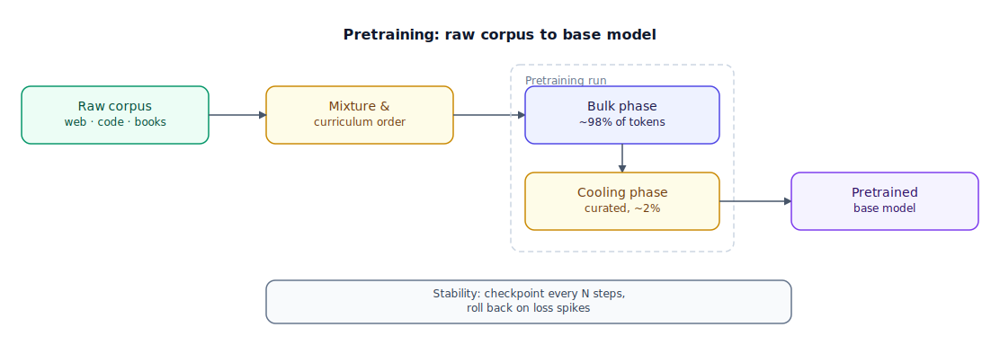

## The 30-second version

Pretraining is the single most expensive step in building a large language model (LLM): a base model learns grammar, world knowledge, and reasoning patterns by predicting the next token across trillions of words of raw text, with no human-labeled examples at all. Two levers dominate the outcome — the data mixture (what fraction of tokens come from web pages versus code versus books) and the token budget (how many tokens you run through a model of a fixed size). Classic scaling-law guidance says a model needs roughly 20 tokens per parameter to minimize training loss for a given compute spend — but production teams now deliberately blow past that ratio by 50-100x or more, because a smaller model trained longer costs far less to serve for the rest of its life than a bigger, "training-optimal" one. Pretraining hands you a raw, general-purpose base model; fine-tuning and alignment, covered in later chapters, turn it into something that reliably follows instructions.

## The analogy

Picture a foundry casting a steel ingot. Designing and running the furnace is the expensive part: raw ore, scrap, and alloying additives get sourced from many suppliers, melted together over weeks, and cast into a single large ingot that everything downstream will be shaped from. Nobody re-runs the furnace per finished part; the ingot is the shared, foundational investment.

What goes into that furnace matters as much as how long it runs. The foundry mixes ore, carbon, and additives in specific ratios, because the wrong mixture produces steel that's brittle in some ways and soft in others. The pour isn't uniform either: it starts with the bulk of the raw material, and finishes with a **cooling stage** — a slow, controlled temperature-drop, sometimes using a higher grade of material, that sets the metal's final crystal structure. Metallurgists call this step annealing, and it's not decorative: rush it and the ingot comes out internally stressed, prone to cracking under load later. A sudden temperature spike mid-pour can crack the whole ingot outright, which is why foundries watch the pour constantly and intervene the moment something goes wrong.

Here's the choice that surprises people outside the industry: a foundry will sometimes deliberately cast a smaller, denser ingot than the furnace run alone would suggest is "efficient," because a rolling mill downstream is going to reshape that ingot into finished parts millions of times over the following years. A smaller, denser ingot mills faster and pays for its slightly pricier casting many times over across its working life. The furnace run is a one-time cost; everything the ingot becomes afterward is a recurring one.

| Foundry & steel casting | Pretraining |
|---|---|
| Raw ore, scrap, and additives from many suppliers | The raw corpus — web text, code, books, papers, synthetic data |
| The ore/carbon/additive mix ratio loaded into the furnace | The data mixture — the percentage weighting of each source |
| The furnace run itself, continuous heat for weeks | The pretraining run — next-token prediction across thousands of GPUs |
| The final slow-cooling (annealing) stage that sets the crystal structure | The "cooling" phase — a small closing slice of tokens drawn from curated, high-quality data |
| A sudden temperature spike cracking the ingot mid-pour | A loss spike partway through training |
| Casting a smaller, denser ingot because the rolling mill will reshape it millions of times | Overtraining a small model well past the training-optimal token count, because inference cost recurs forever |
| Switching the furnace to a faster, lower-fuel firing mode without cracking the pour | Training in FP8 instead of BF16 numeric precision |

## How it actually works

Follow the diagram left to right. Pretraining uses **causal language modeling**: the model sees a stretch of tokens and is trained to predict the next one, over and over, with the loss being the cross-entropy between its predicted distribution and the actual next token. That's the entire supervisory signal — no human ever labels "this is a good answer." At sufficient scale, this simple objective produces a model with broad world knowledge, working grammar in dozens of languages, and rudimentary reasoning, purely as a side effect of getting good at next-token prediction.

The **raw corpus** node is rarely one thing. A typical mix draws roughly half from general web crawl (broad but noisy), a meaningful slice from source code (which measurably improves non-coding reasoning too — writing correct code forces a kind of structured, step-by-step thinking that transfers), a slice from books and long-form text (narrative coherence, long context), a slice from academic and reference material (specialized vocabulary and facts), and a smaller slice of synthetic data from another model (math, logic, and instruction-following patterns rare in naturally occurring text). Getting the *ratios* right, and aggressively deduplicating and quality-filtering before any of it reaches the furnace, matters more at the current data scale than simply finding more raw tokens.

The **pretraining run**, boxed in the diagram, has two distinct phases. The bulk phase burns through the vast majority of tokens in whatever mixture and order the curriculum specifies. The **cooling phase** — the diagram's second, smaller stage — spends a small closing slice of tokens, typically low single-digit percent of the total, on a much higher-quality, often human-curated subset, sometimes at a gradually reduced learning rate. This isn't an afterthought: this late-stage exposure to clean, well-structured examples measurably improves instruction-following and output quality before any dedicated fine-tuning happens, for a tiny fraction of the total training cost. It's why "data mixture" and "data curriculum" are different questions — mixture is *what* fraction comes from where; curriculum is *the order* it's shown in, and the same mixture cooled at the end versus shuffled uniformly throughout produces measurably different models.

Underneath both phases sits the stability problem noted at the bottom of the diagram. A run spanning thousands of GPUs for weeks will, empirically, hit loss spikes — sudden jumps that, left unchecked, can derail the whole run. The standard defense is frequent checkpointing paired with automatic rollback: detect the spike, restore the last good checkpoint, adjust, and resume, rather than losing days of compute to a single bad batch. Numeric precision is the other lever: BF16 (16-bit) has been the stability baseline for the last few years, while FP8 (8-bit), now natively supported on recent-generation accelerators, roughly doubles throughput and halves memory — at the cost of a narrower dynamic range that needs careful scaling and stochastic rounding to stay stable.

## A concrete example

Take an 8-billion-parameter (8B) model as the running example.

**Training-optimal token count.** Classic scaling-law guidance puts the compute-optimal ratio at about 20 tokens per parameter: 20 × 8B = **160B tokens**. Training compute scales (very roughly) as 6 × parameters × tokens, so this run costs about 6 × 8×10⁹ × 160×10⁹ ≈ **7.68×10²¹ floating-point operations (FLOPs)**.

**What frontier teams actually do.** Instead of 160B tokens, an 8B model gets trained on something like **15 trillion (15T) tokens** — 15,000B / 160B ≈ **93.75x** more tokens than the training-optimal point. Compute scales roughly linearly with tokens at a fixed parameter count, so the total training compute for that run is also about 93.75x higher: 93.75 × 7.68×10²¹ ≈ **7.2×10²³ FLOPs** — a training run that costs nearly two orders of magnitude more than "efficient" would suggest.

**Where the data goes.** Using a representative mixture — 55% web, 18% code, 8% books, 9% academic/reference, 10% synthetic (55+18+8+9+10 = 100) — 15T tokens splits into roughly 8.25T web, 2.7T code, 1.2T books, 1.35T academic, and 1.5T synthetic tokens. A 2% cooling phase at the end of that run is 0.02 × 15T = **300B tokens** of curated data — nearly twice the entire training-optimal token budget of the 160B-token run above, spent on quality alone.

**Why anyone would pay for that.** The payoff shows up at inference, not training. A standard approximation puts inference cost at about 2 × parameters FLOPs per generated token. For the 8B model: 2 × 8×10⁹ = **16 gigaFLOPs (GFLOPs) per token**. For a hypothetical 70B model trained to similar quality the training-optimal way: 2 × 70×10⁹ = **140 GFLOPs per token** — 140/16 = **8.75x** more compute per token than the overtrained 8B model. Training cost is paid once; a model queried billions of times over its production life pays its per-token inference cost on every single one of those calls, so an 8B model that costs 93.75x more to *train* than the textbook-optimal point can still be far cheaper over its lifetime.

## The tradeoffs that matter

| Choice | Upside | Cost | Breaks down when |
|---|---|---|---|
| Training-optimal token budget (~20:1 tokens:params) | Cheapest path to a given training loss for a fixed compute budget | Produces a larger model than necessary for the target quality — expensive to serve forever | You're optimizing training compute specifically, not lifetime serving cost — rare outside pure research |
| Overtraining past training-optimal (100-1000+ tokens per param) | Smaller model, comparable or better quality, far cheaper and faster to serve at scale | The training run itself costs much more, and needs a large, clean corpus to avoid repeating data too many times | You'll only ever run the model a handful of times — training cost dominates, not inference |
| More code in the mixture | Measurably improves general reasoning, not just coding ability | Less budget left for broad web-text world knowledge | The target use case has nothing to do with structured or logical tasks |
| Cooling on curated data at the end | Cheap, outsized jump in instruction-following and output quality before any fine-tuning | Curated data is scarce and expensive to build well; too much of it distorts broader coverage | The curated set is small enough, or narrow enough, to overweight and skew the model |
| FP8 training precision | Roughly 2x throughput and memory savings over BF16 on supported hardware | Narrower dynamic range risks instability without careful scaling and rounding | Your hardware or framework doesn't support the safeguards needed to keep FP8 stable |

## Where people go wrong

1. **Treating "more data" as an unconditional good.** Duplicate or low-quality tokens actively hurt, which is why deduplication and quality filtering are now bigger differentiators than raw corpus size.
2. **Assuming scaling laws tell you the "right" model size for production.** They tell you the training-compute-optimal size for a target loss — a different problem from the cheapest-to-serve size, which is what production teams actually care about.
3. **Believing pretraining teaches "facts" the way fine-tuning or retrieval do.** It mostly builds general language competence and diffuse latent world knowledge that's hard to target or update; current or private facts belong in retrieval, not more pretraining tokens.
4. **Ignoring training stability until a run is already underway.** A loss spike halfway through a multi-week run on thousands of GPUs is enormously expensive to recover from without checkpoints already in place.
5. **Conflating data mixture with data curriculum.** Mixture is what fraction of tokens comes from where; curriculum is the order they're shown in — and the two matter independently.

## The interview lens

At senior level, nobody asks you to define pretraining. Interviewers probe whether you understand that pretraining and inference sit on the same cost ledger, and that scaling laws answer a narrower question than people assume.

A strong sound bite: *"Classic scaling laws tell you how to minimize loss for a fixed training budget — they say nothing about serving cost, so production teams intentionally overtrain small models by 50-100x past that point, because you pay for training once but pay for inference on every single request, forever."*

Likely follow-ups:

- If scaling laws say a 70B model is training-compute-optimal for a given loss target, why would a company ship an "overtrained" 8B model instead?
- How would you detect and recover from a loss spike in a run spanning thousands of GPUs?
- What's the difference between data mixture and data curriculum, and why put the best data last instead of first?

## Go deeper

- [Fine-Tuning Strategies](./fine-tuning-strategies.mdx) — what happens to the base model this chapter produces.
- [Transformer Architecture](../foundations/transformer-architecture.mdx) — the architecture the pretraining objective actually shapes.
- [Pricing and Costs](../models/pricing-and-costs.mdx) — why the inference-cost payoff of overtraining a small model matters in production.
- Upstream reference: [Pretraining Basics — AI System Design Guide](https://github.com/ombharatiya/ai-system-design-guide/blob/main/03-training-and-adaptation/01-pretraining-basics.md) (MIT; see [CREDITS](../../../CREDITS.md)).
