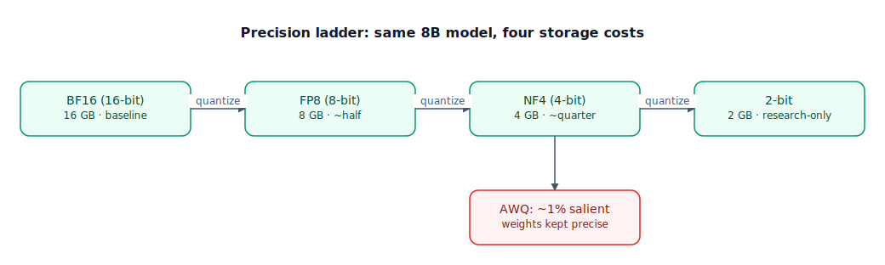

## The 30-second version

Quantization shrinks the numeric precision used to store and compute a model's weights — from 16-bit floats down to 8-bit, 4-bit, or lower — trading a small, usually tolerable amount of accuracy for a large cut in memory footprint and often faster inference. The naive approach spreads a fixed number of representable values evenly across the full range of weight values, which wastes precision on values that barely occur; the methods that actually ship in production spend their limited bits where the data actually is — more resolution where weight values cluster, or extra precision reserved specifically for the small fraction of weights that matter most to the output. Quantization isn't only about weights, either: for long-context serving, the key-value (KV) cache — the model's working memory during generation — is typically quantized separately and independently, because at long context lengths it can outgrow the model's own weight footprint entirely. Get the method and bit-width right and a 4-bit model is close to indistinguishable from full precision on quality; get it wrong and you get a model that's fast, cheap, and visibly worse.

## The analogy

A recording studio finishes a song and exports the master: a pristine, uncompressed studio file, every sample at full bit depth. That master is enormous, and complete overkill for someone streaming it over a mediocre connection. So the studio compresses it for distribution — fewer bits per sample, a fraction of the file size, small enough to stream instantly.

The lazy way to compress is chopping bits off evenly across the entire frequency range — treating a barely-audible 19kHz shimmer the same as the midrange vocal carrying the whole song. It technically shrinks the file, but it wastes bit budget on frequencies nobody will miss while stealing resolution from the part everyone is actually listening to.

A smart encoder spends its bit budget where hearing is actually sensitive — generously where the ear does most of its work, sparingly at the extremes most listeners can't distinguish. Same file size, dramatically better perceived quality, because the compression follows where the information that matters actually lives.

Some mastering engineers go further still: before compressing the full mix, they run a quick listening pass, flag the handful of elements — maybe just the lead vocal — that audibly fall apart under compression, and keep that one element at a higher bitrate while compressing the rest normally, a small preserved slice chosen by testing what actually matters, not by guessing. And streaming isn't only about a finished file — a live broadcast compresses the audio signal itself, in real time, a different problem from compressing a finished master ahead of time. An engineer who already knows a track is headed for heavy compression can also mix with that in mind from the start, so the final product survives the crush instead of falling apart under it.

| Audio mastering & streaming | Quantization |
|---|---|
| The pristine, uncompressed studio master | The full-precision model (BF16/FP32 weights) |
| Exporting a compressed file for streaming | Post-training quantization to a lower bit-width (FP8, INT4) |
| Chopping bits evenly across the whole frequency range | A naive uniform quantizer, spreading its grid evenly across the full range of weight values |
| Spending more bits where the ear is most sensitive | NF4 — more quantization bins where trained weight values actually cluster (near zero, roughly normal) |
| Flagging the one element that needs to stay high-bitrate | AWQ — a calibration pass that finds the small fraction of "salient" weights and keeps them at higher precision |
| A universal file format that plays on any device, a bit slower to decode | GGUF — cross-platform, CPU+GPU, single-file, portable |
| A format tuned for one playback system, fastest there, nowhere else | EXL2 — GPU-only, fastest on that one hardware family, inflexible elsewhere |
| Compressing a live broadcast signal in real time as it streams | KV cache quantization — the model's working memory compressed on the fly during generation |
| Mixing with the eventual compression already accounted for | Quantization-aware training (QAT) — the model compensates for precision loss during training itself |

## How it actually works

Follow the diagram's ladder left to right. A quantizer maps a wide range of values down to a small, fixed set of representable levels, using a scale factor computed from the data being compressed. **BF16** (16-bit) is the reference precision — full dynamic range, no meaningful quality loss, the baseline every other tier is measured against. **FP8** (8-bit) is now hardware-native on recent-generation accelerators, halves memory, and typically costs less than 1% in measured quality for a well-calibrated setup. **4-bit** (INT4 or NF4) is the practical floor for general-purpose deployment: a real, small quality cost for a quarter of the original memory footprint. Below that, **2-bit and lower** trades away enough accuracy that it mostly stays in research and narrow, well-tested use cases.

The step from FP8 to 4-bit is where the interesting engineering lives. **NF4** (NormalFloat4) doesn't use a uniform grid. Trained weight values cluster tightly around zero in something close to a normal distribution, so NF4 places its 16 representable values so each bin captures an equal share of probability mass under that distribution — dense resolution where values actually are, coarser resolution at the rare extremes, instead of wasting levels on values that almost never occur.

Two competing methods decide *which* weights get quantized how aggressively. **GPTQ** quantizes layer by layer, choosing each layer's quantized values to minimize the layer's *output* error over a small calibration set, guided by second-order information about which weights that output is most sensitive to. **AWQ** (Activation-aware Weight Quantization), the diagram's protected branch off the 4-bit tier, starts from a different observation: a small salient fraction of weights — commonly cited around 1% — sees disproportionately large activations in practice, and protecting just that fraction (in the shipped implementation, by rescaling salient channels before quantization so they lose far less to rounding) preserves most of the model's quality. Because it explicitly targets the weights the model leans on hardest, AWQ tends to hold up better at aggressive bit-widths (3-bit) and on smaller models.

Deployment format is a separate decision from bit-width. **GGUF**, from llama.cpp, is single-file, portable, and runs on CPU with optional GPU offload, trading some throughput for reach across hardware. **EXL2** is GPU-only, tuned specifically for NVIDIA hardware, and is typically fastest if your entire deployment lives there and doesn't need portability.

None of the above touches the **KV cache** — the running record of every previous token's key and value vectors the model keeps for the rest of a generation. At long context lengths this cache grows linearly with sequence length and can dwarf the weight footprint entirely (worked out below), so serving frameworks now quantize it independently, on the fly, as tokens stream in and out — a decision made separately from whatever bit-width the weights are stored at.

Finally, everything above is **post-training quantization** — compressing a model that's already finished training. **Quantization-aware training (QAT)** instead simulates the quantization *during* training, so the model's own weights adjust to compensate for the coming precision loss before it happens. This is generally necessary, not optional, for small models to stay usable at 4-bit — they have less redundancy to absorb quantization error after the fact.

## A concrete example

**Weight memory, an 8B model, four tiers.**

- BF16 (2 bytes/param): 8×10⁹ × 2 = 16×10⁹ bytes = **16 GB**.
- FP8 (1 byte/param): 8×10⁹ × 1 = **8 GB** — exactly half of BF16, as expected.
- NF4/INT4 (0.5 bytes/param): 8×10⁹ × 0.5 = **4 GB** — a quarter of BF16.
- 2-bit (0.25 bytes/param): 8×10⁹ × 0.25 = **2 GB** — an eighth of BF16.

Going from BF16 to 4-bit is the difference between "needs a datacenter GPU just to hold the weights" and "runs on a high-end laptop GPU" — before accounting for the KV cache at all.

**KV cache, independent of weight precision.** Take this 8B model with 32 layers, grouped-query attention with 8 key-value heads (far fewer KV heads than query heads is standard practice, specifically to shrink this number), head dimension 128, serving one request at 128,000 tokens of context.

KV cache size = 2 (K and V) × layers × KV heads × head dimension × tokens × bytes/element.

- BF16 cache: 2 × 32 × 8 × 128 × 128,000 × 2 bytes = 16,777,216,000 bytes ≈ **16.8 GB** — almost exactly as large as the entire model's 16 GB of BF16 weights, from a *single* long-context request.
- FP8 cache (1 byte/element): 16.8 / 2 ≈ **8.4 GB**.
- INT4 cache (0.5 bytes/element): 16.8 / 4 ≈ **4.2 GB**.

**Combining both levers.** BF16 weights + BF16 cache = 16 + 16.8 ≈ **32.8 GB** for one long-context request — already past a single 24 GB consumer GPU. NF4 weights + FP8 cache = 4 + 8.4 ≈ **12.4 GB** — fits with room for activations. NF4 weights + INT4 cache = 4 + 4.2 ≈ **8.2 GB** — the same request, on a fraction of the hardware, because both levers were pulled independently.

## The tradeoffs that matter

| Precision | Memory vs. BF16 | Typical quality impact | Breaks down when |
|---|---|---|---|
| BF16 (16-bit) | Baseline | None — reference precision | You need to save memory or increase throughput at all |
| FP8 (8-bit) | Half | Small, usually negligible on modern hardware | Your accelerator lacks native FP8 support — you pay a software-emulation tax |
| INT4 / NF4 (4-bit) | Quarter | Small but real — usually acceptable for production | The task is precision-sensitive (exact arithmetic, tight structured output) and every point of quality matters |
| 2-bit and below | Eighth or less | Large, often visible in output quality | You're serving general-purpose traffic — mostly viable only for narrow, well-tested use cases |
| KV cache quantization (independent of weights) | Cuts cache memory 2-4x | Small, often smaller impact than weight quantization at the same bit-width | Context length is short enough that the cache was never the bottleneck |

## Where people go wrong

1. **Assuming quantization is "free" compression.** Every bit-width reduction trades away some accuracy; the real question is whether that tradeoff is acceptable for the task, not whether it exists.
2. **Using a uniform quantizer and being surprised by the quality drop.** NF4 and similar methods exist because weight values aren't uniformly distributed — a grid that ignores that wastes precision where it isn't needed and starves it where it is.
3. **Quantizing the weights and forgetting the KV cache.** At long context lengths, the cache can be the larger memory consumer, and needs its own quantization decision, independent of the weights' precision.
4. **Picking a format for the wrong deployment target.** A GPU-only format like EXL2 buys nothing on a CPU or cross-platform deployment; a portable format like GGUF leaves real throughput on the table on a homogeneous NVIDIA fleet.
5. **Applying aggressive post-training quantization to a small model and expecting frontier-model results.** Smaller models have less redundancy to absorb quantization error — exactly why quantization-aware training exists for that regime.

## The interview lens

Interviewers use this topic to check whether you understand that quantization isn't one technique with one number attached — the right choice depends on which part of the pipeline (weights vs. KV cache), which hardware, and which failure mode (uniform information loss vs. targeted salience) you're actually optimizing for.

A strong sound bite: *"Quantization only works well when the bit budget follows where the information actually is — a uniform 4-bit grid wastes resolution on values that barely occur, which is exactly the problem NF4 and AWQ solve, and the same logic applies separately to the KV cache once context gets long."*

Likely follow-ups:

- Why does the KV cache need its own quantization decision, separate from the model weights?
- How does AWQ decide which weights to protect, and why does that matter more at 3-bit than at 8-bit?
- When would you choose quantization-aware training over post-training quantization?

## Go deeper

- [LoRA, QLoRA, and PEFT](./lora-qlora-peft.mdx) — where 4-bit quantization of a frozen base and full-precision training meet.
- [KV Cache and Context Caching](../inference/kv-cache-and-context-caching.mdx) — the full mechanics behind the cache this chapter quantizes.
- [On-Device and Edge Deployment](../inference/on-device-and-edge-deployment.mdx) — where aggressive quantization becomes a hard requirement, not an optimization.
- Upstream reference: [Quantization Deep Dive — AI System Design Guide](https://github.com/ombharatiya/ai-system-design-guide/blob/main/03-training-and-adaptation/07-quantization-deep-dive.md) (MIT; see [CREDITS](../../../CREDITS.md)).
