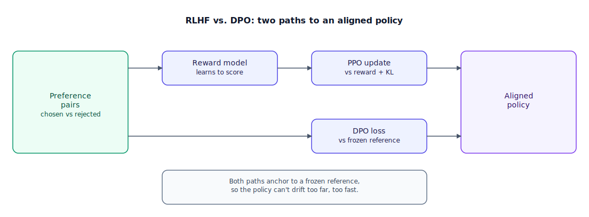

## The 30-second version

Alignment turns a pretrained model that can complete any text into one that reliably does what you actually want. The classic recipe, RLHF (Reinforcement Learning from Human Feedback), trains a separate reward model on human preference pairs, then runs an RL loop — usually PPO (Proximal Policy Optimization) — that nudges the policy toward whatever the reward model scores highly, anchored by a penalty that stops it drifting too far from a frozen reference copy of itself. DPO (Direct Preference Optimization) drops the middle model entirely: it derives a loss straight from the preference pairs that raises the odds of the preferred response and lowers the odds of the rejected one, relative to that same frozen reference. DPO won the default slot for most teams because it needs half the moving parts, trains more predictably, and reaches roughly the same place RLHF does for a fraction of the engineering cost.

## The analogy

Picture a driving school whose students already passed their written test — they know every traffic law cold but haven't been coached to the instructor's standard for a confident, polished drive. That's the pretrained model: capable, but untailored. The instructor has two ways to shape it.

The first way is how advanced coaching programs used to run. Before the student even gets back in the car, the instructor spends weeks building a scoring rubric: hundreds of hours of old footage, graded "smooth" or "rough" by senior instructors, train a machine to predict how a senior instructor would score any new clip. Only once that scoring machine exists does real coaching begin — the student drives lap after lap, the machine grades each attempt, and habits shift toward whatever earns a higher score. To stop the student from gaming the machine (flooring it out of every turn scores oddly well because the rubric never saw that pattern), the instructor also keeps a videotape of day-one driving, before any coaching, and penalizes any lap that strays too far from that original style. That's four things running at once: current driving, the untouched day-one tape, the scoring machine, and a second machine estimating how good a lap will turn out before it's finished. This is RLHF: SFT (supervised fine-tuning) gets the student behind the wheel, a reward model is the scoring machine trained on graded pairs, and PPO is the loop that updates habits against that machine while a KL-divergence penalty ties them back to the reference tape.

The second way skips the scoring machine altogether. The instructor rides along and, after two laps through the same turn, just says: "lap A was better than lap B." No rubric gets written down; instincts shift directly, making lap-A-style driving more likely and lap-B-style driving less likely, always measured against that same day-one tape so the update doesn't overcorrect. Nobody builds a scoring machine or a second model predicting how a lap will turn out partway through — it's just: this one over that one, don't drift too far from where you started. This is DPO: preference pairs go straight into a loss comparing current habits to the original tape, no reward model or RL loop in between.

One more pattern matters for later: if the instructor drills defensive driving so hard the student becomes afraid to merge confidently onto a highway, that's real damage done in the name of safety — the alignment tax, capability quietly lost while chasing a narrower goal.

| Driving-school coaching | RLHF / DPO |
|---|---|
| A student who passed the written test but hasn't been coached | The pretrained, SFT'd base policy |
| Weeks spent building a scoring machine from graded footage | Reward-model training on preference pairs |
| The original day-one driving tape, kept untouched | The frozen reference policy |
| Grading each lap live and updating habits toward a higher score | PPO's policy-gradient update against the reward model |
| Penalizing laps that stray too far from the day-one tape | The KL penalty anchoring the policy to the reference |
| "Lap A beat lap B" — instincts shift directly, no rubric written | DPO's preference pairs feeding a closed-form loss, skipping the reward model and value network |
| Drilling caution until the student is afraid to merge | The alignment tax |

## How it actually works



Both paths start from the same place: preference pairs, each a prompt with a "chosen" and "rejected" response, usually collected by asking annotators (or a stronger judge model) which of two candidates they'd rather receive.

Follow the top lane first. **Reward model training** turns those pairs into a scoring function: a separate model, usually initialized from the policy's own base, learns to score every chosen response higher than its paired rejected one. Once it exists, **PPO update** runs the RL loop — sample a response, score it with the reward model, nudge the policy toward higher-scoring responses — regularized by a KL-divergence penalty (coefficient β) that keeps the policy from wandering too far from the frozen reference in one step. Push β too low and the policy overfits to the reward model's blind spots — reward hacking, the exploit the scoring machine never saw. Push it too high and the policy barely moves. Tuning that knob is most of what makes PPO-based RLHF fiddly, on top of running four models at once — policy, reference, reward, and (for PPO) a value network estimating a partial response's eventual score.

The bottom lane skips past all of that. **DPO loss** starts from the same closed-form link between a reward function and its optimal KL-constrained policy that the reward-model derivation relies on, and works it backward: instead of fitting a reward model and running RL against it, DPO plugs the pairs directly into a loss comparing the policy's own preference for chosen-over-rejected to the reference's preference for the same pair. Push that loss down and you get PPO's same directional effect — chosen more likely, rejected less likely — with two models in memory instead of four, and a supervised-style loss instead of an RL loop, which trains far more predictably.

Both lanes converge into an aligned policy, and both lean on the same guardrail: the reference model is what stops either path from optimizing so hard toward the preference signal that the model quietly gets worse at everything the data didn't cover.

Static preference data also has a shelf life — once the policy improves past whatever generated the pairs, the signal goes stale. An online variant, Online DPO or RLOO (REINFORCE Leave-One-Out), samples fresh responses from the *current* policy each round and has a judge, model or rule-based, rank them on the spot. And for reasoning models, both methods' core assumption — that a judge can look at a *finished response* and say which is better — starts to strain: you want feedback on the reasoning that got there, not just where it landed. That shift, from grading the final answer to mechanically verifying the path, is the next chapter.

## A concrete example

Say your team is aligning a 7B-parameter support-chat model with 8,000 human-labeled preference pairs at roughly $3.50 each — about **$28,000** for the dataset, before any GPU time.

**Memory, side by side.** Both approaches need a frozen reference copy of the 7B model plus the trainable policy — each about 14 GB in bf16 (7 × 10⁹ params × 2 bytes). DPO's footprint for weights alone: 2 × 14 GB = **28 GB**. RLHF's PPO loop adds a reward model and a value network, both roughly 7B-scale: 4 × 14 GB = **56 GB**, before gradients or optimizer state for the two models that actually train — double DPO's weight footprint, which is why teams without dedicated RL infrastructure default to DPO.

**The DPO loss, worked through.** Take one pair partway through training. The chosen response's log-probability has risen from the reference's −12.4 to −9.8 (+2.6 nats). The rejected response's has fallen from −11.0 to −13.5 (−2.5 nats). DPO's loss compares the *difference* of these two gaps, scaled by β = 0.1:

```
β × [(−9.8 − −12.4) − (−13.5 − −11.0)] = 0.1 × [2.6 − (−2.5)] = 0.1 × 5.1 = 0.51
```

Through the sigmoid: −log σ(0.51) ≈ −log(0.625) ≈ **0.47**. At the very start of training, before any preference is learned and the bracketed term is 0: −log σ(0) = −log(0.5) = ln(2) ≈ **0.69**. That drop from 0.69 to 0.47 is DPO doing its job — training on 8,000 pairs is, in practice, that number falling over a few epochs as pairs separate further from the reference in the right direction.

**What lands in production.** A team running this setup typically reports instruction-following compliance moving from the low 70s into the mid-90s (percent judged acceptable by a held-out rubric), at a cost — DPO, 2 epochs over 8,000 pairs on an 8×A100 node — measured in single-digit GPU-hours, not the multi-day PPO runs RLHF is known for.

## The tradeoffs that matter

| Approach | Models in memory | Training stability | Data freshness | Reach for it when |
|---|---|---|---|---|
| RLHF (reward model + PPO) | 4 (policy, reference, reward, value) | Sensitive to β and learning rate; prone to collapse | Static unless you keep collecting | You need fine-grained reward shaping, or you already run RL infra |
| DPO (offline) | 2 (policy, reference) | Stable, supervised-style loss | Static — goes stale as the policy improves past the data | The default for most teams, most of the time |
| Online DPO / RLOO | 2, plus a judge (model or rule-based) each step | Stable, and self-correcting as the policy shifts | Fresh — graded on the current policy's own samples | The policy has moved far enough that offline pairs no longer reflect its mistakes |
| Verifiable reward (RLVR, next chapter) | 2, no reward model at all | Very stable — no reward model to hack | Fresh by construction | The task has a mechanically checkable answer (math, code, structured output) |

Every step down this table — reward model to no reward model, human judgment to a rule — removes one thing that can be gamed or go stale, at the cost of only working where the guarantee holds. None dominates the others: a support chatbot's tone has no verifier, so it lives on the DPO/RLHF end no matter how good verifiable rewards get for math and code.

## Where people go wrong

1. **Assuming DPO is strictly an inferior shortcut.** On the data most teams have, it reaches comparable quality to a well-tuned PPO run for a fraction of the engineering surface — calling it a "toy" is usually folklore, not your own evals talking.
2. **Tuning β once and never again.** It's the whole knob between "learns the preference" and "collapses toward the reference doing nothing" — revisit it whenever the model, data, or task changes.
3. **Training offline forever on one static batch.** Pairs collected when the policy was weaker describe mistakes it may no longer make; the signal quietly stops matching its actual failures.
4. **Chasing alignment metrics without checking capability regression.** A model that got dramatically safer can have quietly lost ground on reasoning or coding — measure the tax, don't assume it away.
5. **Treating human preference as ground truth.** It captures what looks good to a rater in a few seconds, not necessarily what's correct — where correctness is checkable, a verifier beats any judge.

## The interview lens

Interviewers use this to see whether you understand DPO as a mathematical simplification of RLHF's objective, not just "RLHF without the extra model."

A strong sound bite: *"RLHF and DPO optimize the same objective — preferred responses more likely, rejected ones less likely, without drifting too far from the reference policy. DPO just derives a closed-form loss for it instead of fitting a reward model and running PPO against that. Fewer moving parts, same target, which is why most teams reach for it first."*

Likely follow-ups:

- Why does the KL penalty matter, and what happens if you remove it entirely from either method?
- When would you still reach for PPO-style RLHF over DPO, even knowing it costs more?
- How would you detect reward hacking in an RLHF pipeline before it ships?

## Go deeper

- [Fine-Tuning Strategies](./fine-tuning-strategies.mdx) — the SFT stage both RLHF and DPO build on top of.
- [RLVR and Reasoning Models](./rlvr-and-reasoning-models.mdx) — what happens when a verifier replaces the reward model or the judge entirely.
- [LLM Evaluation](../evals/llm-evaluation.mdx) — how you actually measure whether alignment worked, and what it cost.
- Upstream reference: [RLHF and DPO (Alignment) — AI System Design Guide](https://github.com/ombharatiya/ai-system-design-guide/blob/main/03-training-and-adaptation/04-rlhf-and-dpo.md) (MIT; see [CREDITS](../../../CREDITS.md)).
