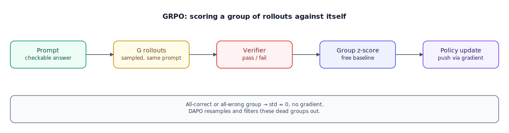

## The 30-second version

RLVR, short for Reinforcement Learning with Verifiable Rewards, is how frontier reasoning models (DeepSeek-R1, OpenAI's o-series, Qwen's thinking models) get trained past what RLHF and DPO reach — reward earned through mechanical verification rather than human taste. There's no learned scorer standing in for a person's judgment here: a programmatic checker inspects the finished chain of thought and confirms whether the number solved the equation or the code cleared its test suite. GRPO (Group Relative Policy Optimization), the algorithm DeepSeek made famous, drops PPO's separate value network and instead samples several completions per prompt at once, scoring each one against how the rest of that batch performed. It's cheap, it scales, and it breaks in specific, well-documented ways — this chapter covers the mechanism, where it silently fails, and why most teams should try distillation before running their own RL.

## The analogy

Picture a competitive archer training for a tournament that uses an electronic scoring rig bolted to the target — a sensor grid measuring, to the millimeter, how far each arrow landed from center. No judge on a stool with a clipboard, no committee debating whether a shot "felt" close. The rig is deterministic: same landing spot, same score, every time.

A coaching session doesn't grade one arrow in isolation. The archer shoots a full round of eight arrows at the same target under the same conditions — a group. The rig scores each one, and here's the trick the coach uses instead of hiring a second observer to guess how good the round "should" have been: take the round's own average score and spread, and grade every arrow relative to that. An arrow beating the round's average by more than its typical spread gets a strong "do more of this"; one below average gets "do less." Nobody brought in an outside baseline — the group graded itself.

That trick has a blind spot. If all eight arrows land in the bullseye — an easy round, at a distance the archer has mastered — every arrow ties the average exactly. Spread is zero, "beat the average by more than the spread" is undefined for all eight, and the round produces no coaching signal at all, even though every arrow was excellent. The same happens in reverse if all eight sail off the target on an impossibly hard round. A round only teaches the archer something when the arrows actually disagree with each other.

A second failure mode: suppose the archer takes up a long, elaborate stance-and-breathing routine that happens to correlate loosely with better scores on a few rounds. Broadcasting one round's average grade across every second of that longer routine ends up rewarding the length of the routine as much as the accuracy of the shot — an artifact of how credit gets spread out, not a real improvement in aim.

And when the coach wants to fast-track a promising junior archer instead of years of live-scored rounds, there's a shortcut: study frame-by-frame footage of a grandmaster's draw, anchor, and release, and copy the form directly — far cheaper than earning the same skill through trial, error, and a scoring rig, and usually where a new archer should start.

| Archery with an electronic scoring rig | RLVR / GRPO |
|---|---|
| The scoring rig measuring exact distance from center | The verifier — a deterministic, programmatic reward |
| A judge with a clipboard guessing how good a shot "felt" | A learned reward model (what RLHF uses instead) |
| A round of eight arrows at the same target | A group of G sampled completions for one prompt |
| Grading each arrow against the round's own average and spread | The group-relative advantage (z-score), GRPO's critic-free baseline |
| A round where every arrow ties the average — no lesson to learn | Zero-variance collapse: an all-correct or all-wrong group |
| An elaborate pre-shot routine that rewards length, not aim | GRPO's length bias — one advantage value spread over more tokens |
| Studying a grandmaster's footage instead of years of scored rounds | Distillation on a strong reasoner's traces, instead of running your own RL |

## How it actually works

Follow the diagram left to right. It starts with a **prompt** whose answer can be mechanically checked — a competition math problem, a coding task with unit tests, a logic puzzle with one valid solution. The policy **samples G rollouts**: several independent long chains of thought for that prompt, typically 8 to 64. A **verifier scores each** one: run the code, compare the final number, check the proof — a hard pass/fail, no learned model standing between the completion and its grade.

That group feeds the diagram's key move: **group z-score**. Instead of training a separate value network to estimate a partial completion's eventual reward — PPO's approach, and one whose parameter count usually matches the policy's own — GRPO standardizes each rollout's reward against the group's own mean and standard deviation: (reward − group mean) / group standard deviation. That z-score becomes the advantage for every token in the rollout, and the **policy gradient update** pushes the policy toward rollouts above their group's average and away from those below it. No critic, no separate reward model — the group grades itself, the entire reason GRPO is cheap enough to run at DeepSeek-R1's scale.

The note under the diagram names the sharpest failure mode: **zero-variance collapse**. When every rollout in a group lands on the same reward — an easy prompt the policy now always solves, or a hard one it never does — the standard deviation is zero, every advantage is zero (clamped, in practice), and the group contributes nothing to the gradient. This worsens as training progresses, precisely because the policy is improving: more prompts become "gets this right every time," so a growing share of each batch trains on nothing. DAPO's fix, dynamic sampling, is direct: oversample prompts, discard any group that came back all-correct or all-wrong, and keep resampling until the batch is full of groups that actually disagree with themselves.

The other documented failure is the length-normalization artifact from the analogy: one scalar advantage broadcast across every token means a longer correct rollout distributes that advantage over more tokens than a short one, quietly biasing training toward length regardless of whether it helped. Dr.GRPO removes the normalization terms responsible; GSPO, built for mixture-of-experts models, computes its probability ratio over the whole sequence instead of token by token, since routing differences between policy versions make token-level ratios noisy in an MoE.

Verifiable rewards don't fully close the door on gaming, either — a model can land on a correct output while the steps that produced it don't actually hold up, and a pure outcome check rewards that anyway, so faithfulness and length are worth watching even when accuracy looks great.

One open question deserves honesty over confidence: does RL teach reasoning the model didn't have, or mostly sharpen which paths it already had get sampled more? Evidence sits on both sides — some results show the base model matching the RL-trained one given enough sampled attempts (sharpening); others show extended RL solving problems the base never reaches at any sample count (real expansion). The most defensible synthesis: RL adds the most where the base model already has partial competence — the zero-variance blind spot again, from a different angle.

Because of that, and because RLVR infrastructure is genuinely expensive to run correctly, most teams should try **distillation** first: fine-tuning a smaller model directly on a strong reasoner's traces, sidestepping the rollout-verify-update loop entirely. It's the archer studying a grandmaster's footage, and the next chapter covers why it usually wins on cost and quality for anyone not already at the frontier.

## A concrete example

Take a single GRPO step on one competition-math prompt, group size G = 8. The policy samples 8 chains of thought; the verifier marks 2 correct (reward 1) and 6 wrong (reward 0).

- Group mean: (2×1 + 6×0) / 8 = **0.25**
- Variance: [6×(0−0.25)² + 2×(1−0.25)²] / 8 = [0.375 + 1.125] / 8 = 0.1875
- Standard deviation: √0.1875 ≈ **0.433**
- Advantage, correct rollout: (1 − 0.25) / 0.433 ≈ **+1.73**
- Advantage, wrong rollout: (0 − 0.25) / 0.433 ≈ **−0.58**

Every token in the 2 correct rollouts gets pushed with advantage +1.73; every token in the 6 wrong ones gets pushed with −0.58 — a real, differentiated gradient signal from one group, no second model computing any of it.

Now change the prompt's difficulty and watch the collapse: if it's easy enough that all 8 rollouts come back correct, mean = 1.0, variance = 0, standard deviation = 0 — every advantage is 0/0, clamped to zero, and the group teaches the policy nothing despite 8 rollouts' worth of compute. The same happens in reverse on an impossibly hard prompt. DAPO's dynamic sampling exists precisely to keep resampling until a batch is full of groups like the 6-wrong/2-correct one above, where there's an actual difference to learn from.

Length bias, worked through: two rollouts in a group both marked correct with the same reward, one 50 tokens, the other 500. Both receive the identical advantage from the group z-score — but that value applies once per token, so the 500-token rollout accumulates 500/50 = **10 times** the total gradient of the short one, for the same correctness signal. Nothing in the reward said "longer is better," but the optimization pressure favors it anyway — the artifact Dr.GRPO's normalization removes.

**Distillation for scale, by comparison.** DeepSeek-R1's own reported numbers make the cost case bluntly: distilling a 32B dense model on roughly 800,000 reasoning traces from the full R1 model — ordinary SFT compute, no rollout-verify loop — outperformed standing up a full RL training run on that identical 32B checkpoint, at a fraction of the compute cost. A 7B student at a comparable traces-per-parameter ratio finishes in a small number of GPU-days; running your own GRPO pipeline at meaningful scale is routinely reported in the tens of thousands of GPU-hours, before the engineering time spent chasing bugs like the ones above.

## The tradeoffs that matter

| Approach | Reward source | Stability | Compute cost | Reach for it when |
|---|---|---|---|---|
| RLHF / DPO | Human preference or a reward model | Can be gamed | Moderate | The target is subjective — tone, helpfulness, safety |
| RLVR / GRPO | Programmatic verifier | Stable in principle; zero-variance/length artifacts in practice | High — many rollouts per prompt, repeated across steps | A genuinely mechanical correctness check, plus the infra to run RL |
| Off-policy distillation | A stronger teacher's traces | Very stable — ordinary SFT | Low — one SFT run, no rollout loop | A smaller model that reasons well in a domain a strong teacher covers |
| On-policy distillation | Teacher's per-token distribution on the student's own samples | Stable, reported more sample-efficient than RL | Moderate — sampling plus dense supervision | RL's on-policy relevance without RL's sparse, unstable reward |

The pattern here is the same one from the RLHF/DPO chapter: every step further from "a human or model judges a finished output" buys stability, at the cost of only applying where the assumption holds. RLVR assumes correctness is checkable; where it's not — creative writing, ambiguous judgment calls, most product features — none of this applies, and you're back to preference-based alignment.

## Where people go wrong

1. **Reaching for RLVR without a real verifier.** No mechanically checkable reward means nothing for GRPO to compute an advantage from — this only works in genuinely verifiable domains.
2. **Reporting pass@1 only.** A model can look improved because it's more likely to sample a correct answer first try, while pass@k at large k stays flat or drops — the sharpening-vs-adding question, hidden by one number.
3. **Trusting a single-model-family RL result.** GRPO with near-random rewards has been shown to improve one model family and fail to transfer to others — a warning against generalizing from one setup.
4. **Not budgeting for rollout cost.** The expensive part isn't the gradient step, it's generating and verifying many long chains of thought per prompt — teams estimating from the update step alone are routinely off by an order of magnitude.
5. **Skipping distillation because RL feels more rigorous.** For most teams, distilling from a strong reasoner gets to a better result faster and cheaper than standing up an RL pipeline from scratch.

## The interview lens

Interviewers use this to separate candidates who've absorbed the DeepSeek-R1 headline from ones who understand why GRPO needed to exist and where it breaks.

A strong sound bite: *"GRPO replaces a learned critic with the group's own statistics — sample several completions, z-score them against each other, that's your advantage. It's cheap because it needs no second model, and it silently produces zero gradient the moment a whole group agrees with itself, which is why dynamic sampling isn't optional at scale."*

Likely follow-ups:

- Why does GRPO's group-relative baseline replace PPO's value network, and what does that trade away?
- Walk me through a scenario where a model reaches the right final answer through reasoning you wouldn't trust.
- When would you choose to run your own RLVR pipeline instead of distilling from an existing reasoning model?

## Go deeper

- [RLHF and DPO](./rlhf-and-dpo.mdx) — the preference-based alignment this chapter's verifier-based approach replaces for checkable domains.
- [Knowledge Distillation](./knowledge-distillation.mdx) — the cheaper path most teams should try before running their own RL.
- [Benchmarks and Leaderboards](../evals/benchmarks-and-leaderboards.mdx) — why pass@1 alone hides the sharpening-vs-adding question this chapter raises.
- Upstream reference: [Training Reasoning Models: RLVR and GRPO — AI System Design Guide](https://github.com/ombharatiya/ai-system-design-guide/blob/main/03-training-and-adaptation/08-rlvr-and-reasoning-models.md) (MIT; see [CREDITS](../../../CREDITS.md)).
