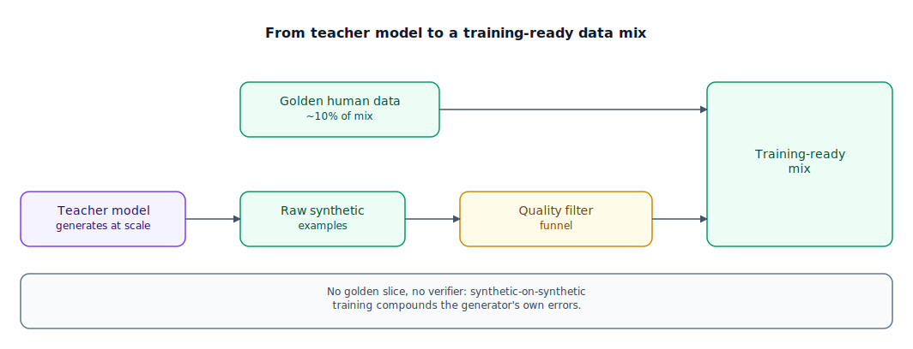

## The 30-second version

Frontier models have run into a real ceiling: high-quality human-written text on the open web isn't growing nearly as fast as the token counts these models train on. Synthetic data — text generated by a model instead of a person — has become the default way past that ceiling, now making up the majority of the data mixture in most fine-tuning pipelines and a real share of pretraining itself. Done well, a strong "teacher" model generates and progressively complicates training examples, a second pass critiques and revises the weak ones, and anything with a mechanically checkable answer gets verified before it's kept. Done badly, a model trains on its own unfiltered output, echoes its own blind spots back at itself, and gets narrower and blander with every generation — a failure mode called model collapse.

## The analogy

Airline pilots don't earn most of their hours in the air anymore — they earn them in a simulator, running scenarios a training department writes specifically to stress a skill: a crosswind landing, an engine failure at rotation, an instrument approach into fog. Simulator time exists because real flight hours are expensive, slow to accumulate, and, worse for training purposes, mostly uneventful. A simulator can generate exactly the emergency a pilot needs practice on, as often as needed, for a fraction of the cost of chasing that same emergency in the real world.

A serious training department doesn't run the same three scenarios on a loop. It evolves them: a calm-weather landing becomes a landing with a stiff crosswind, then a crosswind landing with one engine out, then that same failure at night with the glideslope indicator broken — breadth from covering more airport types and configurations, depth from stacking complicating factors onto scenarios the trainee already handles. After every simulated flight, a review panel doesn't just say pass or fail — an instructor walks the checklist against what happened, flags the specific deviation, and the pilot reflies the same scenario with that correction folded in. The corrected flight, not the original attempt, becomes the training record.

Some of what gets graded is beautifully mechanical: did the aircraft touch down inside the marked zone, did the glideslope needle stay within tolerance — a number off an instrument, no judgment call required. Landing quality on a bumpy approach is a matter of opinion; whether the wheels crossed the threshold within 500 feet of the aim point is a tape measure. The department leans hard on the tape-measure scenarios wherever it can, precisely because there's no ambiguity about what "correct" means.

The one thing every serious program refuses to do is train pilots on simulator data alone, generation after generation, with no real flight hours mixed back in. A simulator's crosswind physics model has its own small, consistent quirks — not wrong, just not quite real air — and a pilot trained purely on simulated crosswinds, evaluated purely by other simulated sessions, ends up excellent at the simulator's version of a crosswind and subtly unprepared for the real one. The fix: keep a real, non-negotiable share of actual flight hours in every training log, no matter how good the simulator gets.

| Flight-simulator pilot training | Synthetic data generation |
|---|---|
| Real flight hours: expensive, slow, mostly uneventful | Human-authored training data — the reason for the "data wall" |
| The simulator generating scenarios on demand | A teacher model generating synthetic examples |
| Evolving a calm landing into a multi-failure night approach | Progressively complicating generated instructions (breadth and depth) |
| A reviewer flagging the deviation and the pilot reflying with the fix folded in | A critique-and-revise loop: propose, critique, revise, keep the revision |
| Touchdown zone and glideslope tolerance — a tape measure, not an opinion | Verifiable synthetic data — math and code checked by execution |
| Training purely on simulator sessions with no real flight hours | Model collapse — training on a model's own (or a peer's) unanchored synthetic output |
| The non-negotiable share of real flight hours in every log | Mixing a golden slice of human-authored data back into the synthetic set |

## How it actually works

Follow the diagram's bottom row first, since that's where volume comes from. A **teacher model** — usually the strongest one a team has access to — generates **raw synthetic examples** at essentially the cost of inference: a prompt in, a labeled training example out, no person in the loop per example. That's what makes synthetic data possible at the scale frontier training now requires — inference is cheap and parallelizable in a way hiring human annotators at the same volume simply isn't.

Raw generation alone is not a training set — it's a firehose that needs a **quality filter funnel** before anything downstream touches it, and this is where most engineering effort lives. A production pipeline runs several checks in sequence: semantic deduplication using embeddings, to catch near-identical examples that would let the model overfit to one overrepresented pattern; a strong model acting as judge on a sample, scoring for logical soundness and safety; a perplexity check, using a small reference model to flag text so predictable it's likely filler, or so unpredictable it's likely nonsense; and, wherever content allows it, a verifiable execution check — running generated code against test cases, checking a derivation with a solver. That last check matters most: it's the difference between a filter that guesses at quality and one that proves it, and the primary reason math and code are where synthetic data has scaled furthest with the least controversy.

Meanwhile, the diagram's top row shows a second, independent input: **golden human data**, deliberately kept in the final blend even after the synthetic pipeline matures. This isn't training wheels — it's a permanent safeguard against the failure the note under the diagram names. If a model trains on synthetic data that its own prior iteration produced, with nothing anchoring the loop to an outside distribution, its stylistic quirks and blind spots get reinforced instead of corrected — a narrowing drift that shows up as blander, less accurate output each generation. That's model collapse. The defenses that actually work are structural: a real, unmoving share of independently-sourced human data in the mix, and verifiable checks wherever they exist, since a wrong answer that fails execution can't be learned as correct no matter how many times it's regenerated.

Where the checkable-answer trick doesn't apply — tone, underrepresented languages, varied phrasings of one logical fallacy so a model learns to recognize it in different clothing — the propose-critique-revise loop from the analogy does the work. One model produces a first attempt; a second pass critiques it against named criteria rather than a vague "make it better"; a third revises; and it's the *revised* version that becomes training data — structured improvement without a human reading every example, the review moved from a person to a second model call guided by rules a person wrote once.

## A concrete example

Say a team needs 10 million synthetic instruction-following examples and generates them with a teacher model API, averaging 300 input tokens and 400 output tokens per example.

**Generation cost.** Input tokens: 10,000,000 × 300 = 3 billion tokens; at an illustrative $1 per million input tokens, that's $3,000. Output tokens: 10,000,000 × 400 = 4 billion tokens; at $3 per million output tokens, that's $12,000. Total generation cost: **$15,000** for 10 million raw examples. The same 10 million examples collected from human annotators, even at a bare-bones $0.50 each, would run **$5,000,000** — synthetic generation isn't a little cheaper here, it's roughly **333 times** cheaper ($5,000,000 / $15,000), which is a large part of why it displaced human data as the default source for fine-tuning mixtures.

**The quality funnel.** Ten million raw generations rarely survive filtering intact:

- Start: 10,000,000
- Semantic deduplication removes 22% of near-identical clusters: 10,000,000 × 0.78 = 7,800,000
- LLM-as-judge quality filtering removes a further 15% of what remains: 7,800,000 × 0.85 = 6,630,000
- Perplexity filtering removes a further 8%: 6,630,000 × 0.92 ≈ **6,099,600**

Roughly 6.1 million examples, about 61%, survive the funnel intact — nearly 4 in 10 raw generations were duplicates, low-quality, or degenerate text that never should have shipped, caught before a single training step touched them.

**Mixing in the golden slice.** The team wants human-authored data to make up exactly 10% of the final training mix, on top of the 6,099,600 filtered synthetic examples. If *g* is the golden-data count and the target ratio is g / (6,099,600 + g) = 0.10, solving gives 0.9g = 609,960, so g ≈ **677,733**. The final mix: 6,099,600 synthetic + 677,733 golden ≈ **6.78 million** examples, with golden data landing at 677,733 / 6,777,333 ≈ **10.0%** — the non-negotiable share from the analogy's flight-hour rule, sized precisely rather than eyeballed.

## The tradeoffs that matter

| Data source | Cost at scale | Diversity / ceiling | Risk | Reach for it when |
|---|---|---|---|---|
| Human-authored | High, slow to scale | High diversity, mirrors real usage, finite supply | None inherent, but expensive to refresh | The ground truth nothing else substitutes for; the golden anchor slice |
| Raw synthetic (unfiltered) | Very low | Narrows toward the teacher's own style over generations | Model collapse without filtering or a human anchor | Never, alone — this row is what the filter funnel exists to fix |
| Filtered synthetic | Low, plus filtering compute | Broad, but bounded by what the teacher model can produce | Inherits the teacher's blind spots and biases | The bulk of a fine-tuning mixture, math/code/structured domains especially |
| Verifiable synthetic (math/code) | Low | Effectively unlimited within the checkable domain | Minimal — wrong answers fail the check before they're kept | Any domain with a mechanical correctness test |

The table's shape should look familiar from the last two chapters: every source that removes a human from the loop gets cheaper and more scalable, and every source that removes an external check gets riskier. Verifiable synthetic data is the sweet spot for the same reason RLVR is in the reasoning-models chapter — a wrong answer that fails execution simply doesn't survive to become training data, so the usual worry about a model teaching itself its own mistakes doesn't apply in the same way.

## Where people go wrong

1. **Training on a model's own output with no golden anchor.** Even a small, fixed share of independently-sourced human data — 5 to 10% is a common target — keeps the distribution from narrowing generation over generation; skipping it is the single most common cause of visible model collapse.
2. **Treating LLM-as-judge as sufficient quality control alone.** A judge model can be fooled by the same stylistic tells a generator produces; pairing it with mechanical checks — dedup, perplexity, execution — catches what a judge alone misses.
3. **Assuming synthetic data is free.** Generation cost is low compared to human labeling, but filtering compute and the engineering time to build and maintain the pipeline are real, recurring costs left out of back-of-envelope comparisons.
4. **Over-indexing on verifiable domains and assuming the trick generalizes.** Math and code scale beautifully because correctness is checkable; a chatbot's tone or a legal document's nuance has no equivalent verifier, and LLM-as-judge overstates its reliability there.
5. **Skipping deduplication and calling volume a proxy for diversity.** Ten million examples with heavy near-duplicate clusters teaches a model to overfit on whatever pattern the teacher generated most, not to generalize.

## The interview lens

Interviewers use this topic to check whether you can name the actual failure mode — narrowing self-reinforcement, not just "the data might be low quality" — and whether you know which domains synthetic data has actually solved versus where it's still a supplement.

A strong sound bite: *"Synthetic data solves the volume problem, not the ground-truth problem. The domains where it's scaled cleanest are the ones with a mechanical check — math and code — where a wrong answer simply fails and never becomes training data. Everywhere else, it's a force multiplier on a human-labeled or human-reviewed core, not a replacement for one."*

Likely follow-ups:

- How would you detect model collapse in a training pipeline before it shows up in eval scores?
- What's the difference between hard-label and verifiable-reward filtering, and why does the second one scale further?
- If you had to cut your quality-filter funnel down to one stage, which would you keep, and why?

## Go deeper

- [RLVR and Reasoning Models](./rlvr-and-reasoning-models.mdx) — the same verifiable-correctness idea applied to training signal instead of training data.
- [Knowledge Distillation](./knowledge-distillation.mdx) — what happens to a synthetic dataset once it's used to train a smaller model directly on a teacher's outputs.
- [LLM Evaluation](../evals/llm-evaluation.mdx) — how the LLM-as-judge pattern this chapter borrows is scored and trusted.
- Upstream reference: [Synthetic Data Generation — AI System Design Guide](https://github.com/ombharatiya/ai-system-design-guide/blob/main/03-training-and-adaptation/06-synthetic-data-generation.md) (MIT; see [CREDITS](../../../CREDITS.md)).
