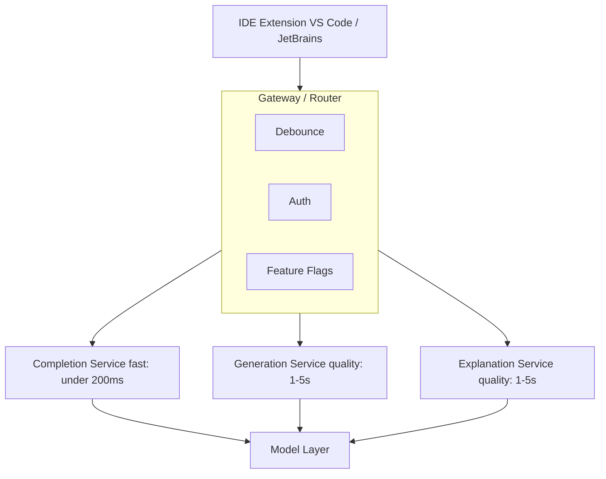
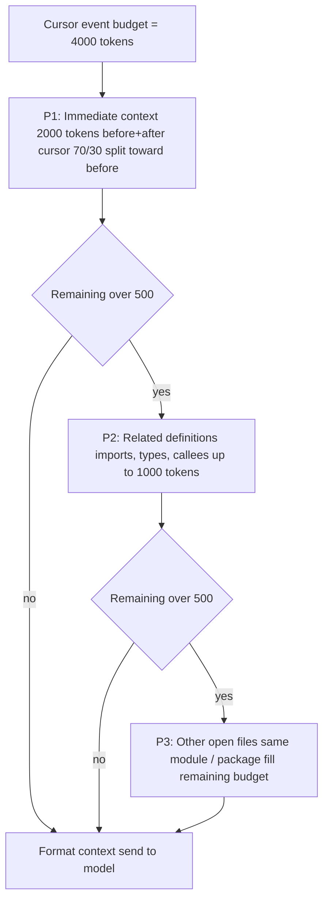
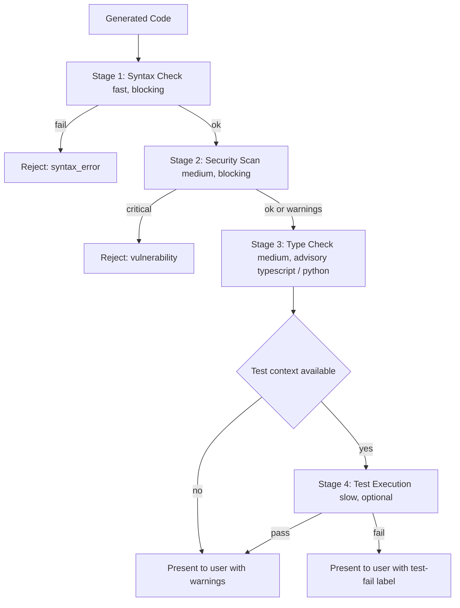

## The 30-second version

This case study covers designing a production code assistant that provides real-time suggestions, code generation, and debugging help.

## How it actually works

This case study covers designing a production code assistant that provides real-time suggestions, code generation, and debugging help.


## Problem Statement

**Company:** Developer tools company building IDE extension

**Goal:**
- Real-time code completion as developers type
- Multi-line code generation from natural language
- Code explanation and debugging assistance
- Support for 20+ programming languages

**Constraints:**
- Latency &lt; 200ms for completions (typing flow)
- Latency &lt; 3s for generation (acceptable pause)
- Security: no code leaves customer infrastructure (enterprise option)
- Cost: sustainable at scale (millions of developers)

## Requirements Analysis

### Functional Requirements

| Feature | Description | Latency Target |
|---------|-------------|----------------|
| Inline completion | Complete current line/block | &lt; 200ms |
| Multi-line generation | Generate function/class from comment | &lt; 3s |
| Code explanation | Explain selected code | &lt; 5s |
| Error fixing | Suggest fixes for errors | &lt; 2s |
| Refactoring | Suggest improvements | &lt; 5s |
| Documentation | Generate docstrings | &lt; 2s |

### Quality Requirements

| Dimension | Target | Measurement |
|-----------|--------|-------------|
| Acceptance rate | > 30% | Suggestions accepted / shown |
| Syntax correctness | > 99% | Compiles/parses successfully |
| Security | 0 vulnerabilities | SAST scan pass rate |
| Relevance | > 85% | User ratings |

## Architecture Design

### High-Level Architecture

```
┌─────────────────────────────────────────────────────────────────┐
│                    CODE ASSISTANT ARCHITECTURE                   │
├─────────────────────────────────────────────────────────────────┤
│                                                                  │
│  ┌─────────────┐                                                │
│  │     IDE     │                                                │
│  │  Extension  │                                                │
│  └──────┬──────┘                                                │
│         │                                                        │
│         ▼                                                        │
│  ┌─────────────────────────────────────────────────────────┐    │
│  │                    GATEWAY / ROUTER                      │    │
│  │  ┌──────────┐  ┌──────────┐  ┌──────────┐              │    │
│  │  │ Debounce │  │  Auth    │  │ Feature  │              │    │
│  │  │          │  │          │  │  Flags   │              │    │
│  │  └──────────┘  └──────────┘  └──────────┘              │    │
│  └─────────────────────────┬───────────────────────────────┘    │
│                            │                                     │
│         ┌──────────────────┼──────────────────┐                 │
│         ▼                  ▼                  ▼                 │
│  ┌─────────────┐    ┌─────────────┐    ┌─────────────┐         │
│  │  Completion │    │ Generation  │    │ Explanation │         │
│  │   Service   │    │  Service    │    │  Service    │         │
│  │  (fast)     │    │ (quality)   │    │ (quality)   │         │
│  └──────┬──────┘    └──────┬──────┘    └──────┬──────┘         │
│         │                  │                  │                  │
│         └──────────────────┼──────────────────┘                 │
│                            ▼                                     │
│                    ┌─────────────┐                              │
│                    │   Model     │                              │
│                    │   Layer     │                              │
│                    └─────────────┘                              │
│                                                                  │
└─────────────────────────────────────────────────────────────────┘
```

The architecture as a flow. Three service tiers split by latency vs quality (completion is sub-200ms, generation and explanation are quality-prioritized) all share one model layer:



### Context Assembly

```python
class CodeContextAssembler:
    """
    Assemble context for code completion.
    Challenge: Balance context richness with latency.
    """
    
    def __init__(self, max_tokens: int = 4000):
        self.max_tokens = max_tokens
    
    def assemble(
        self,
        cursor_position: dict,
        file_content: str,
        open_files: list[dict],
        project_context: dict
    ) -> str:
        context_parts = []
        remaining_tokens = self.max_tokens
        
        # Priority 1: Immediate context (before and after cursor)
        immediate = self.get_immediate_context(
            file_content, cursor_position, tokens=2000
        )
        context_parts.append(immediate)
        remaining_tokens -= count_tokens(immediate)
        
        # Priority 2: Related imports and definitions
        if remaining_tokens > 500:
            related = self.get_related_definitions(
                file_content, cursor_position, tokens=min(1000, remaining_tokens)
            )
            context_parts.append(related)
            remaining_tokens -= count_tokens(related)
        
        # Priority 3: Other open files (same module/package)
        if remaining_tokens > 500:
            other_files = self.get_relevant_open_files(
                open_files, cursor_position, tokens=remaining_tokens
            )
            context_parts.append(other_files)
        
        return self.format_context(context_parts)
    
    def get_immediate_context(
        self,
        content: str,
        cursor: dict,
        tokens: int
    ) -> str:
        lines = content.split("\n")
        cursor_line = cursor["line"]
        
        # Get lines before cursor (more important)
        before_ratio = 0.7
        before_tokens = int(tokens * before_ratio)
        after_tokens = tokens - before_tokens
        
        # Expand outward from cursor
        before_lines = lines[:cursor_line]
        after_lines = lines[cursor_line:]
        
        # Truncate to fit
        before_text = self.truncate_to_tokens(
            "\n".join(before_lines), before_tokens, from_end=True
        )
        after_text = self.truncate_to_tokens(
            "\n".join(after_lines), after_tokens, from_end=False
        )
        
        return f"{before_text}\n<CURSOR>\n{after_text}"
```

Context assembly is a priority-driven budget allocation. The model only sees what survives the 4000-token cap, so the order matters: immediate code first (always fits), then related definitions, then other open files only if budget remains:



## Code Generation Pipeline

### Completion Service (Dec 2025)

```python
class DeepCompletion:
    """
    Sub-150ms latency using o4-mini with speculative decoding.
    """
    def __init__(self):
        self.model = "o4-mini"  # Native code-optimized mini
        self.draft_model = "nano-code-1b" # Local on-device model
    
    async def complete(self, context: str) -> str:
        # Speculative decoding: 1B model drafts, o4-mini verifies
        return await self.openai.generate(
            model=self.model,
            draft_model=self.draft_model,
            prompt=context,
            max_tokens=64
        )
```

### Generation Service (The 'Claude Code' Era)

```python
class AgenticGeneration:
    """
    Using Claude Sonnet 4.6 (Hybrid) for autonomous refactoring.
    """
    async def refactor_module(self, folder_path: str):
        # Claude Sonnet 4.6 with 'Thinking' enabled for architecture consistency
        agent = ClaudeCodeAgent(
            model="claude-3-7-sonnet",
            tools=["ls", "read_file", "write_file", "test_runner"]
        )
        
        # Agent explores codebase, understands dependencies, and applies fix
        return await agent.run(f"Refactor {folder_path} to use async/await.")
```

> [!TIP]
> **Production Choice:** While Claude Opus 4.7 is a coding beast, **Claude Sonnet 4.6** is the preferred production choice in Dec 2025 for IDEs due to its **Hybrid Reasoning**: developers can toggle "Thinking" for hard bugs and "Fast" for boilerplate.

## Quality Assurance

### Multi-Stage Verification

The verifier is a fail-fast gauntlet. Cheap checks (syntax) run first and block hard; expensive checks (test execution) run last and only when context allows. Any blocking failure short-circuits the rest:



```python
class CodeVerifier:
    """
    Verify generated code before presenting to user.
    """
    
    async def verify(self, code: str, language: str, context: str) -> VerificationResult:
        results = {}
        
        # Stage 1: Syntax check (fast, blocking)
        syntax_ok = self.check_syntax(code, language)
        if not syntax_ok:
            return VerificationResult(passed=False, reason="syntax_error")
        
        # Stage 2: Security scan (medium, blocking)
        security = await self.security_scan(code, language)
        if security.has_critical:
            return VerificationResult(passed=False, reason="security_vulnerability")
        results["security"] = security
        
        # Stage 3: Type check if applicable (medium)
        if language in ["typescript", "python"]:
            type_result = await self.type_check(code, context, language)
            results["types"] = type_result
        
        # Stage 4: Test execution if available (slow, optional)
        if self.has_test_context(context):
            test_result = await self.run_tests(code, context)
            results["tests"] = test_result
        
        return VerificationResult(
            passed=True,
            details=results,
            warnings=security.warnings if security else []
        )
    
    def check_syntax(self, code: str, language: str) -> bool:
        parsers = {
            "python": self.parse_python,
            "javascript": self.parse_javascript,
            "typescript": self.parse_typescript,
            # ... other languages
        }
        
        parser = parsers.get(language)
        if not parser:
            return True  # Cannot verify, assume OK
        
        try:
            parser(code)
            return True
        except SyntaxError:
            return False
    
    async def security_scan(self, code: str, language: str) -> SecurityResult:
        # Run static analysis
        if language == "python":
            result = await self.run_bandit(code)
        elif language in ["javascript", "typescript"]:
            result = await self.run_eslint_security(code)
        else:
            result = await self.run_semgrep(code, language)
        
        return result
```

### Acceptance Optimization

```python
class AcceptanceOptimizer:
    """
    Learn from user acceptance patterns to improve suggestions.
    """
    
    def __init__(self):
        self.feedback_store = FeedbackStore()
    
    async def record_feedback(
        self,
        suggestion_id: str,
        accepted: bool,
        edited: bool,
        context_hash: str
    ):
        await self.feedback_store.record({
            "suggestion_id": suggestion_id,
            "accepted": accepted,
            "edited": edited,
            "context_hash": context_hash,
            "timestamp": datetime.now()
        })
    
    async def should_show_suggestion(
        self,
        suggestion: str,
        confidence: float,
        user_context: dict
    ) -> bool:
        # Historical acceptance rate for similar suggestions
        historical_rate = await self.get_historical_rate(
            user_context["user_id"],
            user_context["language"],
            confidence
        )
        
        # Threshold based on user preferences
        threshold = user_context.get("suggestion_threshold", 0.3)
        
        # Only show if likely to be accepted
        return (confidence * historical_rate) > threshold
```

## Performance Optimization

### Latency Optimization

| Technique | Impact | Implementation |
|-----------|--------|----------------|
| Request debouncing | -50ms | 150ms debounce in IDE |
| Connection pooling | -30ms | Persistent HTTP/2 |
| Model warm-up | -100ms | Pre-loaded models |
| Speculative decoding | -40% | Draft model + verify |
| Edge caching | -80ms | CDN for common patterns |

### Caching Strategy

```python
class CompletionCache:
    """
    Multi-level cache for completions.
    """
    
    def __init__(self):
        self.local_cache = LRUCache(max_size=10000)  # In-memory
        self.redis_cache = Redis()  # Distributed
    
    def get_cache_key(self, context: str) -> str:
        # Hash context for cache key
        # Include language and cursor position
        return hashlib.sha256(context.encode()).hexdigest()[:16]
    
    async def get(self, context: str) -> str | None:
        key = self.get_cache_key(context)
        
        # Check local first
        local = self.local_cache.get(key)
        if local:
            return local
        
        # Check distributed
        remote = await self.redis_cache.get(f"completion:{key}")
        if remote:
            self.local_cache.set(key, remote)
            return remote
        
        return None
    
    async def set(self, context: str, completion: str):
        key = self.get_cache_key(context)
        
        # Set in both caches
        self.local_cache.set(key, completion)
        await self.redis_cache.setex(
            f"completion:{key}",
            3600,  # 1 hour TTL
            completion
        )
```

## Results and Metrics

### Performance Results

| Metric | Target | Achieved |
|--------|--------|----------|
| Completion latency (p50) | &lt; 200ms | 145ms |
| Completion latency (p99) | &lt; 500ms | 380ms |
| Generation latency (p50) | &lt; 3s | 2.1s |
| Syntax correctness | > 99% | 99.5% |
| Security (0 high severity) | 100% | 99.8% |
| Acceptance rate | > 30% | 34% |

### Cost Analysis (Dec 2025)

| Component | Cost per 1M suggestions | Notes |
|-----------|------------------------|-------|
| **Completion (o4-mini)** | $0.20 | Extremely optimized for volume |
| **Agentic Task (Claude Sonnet 4.6)** | $45.00 | Assuming 10k tokens + Thinking |
| **Verification (Local)** | $0.00 | Shifted to on-device Nano |
| **Infrastructure** | $15.00 | Managed GPU serving |
| **Total (Blended)** | **~$12.00** | **90% reduction vs 2024** |

*Blended cost assumes 98% completions, 2% high-value agentic refactors.*

## Interview Walkthrough

**Interviewer:** "Design an AI code assistant for an IDE."

**Strong response:**

1. **Clarify requirements** (1 min)
   - "What's the target latency for completions vs generations?"
   - "Enterprise deployment with on-prem option?"
   - "What languages need support?"

2. **Identify the key challenge** (1 min)
   - "The core tension is latency vs quality. Completions need &lt; 200ms for typing flow, but good code requires rich context and verification."

3. **Two-tier architecture** (3 min)
   - "I would separate completions (fast) from generations (quality):"
   - "Completions: smaller model, minimal context, speculative decoding"
   - "Generations: frontier model, best-of-N, syntax and security verification"

4. **Context assembly** (2 min)
   - "Context is critical. I prioritize: immediate code > imports/definitions > open files"
   - "For completions, I cap at 2K tokens for speed"
   - "For generations, I can use 8K+ tokens for better understanding"

5. **Quality assurance** (2 min)
   - "Every suggestion runs through: syntax check, security scan, optionally type check"
   - "For generations, I use best-of-N with 8 candidates, filter invalid, score and select"
   - "This catches security vulnerabilities before they reach the developer"

6. **Latency optimization** (2 min)
   - "Request debouncing in IDE, connection pooling, model warm-up"
   - "Speculative decoding for 40% latency reduction"
   - "Caching common patterns (imports, boilerplate)"

## References

- GitHub Copilot Architecture: https://github.blog/
- Codestral: https://mistral.ai/news/codestral/
- CodeLlama: https://ai.meta.com/blog/code-llama/

*Next: [Content Moderation Case Study](05-content-moderation.md)*

## Go deeper

- [Upstream chapter (Case Study: AI Code Assistant)](https://github.com/ombharatiya/ai-system-design-guide/blob/main/16-case-studies/04-code-assistant.md)
- Related questions in the [question bank](/questions)
- Practice with [SPIDER walkthrough](/practice) or [mock interview](/mock)
