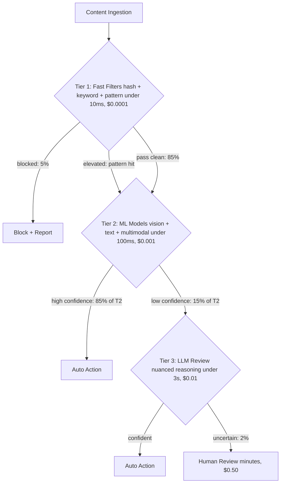
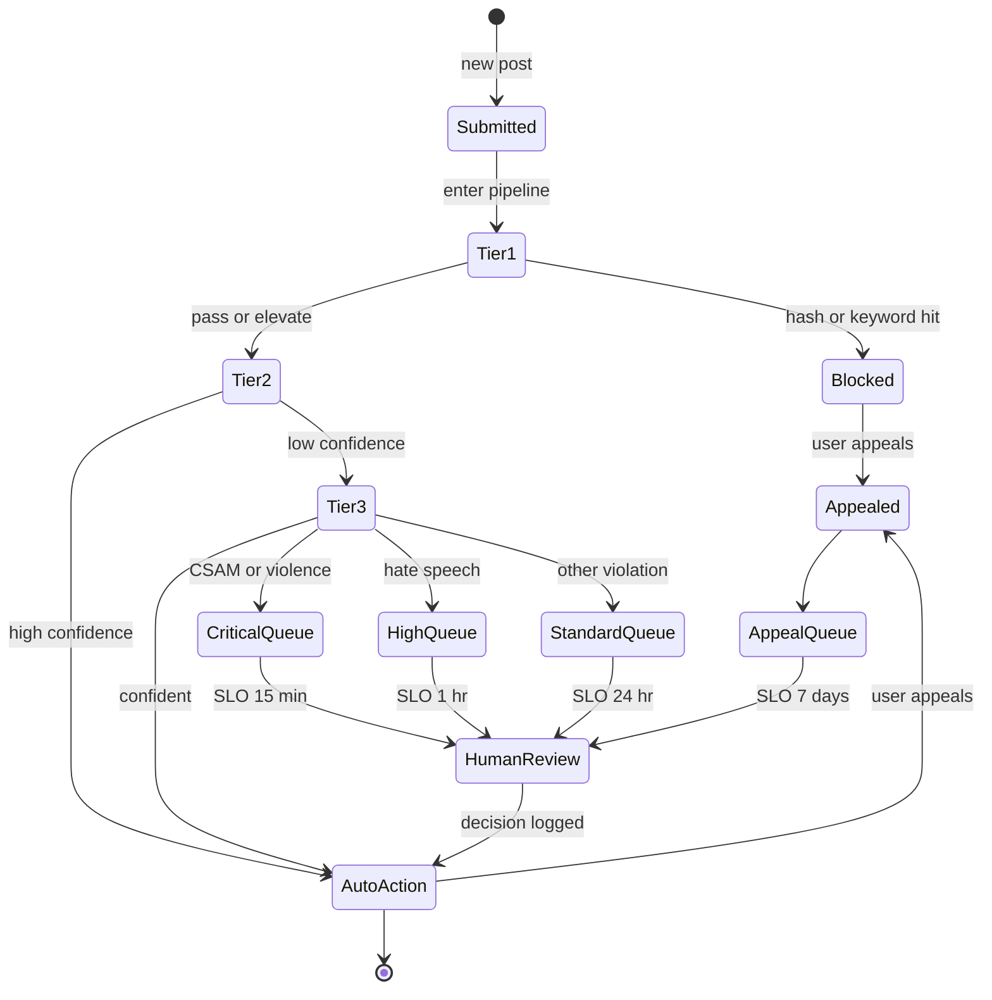

## The 30-second version

This case study covers designing an AI-powered content moderation system for a social platform handling millions of posts daily.

## How it actually works

This case study covers designing an AI-powered content moderation system for a social platform handling millions of posts daily.


## Problem Statement

**Company:** Social media platform with 50M daily active users

**Current state:**
- 10M posts per day
- 500 human moderators
- Average review time: 4 hours
- False positive rate: 15%
- Harmful content reaching users: 2%

**Goals:**
- Reduce harmful content exposure to &lt; 0.1%
- Review priority content in &lt; 15 minutes
- Reduce false positive rate to &lt; 5%
- Scale without linear moderator growth

## Requirements Analysis

### Content Categories

| Category | Severity | Action | Latency |
|----------|----------|--------|---------|
| CSAM | Critical | Block + Report | Immediate |
| Violence/Gore | High | Block + Review | &lt; 1 min |
| Hate speech | High | Block + Review | &lt; 5 min |
| Harassment | Medium | Review + Warn | &lt; 15 min |
| Spam | Medium | Deprioritize | &lt; 1 hour |
| Misinformation | Medium | Label + Review | &lt; 1 hour |
| Adult content | Low | Age-gate | &lt; 1 hour |

### Accuracy Requirements

| Metric | Target | Rationale |
|--------|--------|-----------|
| Recall (harmful) | > 99% | Minimize harm exposure |
| Precision | > 95% | Minimize false positives |
| Latency (critical) | &lt; 1 min | Prevent spread |
| Latency (standard) | &lt; 15 min | Balance resources |

## Architecture Design

### High-Level Architecture

```
┌─────────────────────────────────────────────────────────────────┐
│                  CONTENT MODERATION PIPELINE                     │
├─────────────────────────────────────────────────────────────────┤
│                                                                  │
│  ┌─────────────┐                                                │
│  │   Content   │                                                │
│  │   Ingestion │                                                │
│  └──────┬──────┘                                                │
│         │                                                        │
│         ▼                                                        │
│  ┌─────────────────────────────────────────────────────────┐    │
│  │                   TIER 1: FAST FILTERS                   │    │
│  │  ┌──────────┐  ┌──────────┐  ┌──────────┐              │    │
│  │  │  Hash    │  │ Keyword  │  │  Known   │              │    │
│  │  │ Matching │  │ Blocklist│  │ Patterns │              │    │
│  │  └──────────┘  └──────────┘  └──────────┘              │    │
│  └──────────────────────────┬──────────────────────────────┘    │
│                             │                                    │
│         ┌───────────────────┼───────────────────┐               │
│         │ Blocked           │ Pass              │ Elevated      │
│         ▼                   ▼                   ▼               │
│  ┌─────────────┐    ┌─────────────────────────────────────┐    │
│  │   Block +   │    │          TIER 2: ML MODELS          │    │
│  │   Report    │    │  ┌────────┐  ┌────────┐  ┌────────┐│    │
│  └─────────────┘    │  │ Vision │  │  Text  │  │ Multi- ││    │
│                     │  │ Model  │  │ Model  │  │ modal  ││    │
│                     │  └────────┘  └────────┘  └────────┘│    │
│                     └──────────────────┬──────────────────┘    │
│                                        │                        │
│         ┌──────────────────────────────┼──────────────────┐    │
│         │ High Confidence              │ Low Confidence   │    │
│         ▼                              ▼                   │    │
│  ┌─────────────┐              ┌─────────────────────────┐ │    │
│  │ Auto Action │              │    TIER 3: LLM REVIEW   │ │    │
│  └─────────────┘              │  (nuanced cases)        │ │    │
│                               └────────────┬────────────┘ │    │
│                                            │               │    │
│                        ┌───────────────────┼──────────────┐│    │
│                        │ Confident         │ Uncertain    ││    │
│                        ▼                   ▼              ││    │
│                 ┌─────────────┐    ┌─────────────┐       ││    │
│                 │ Auto Action │    │   Human     │       ││    │
│                 └─────────────┘    │   Review    │       ││    │
│                                    └─────────────┘       ││    │
│                                                          ││    │
└──────────────────────────────────────────────────────────┘│    │
```

The tiered pipeline as a decision tree. Each tier escalates only what it cannot decide cheaply. The cost-per-decision ratio between Tier 1 and Tier 4 is roughly 1:5000, so getting routing right is the main lever for unit economics:



### Processing Tiers

| Tier | Method | Latency | Cost | Coverage |
|------|--------|---------|------|----------|
| 1 | Hash/keyword | &lt; 10ms | $0.0001 | 5% blocked |
| 2 | ML classifiers | &lt; 100ms | $0.001 | 85% auto-decided |
| 3 | LLM review | &lt; 3s | $0.01 | 8% nuanced |
| 4 | Human review | Minutes | $0.50 | 2% escalated |

## Classification Pipeline

### Tier 1: Fast Filters

```python
class FastFilters:
    """
    Immediate blocking for known harmful content.
    No false positives for matches.
    """
    
    def __init__(self):
        self.hash_db = PhotoDNADatabase()  # CSAM detection
        self.keyword_filter = KeywordBlocklist()
        self.pattern_matcher = RegexPatterns()
    
    async def filter(self, content: Content) -> FilterResult:
        # CSAM hash matching (highest priority)
        if content.has_media:
            hash_match = await self.hash_db.check(content.media_hashes)
            if hash_match:
                return FilterResult(
                    action="block_report",
                    reason="csam_hash_match",
                    confidence=1.0,
                    tier=1
                )
        
        # Keyword blocklist
        if content.text:
            keyword_match = self.keyword_filter.check(content.text)
            if keyword_match and keyword_match.severity == "critical":
                return FilterResult(
                    action="block_review",
                    reason=f"keyword_{keyword_match.category}",
                    confidence=0.99,
                    tier=1
                )
        
        # Pattern matching (phone numbers in suspicious context, etc)
        pattern_match = self.pattern_matcher.check(content.text)
        if pattern_match:
            return FilterResult(
                action="elevate",
                reason=f"pattern_{pattern_match.type}",
                confidence=pattern_match.confidence,
                tier=1
            )
        
        return FilterResult(action="continue", tier=1)
```

### Tier 2: ML Classification

```python
### Tier 2: Native Multimodal Classification (Gemini 3 Flash)

```python
class MultimodalSafety:
    """
    Dec 2025 Shift: No separate OCR/Vision models.
    Gemini 3 Flash handles interleaved text/images natively for &lt;$0.10 / 1M posts.
    """
    async def classify(self, content: Content) -> dict:
        # Native multimodal understanding catches context (e.g., text on a protest sign)
        response = await genai.submit(
            model="gemini-3-flash",
            content=[content.text, content.image_bytes],
            schema=SafetySchema
        )
        return response
```

### Tier 3: Nuanced LLM Review (GPT-5.2-mini)

```python
class NuanceReviewer:
    """
    Using GPT-5.2-mini for nuanced context (sarcasm, regional slang).
    Reasoning capabilities of 2025-mini models exceed 2024-frontier models.
    """
    async def review(self, content: Content, context: dict) -> dict:
        result = await client.chat.completions.create(
            model="gpt-5.2-mini",
            messages=[
                \{"role": "system", "content": "Analyze for regional hate speech slang."\},
                \{"role": "user", "content": content.text\}
            ],
            response_format=\{"type": "json_object"\}
        )
        return json.loads(result)
```
```

## Human-in-the-Loop

### Review Queue Management

Every piece of content traverses a lifecycle from submission to a terminal state. The lifecycle as a state machine makes SLOs concrete: each priority lane has a different target time-to-terminal, and an appeal can transition back to pending:



```python
class ReviewQueueManager:
    """
    Prioritize and route content to human moderators.
    """
    
    def __init__(self):
        self.queues = {
            "critical": PriorityQueue(),  # CSAM, violence - immediate
            "high": PriorityQueue(),      # Hate speech - < 15 min
            "standard": PriorityQueue(),  # Other violations - < 1 hour
            "appeals": PriorityQueue()    # User appeals
        }
    
    async def enqueue(self, content: Content, result: ReviewResult):
        priority = self.calculate_priority(content, result)
        
        item = ReviewItem(
            content_id=content.id,
            content=content,
            ai_analysis=result,
            priority=priority,
            enqueued_at=datetime.now()
        )
        
        queue_name = self.get_queue(result.severity)
        await self.queues[queue_name].put(item)
        
        # Alert if critical
        if queue_name == "critical":
            await self.alert_moderators(item)
    
    def calculate_priority(self, content: Content, result: ReviewResult) -> float:
        priority = 0.0
        
        # Severity weight
        severity_weights = {"critical": 100, "high": 50, "medium": 20, "low": 5}
        priority += severity_weights.get(result.severity, 0)
        
        # Reach weight (viral content prioritized)
        priority += min(content.reach_score * 10, 50)
        
        # Confidence inverse (less confident = higher priority)
        priority += (1 - result.confidence) * 30
        
        return priority
```

### Moderator Interface

```python
class ModeratorDecision:
    async def submit(
        self,
        moderator_id: str,
        content_id: str,
        decision: str,
        reason: str,
        notes: str = None
    ):
        # Record decision
        await self.store_decision({
            "content_id": content_id,
            "moderator_id": moderator_id,
            "decision": decision,
            "reason": reason,
            "notes": notes,
            "ai_recommendation": await self.get_ai_result(content_id),
            "decided_at": datetime.now()
        })
        
        # Execute action
        await self.execute_action(content_id, decision)
        
        # Update ML models with feedback
        await self.feedback_loop.record(
            content_id=content_id,
            ai_prediction=await self.get_ai_result(content_id),
            human_decision=decision
        )
```

## Adversarial Robustness

### Evasion Techniques and Defenses

| Evasion Technique | Defense |
|-------------------|---------|
| Character substitution (h@te) | Normalization + homoglyph mapping |
| Image text (text in images) | OCR pipeline |
| Invisible characters | Unicode normalization |
| Context manipulation | Multi-turn analysis |
| Encoded content | Decoding pipeline |
| Adversarial images | Robust vision models |

### Defensive Pipeline

```python
class AdversarialDefense:
    def __init__(self):
        self.normalizer = TextNormalizer()
        self.ocr = OCRPipeline()
        self.decoder = ContentDecoder()
    
    def preprocess(self, content: Content) -> Content:
        processed = content.copy()
        
        # Normalize text
        if processed.text:
            processed.text = self.normalizer.normalize(processed.text)
            processed.text = self.decoder.decode_obfuscation(processed.text)
        
        # Extract text from images
        if processed.has_images:
            for image in processed.images:
                extracted_text = self.ocr.extract(image)
                if extracted_text:
                    processed.text = f"{processed.text}\n[IMAGE TEXT]: {extracted_text}"
        
        return processed
    
    def normalize(self, text: str) -> str:
        # Homoglyph normalization
        text = self.homoglyph_map(text)
        
        # Unicode normalization
        text = unicodedata.normalize("NFKC", text)
        
        # Remove zero-width characters
        text = re.sub(r"[\u200b-\u200f\u2028-\u202f]", "", text)
        
        # Leetspeak normalization
        text = self.leetspeak_decode(text)
        
        return text
```

## Results and Metrics

### Performance Comparison

| Metric | Before | After | Improvement |
|--------|--------|-------|-------------|
| Harmful content exposure | 2% | 0.08% | 96% reduction |
| Review latency (critical) | 4 hours | 8 minutes | 30x faster |
| False positive rate | 15% | 4.2% | 72% reduction |
| Moderator efficiency | 50/day | 200/day | 4x increase |

### Cost Analysis (Dec 2025)

| Component | Per 10M Posts | Notes |
|-----------|---------------|-------|
| Tier 1 Filters | $0.10 | Negligible |
| Tier 2 Multimodal | $0.50 | Gemini 3 Flash ($0.05/1M) |
| Tier 3 LLM (GPT-5.2) | $0.20 | Nuance checks on 10% traffic |
| Human Review | $15.00 | Focused on only 1% of volume |
| **Total** | **$15.80** | **40% reduction vs 2024** |

> [!TIP]
> **Production Wisdom:** Moving the heavy lifting from 'Tier 2 Vision/OCR' to **Native Multimodal (Gemini 3 Flash)** reduced pipeline complexity by 70% and latency by 400ms.

*Human review still dominates cost but focused on hard cases*

## Interview Walkthrough

**Interviewer:** "Design a content moderation system for a social media platform."

**Strong response:**

1. **Clarify scale and requirements** (1 min)
   - "What's the volume? What content types? What's acceptable false positive rate?"
   - "Any regulatory requirements (CSAM reporting, GDPR)?"

2. **Multi-tier architecture** (3 min)
   - "I would use a cascade of increasing sophistication:"
   - "Tier 1: Hash matching, keyword filters - instant, certain"
   - "Tier 2: ML classifiers - fast, specialized"
   - "Tier 3: LLM review - nuanced, context-aware"
   - "Tier 4: Human review - final arbiter"
   - "Each tier handles what the previous cannot"

3. **Prioritization is key** (2 min)
   - "Not all harmful content is equal. CSAM and violence need immediate action. Hate speech is priority but not instant. Spam can wait."
   - "Priority queue based on severity, reach, and confidence"

4. **Human-in-the-loop design** (2 min)
   - "Humans for low-confidence decisions and appeals"
   - "AI handles 95%+ automatically to make human review economically viable"
   - "Feedback loop: human decisions improve ML models"

5. **Adversarial robustness** (2 min)
   - "Users will evade detection. Defenses include:"
   - "Text normalization for obfuscation"
   - "OCR for text in images"
   - "Continuous model updates as evasion evolves"

6. **Metrics** (1 min)
   - "Primary: harmful content exposure rate (target &lt; 0.1%)"
   - "Secondary: false positive rate (user experience)"
   - "Operational: review latency, moderator throughput"

## References

- Meta Content Moderation: https://transparency.fb.com/
- Google Perspective API: https://perspectiveapi.com/
- OpenAI Moderation: https://platform.openai.com/docs/guides/moderation

*Next: [LLM Pricing Reference](../02-model-landscape/03-pricing-and-costs.md)*

## Go deeper

- [Upstream chapter (Case Study: Content Moderation at Scale)](https://github.com/ombharatiya/ai-system-design-guide/blob/main/16-case-studies/05-content-moderation.md)
- Related questions in the [question bank](/questions)
- Practice with [SPIDER walkthrough](/practice) or [mock interview](/mock)
