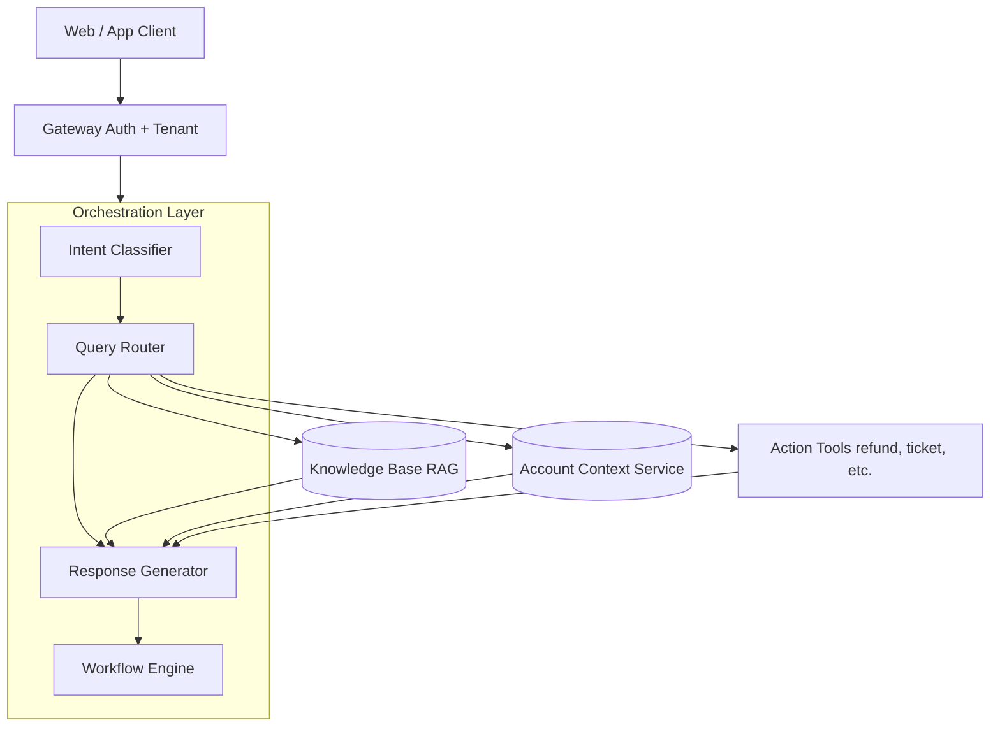
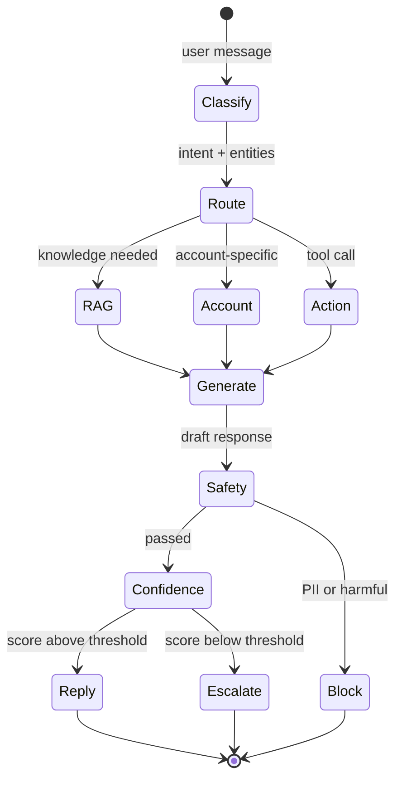
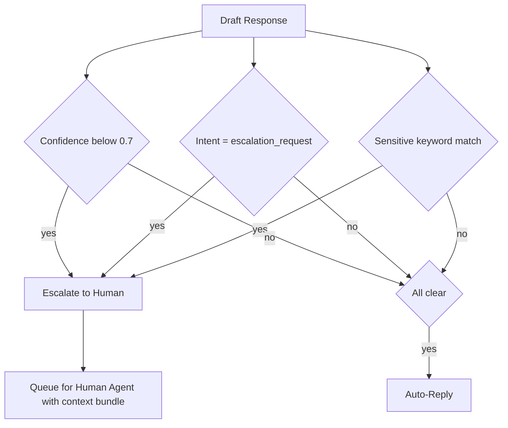

## The 30-second version

This case study walks through designing a production customer support agent for a B2B SaaS company.

## How it actually works

This case study walks through designing a production customer support agent for a B2B SaaS company.


## Problem Statement

**Company:** B2B SaaS platform with 50K enterprise customers

**Current state:**
- 500K support tickets per month
- Average response time: 4 hours
- Customer satisfaction (CSAT): 72%
- Support team: 100 agents

**Goal:**
- Reduce response time to &lt; 5 minutes for common queries
- Improve CSAT to > 85%
- Handle 60% of tickets without human intervention
- Maintain quality for escalated tickets

## Requirements Analysis

### Functional Requirements

| Requirement | Description | Priority |
|-------------|-------------|----------|
| Query understanding | Classify intent, extract entities | P0 |
| Knowledge retrieval | Search product docs, FAQs, past tickets | P0 |
| Account context | Access user's subscription, history | P0 |
| Response generation | Natural, accurate, helpful responses | P0 |
| Conversation memory | Multi-turn context | P0 |
| Action execution | Create tickets, trigger workflows | P1 |
| Human escalation | Seamless handoff when needed | P0 |
| Billing inquiries | Handle sensitive financial data | P1 |

### Non-Functional Requirements

| Requirement | Target | Rationale |
|-------------|--------|-----------|
| Latency (TTFT) | &lt; 1s | User expectation for chat |
| Latency (full) | &lt; 5s | Maintain engagement |
| Availability | 99.9% | Business-critical |
| Accuracy | > 95% | Customer trust |
| Escalation rate | &lt; 40% | Cost efficiency |
| CSAT | > 85% | Business goal |

### Security Requirements

- No PII in logs
- Tenant isolation (customers only see their data)
- Audit trail for all actions
- SOC 2 compliance

## Architecture Design

### High-Level Architecture

```
┌─────────────────────────────────────────────────────────────────┐
│                      CUSTOMER SUPPORT AGENT                      │
├─────────────────────────────────────────────────────────────────┤
│                                                                  │
│  ┌─────────────┐     ┌─────────────┐     ┌─────────────┐        │
│  │   Web/App   │────▶│   Gateway   │────▶│    Auth     │        │
│  │   Client    │     │             │     │  + Tenant   │        │
│  └─────────────┘     └──────┬──────┘     └─────────────┘        │
│                             │                                    │
│                             ▼                                    │
│  ┌──────────────────────────────────────────────────────────┐   │
│  │                   ORCHESTRATION LAYER                     │   │
│  │  ┌────────────────────────────────────────────────────┐  │   │
│  │  │  Intent        Query          Response    Workflow │  │   │
│  │  │  Classifier → Router →        Generator → Engine   │  │   │
│  │  └────────────────────────────────────────────────────┘  │   │
│  └──────────────────────────────────────────────────────────┘   │
│                             │                                    │
│         ┌───────────────────┼───────────────────┐               │
│         ▼                   ▼                   ▼               │
│  ┌─────────────┐     ┌─────────────┐     ┌─────────────┐        │
│  │  Knowledge  │     │   Account   │     │   Action    │        │
│  │    Base     │     │   Context   │     │   Tools     │        │
│  │   (RAG)     │     │   Service   │     │             │        │
│  └─────────────┘     └─────────────┘     └─────────────┘        │
│                                                                  │
└─────────────────────────────────────────────────────────────────┘
```

Rendered as a layered flow. The orchestration layer dispatches to three parallel context sources, then assembles them in the response generator:



### Conversation Flow

```
User Message
    │
    ▼
┌─────────────────┐
│ Intent Classify │─── billing, technical, account, general, escalation
└────────┬────────┘
         │
         ▼
┌─────────────────┐
│ Query Routing   │─── Which knowledge sources? Which tools?
└────────┬────────┘
         │
    ┌────┴────┬────────────┐
    ▼         ▼            ▼
┌───────┐ ┌───────┐ ┌──────────┐
│  RAG  │ │Account│ │ Actions  │
│ Query │ │Context│ │ (if any) │
└───┬───┘ └───┬───┘ └────┬─────┘
    │         │          │
    └────┬────┴──────────┘
         │
         ▼
┌─────────────────┐
│    Generate     │
│    Response     │
└────────┬────────┘
         │
         ▼
┌─────────────────┐
│  Safety Check   │─── PII, harmful, off-topic
└────────┬────────┘
         │
         ▼
┌─────────────────┐
│  Confidence     │─── Low confidence? Escalate
│    Check        │
└────────┬────────┘
         │
         ▼
    Response / Escalation
```

A turn is a state machine. The two gates that matter for cost and trust are *safety* (must pass before leaving the system) and *confidence* (decides escalation vs auto-reply):



## Component Deep Dives

### Intent Classification (Dec 2025)

```python
class IntentClassifier:
    async def classify(self, message: str, history: list[dict]) -> dict:
        # Using GPT-5.5-mini for &lt;100ms classification latency
        result = await client.chat.completions.create(
            model="gpt-5.2-mini",
            messages=[{"role": "user", "content": message}],
            response_format={"type": "json_object"}
        )
        return json.loads(result.choices[0].message.content)
```

### Knowledge Base (Gemini 3 Flash RAG)

```python
class SupportKnowledgeBase:
    async def retrieve(self, query: str, context_window: int = 1_000_000) -> list[dict]:
        # Using Gemini 3 Flash for massive context retrieval
        # No more 'reranking' needed for many standard support tasks
        results = await self.sources.search(query, limit=50) 
        return results
```

### Response Generation (Claude Sonnet 4.6)

```python
class ResponseGenerator:
    async def generate(self, query: str, context: list[dict]) -> dict:
        # Claude Sonnet 4.6 for 'Hybrid Reasoning'
        # Toggle 'Thinking' mode for complex billing issues
        is_complex = self.detect_complexity(query)
        
        response = await self.anthropic.messages.create(
            model="claude-3-7-sonnet-20250219",
            thinking={"enabled": is_complex, "budget_tokens": 2048},
            messages=[{"role": "user", "content": f"Context: {context}\nQuery: {query}"}]
        )
        return {"response": response.content[0].text}
```

> [!NOTE]
> **Production Wisdom:** While Gemini 3 Flash is great for high-volume retrieval, **Claude 3.5 Sonnet** remains the most "stable" generator for many support teams who have spent months fine-tuning guardrails around its specific personality and refusal patterns.

## Reliability Patterns

### Confidence-Based Escalation

```python
class EscalationHandler:
    def __init__(self, confidence_threshold: float = 0.7):
        self.threshold = confidence_threshold
    
    async def check_escalation(
        self,
        response: dict,
        intent: str,
        user_request: str
    ) -> dict:
        should_escalate = False
        reason = None
        
        # Low confidence
        if response["confidence"] < self.threshold:
            should_escalate = True
            reason = "low_confidence"
        
        # Explicit escalation request
        if intent == "escalation_request":
            should_escalate = True
            reason = "user_requested"
        
        # Sensitive topics
        if await self.is_sensitive(user_request):
            should_escalate = True
            reason = "sensitive_topic"
        
        if should_escalate:
            return await self.create_escalation(response, reason)
        
        return {"escalate": False, "response": response}
    
    async def is_sensitive(self, message: str) -> bool:
        sensitive_keywords = [
            "legal", "lawsuit", "lawyer",
            "refund", "cancel subscription",
            "competitor", "data breach"
        ]
        return any(kw in message.lower() for kw in sensitive_keywords)
```

The escalation decision combines three independent signals. Any one of them triggers handoff. Visualizing it as a decision tree makes the OR semantics obvious and easy to extend with a fourth signal:



### Multi-Turn Memory

```python
class ConversationMemory:
    def __init__(self, max_turns: int = 10):
        self.max_turns = max_turns
        self.redis = Redis()
    
    async def get_history(self, session_id: str) -> list[dict]:
        key = f"conversation:{session_id}"
        history = await self.redis.get(key)
        if history:
            return json.loads(history)
        return []
    
    async def add_turn(
        self,
        session_id: str,
        user_message: str,
        assistant_message: str
    ):
        history = await self.get_history(session_id)
        
        history.append({"role": "user", "content": user_message})
        history.append({"role": "assistant", "content": assistant_message})
        
        # Trim to max turns
        if len(history) > self.max_turns * 2:
            history = history[-(self.max_turns * 2):]
        
        await self.redis.setex(
            f"conversation:{session_id}",
            3600,  # 1 hour TTL
            json.dumps(history)
        )
```

## Evaluation and Monitoring

### Quality Metrics

```python
class QualityMonitor:
    def __init__(self, sample_rate: float = 0.05):
        self.sample_rate = sample_rate
        self.judge = LLMJudge()
    
    async def evaluate(self, conversation: dict):
        if random.random() > self.sample_rate:
            return
        
        scores = await self.judge.evaluate(
            query=conversation["user_message"],
            response=conversation["assistant_message"],
            context=conversation["context"],
            criteria={
                "relevance": "Does the response address the user's question?",
                "accuracy": "Is the information correct based on the context?",
                "helpfulness": "Would this response help the user?",
                "tone": "Is the tone professional and empathetic?"
            }
        )
        
        # Record metrics
        for criterion, score in scores.items():
            metrics.record(f"quality_{criterion}", score)
```

### Dashboard Metrics

| Metric | Target | Actual |
|--------|--------|--------|
| Latency (TTFT) | &lt; 1s | 0.8s |
| Latency (full) | &lt; 5s | 3.2s |
| Accuracy | > 95% | 94.3% |
| Escalation rate | &lt; 40% | 38% |
| CSAT | > 85% | 87% |
| Resolution rate | > 60% | 62% |

## Cost Analysis

### Per-Conversation Cost Breakdown (Dec 2025)

| Component | Cost | Notes |
|-----------|------|-------|
| Intent classification | $0.0001 | GPT-5.5-mini ($0.10/1M) |
| RAG retrieval | $0.0001 | Gemini 3 Flash ($0.05/1M) |
| Thinking mode | $0.0050 | Claude Sonnet 4.6 Thinking (avg 250 tokens) |
| Response generation | $0.0030 | Claude Sonnet 4.6 ($3/1M in) |
| Quality sampling | $0.0001 | 5% sample rate on GPT-5.5 |
| **Total** | **~$0.0083** | **Per conversation (62% reduction vs 2024)** |

### Monthly Cost Projection

| Item | Calculation | Cost |
|------|-------------|------|
| Conversations | 500K × $0.022 | $11,000 |
| Infrastructure | Fixed | $2,000 |
| Human escalations | 190K × $5 (human cost) | $950,000 |
| **Total** | | $963,000 |
| **Savings vs all-human** | 500K × $5 - $963K | $1.5M/year |

## Lessons Learned

### What Worked

1. **Intent-based routing** reduced latency by focusing retrieval on relevant sources
2. **Confidence-based escalation** maintained quality while reducing human load
3. **Account context** made responses more personalized and accurate
4. **Lower temperature (0.3)** improved consistency for support responses

### What Did Not Work Initially

1. **Single model for everything** - routing to different models for different tasks improved quality
2. **Too high escalation threshold** - started at 0.9 confidence, causing too many escalations
3. **Full conversation history** - exceeded context limits, switched to summarization

### Recommendations

1. Start with high escalation rate and lower gradually as confidence improves
2. Monitor CSAT by escalation reason to identify weak areas
3. Retrain embeddings on support-specific vocabulary
4. Build feedback loop: agents tag escalated conversations for training data

## Interview Walkthrough

**Interviewer:** "Design an AI customer support system for a SaaS company."

**Strong response pattern:**

1. **Clarify requirements** (2 min)
   - "What's the ticket volume? What channels? What's the current CSAT?"

2. **State constraints explicitly**
   - "Key constraints: accuracy over speed, seamless escalation, tenant isolation"

3. **High-level architecture** (3 min)
   - Draw the flow: intent → routing → RAG → generation → safety → response/escalation

4. **Deep dive on critical component** (5 min)
   - "Let me detail the confidence-based escalation..."

5. **Address reliability** (3 min)
   - "For reliability, I would use self-consistency for billing queries, multi-provider fallback"

6. **Metrics and monitoring** (2 min)
   - "Key metrics: CSAT, resolution rate, escalation rate, accuracy sampling"

7. **Cost consideration** (1 min)
   - "At 500K conversations/month, cost per conversation matters. Model routing helps."

## References

- Anthropic Customer Support Best Practices: https://docs.anthropic.com/claude/docs/customer-service
- LangChain Conversational Agents: https://python.langchain.com/docs/use_cases/chatbots

*Next: [Code Assistant Case Study](04-code-assistant.md)*

## Go deeper

- [Upstream chapter (Case Study: Customer Support Conversational Agent)](https://github.com/ombharatiya/ai-system-design-guide/blob/main/16-case-studies/02-conversational-agent.md)
- Related questions in the [question bank](/questions)
- Practice with [SPIDER walkthrough](/practice) or [mock interview](/mock)
