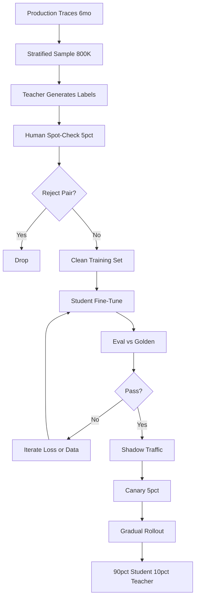

## The 30-second version

A Series-B AI product cuts frontier-model spend from $50K per month to $4 to 6K by distilling a 7B student model on 6 months of production traces, with a 3-month payback and a 4 to 6 month re-distillation cadence.

## How it actually works

A Series-B AI product cuts frontier-model spend from $50K per month to $4 to 6K by distilling a 7B student model on 6 months of production traces, with a 3-month payback and a 4 to 6 month re-distillation cadence.

## The Business Problem

A scaled AI product (about 8M user requests per month) runs on a frontier model. The cost line crossed $50K per month in early 2026, growth is 18 percent quarter over quarter, and finance asked for a plan. The team had one clean realization: roughly 90 percent of production traffic falls into a small number of recurring task patterns (intent classification, structured extraction, document summarization, three categories of triage). A frontier model is overkill for these; a much smaller model fine-tuned on the frontier's own outputs can serve them at a fraction of the cost.

Constraints from the May 2026 reality:

- $50K per month frontier-model spend, growing
- Latency budget: under 350 ms p95 for the high-volume tasks
- Quality bar: less than 2 percent regression on the customer's golden set
- Compliance: customer data cannot leave a specific cloud region
- Headcount: 1 ML engineer plus part-time platform support

The distillation pattern is mature: DistilBERT ([Sanh et al., 2019](https://arxiv.org/abs/1910.01108)), TinyBERT, Alpaca-style instruction distillation ([Taori et al., 2023](https://github.com/tatsu-lab/stanford_alpaca)), and more recent work on chain-of-thought distillation ([Hsieh et al., 2023](https://arxiv.org/abs/2305.02301)) all show that a 7 to 13B student can recover 92 to 98 percent of teacher performance on focused tasks. Frontier-lab FDE teams (Anthropic Field Engineering, OpenAI Solutions) have publicly walked through the budget math in conference talks; the numbers below are aligned with what those teams quote to customers.

## Architecture

```mermaid
flowchart LR
    subgraph Collect["Trace Collection"]
        PROD[Production Traffic] --> TRACES[Trace Store]
        TRACES --> SAMPLER[Stratified Sampler]
        SAMPLER --> CURATE[Curation Queue]
    end

    subgraph Label["Labeling"]
        CURATE --> TEACHER[Teacher Frontier Model]
        TEACHER --> LABELS[Distillation Pairs]
        LABELS --> HUMAN[Human Spot-Check]
        HUMAN --> CLEAN[Clean Pairs]
    end

    subgraph Train["Distillation"]
        CLEAN --> FT[Student Fine-Tune 8x H100]
        FT --> EVAL[Eval Suite]
        EVAL --> CANARY[Canary Cohort]
    end

    subgraph Serve["Serving"]
        CANARY --> SHADOW[Shadow Traffic]
        SHADOW --> ROLLOUT[Gradual Rollout]
        ROLLOUT --> STUDENT[Student Model Serving]
    end
```

### Components

| Layer | Tech | Purpose |
|-------|------|---------|
| Teacher | Frontier model (Claude Opus 4.7 or equivalent) | Source of labels |
| Student | Llama 4 7B int4 or Qwen 3.6 7B | Production serving |
| Trace store | S3 plus Langfuse | Sampling and replay |
| Trainer | DeepSpeed plus FSDP on 8x H100 | One-week training run |
| Eval | Per-task golden set, on-call paged on regression | Quality gate |
| Serving | vLLM with FP8 | 350 ms p95 |

### Data flow

1. Six months of production traces accumulate in Langfuse plus S3.
2. The sampler pulls stratified samples by task category, with rebalancing to ensure rare categories are represented.
3. The teacher (frontier model) generates target outputs for each sample, often with chain-of-thought reasoning traces if the task benefits from reasoning distillation.
4. A 5 percent human spot-check by domain experts catches teacher mistakes; we apply rejection sampling, keeping only pairs where human reviewers agree with the teacher.
5. The student is fine-tuned for about 1 week on 8x H100 (~$22K compute), producing a 7B model.
6. The model passes per-task evals, runs in shadow against production for 2 weeks, then gradual rollout: 5 percent, 20 percent, 50 percent, 90 percent over 3 weeks, with auto-rollback wired to live quality metrics.

## Key Design Decisions

### 1. Distill on real production traces, not synthetic data

The temptation is to generate synthetic prompts via an LLM and label them with the teacher. We tried this; it produces a model that excels at synthetic prompts and degrades 4 to 7 points on real traffic. Production traces capture the distribution shift, oddities, and tail cases that matter. We collect 6 months of traces, sample stratified by task category, and use real prompts as the distillation source. This aligns with the practice frontier labs' FDE teams recommend.

### 2. Reject-sample with human spot-check

Teacher errors propagate into the student. A 92 percent teacher precision becomes a 90 percent student precision if you train on every teacher output. We have a 5 percent human spot-check on a random sample of teacher labels, and we reject pairs where the human disagrees. This catches roughly 4 percent of labels and lifts the final student's quality by 2 to 4 points on our composite metric. Cost: about $1,800 in human labeling per re-distillation, on top of compute.

### 3. Chain-of-thought distillation where it pays

For reasoning-heavy tasks (the triage category in our case), we use Hsieh et al.'s [distillation with rationales](https://arxiv.org/abs/2305.02301) approach: the teacher emits both the answer and a reasoning trace; the student is trained to emit both. This gives the student structured thinking it would not develop from input-output pairs alone. We do not use this for classification or extraction tasks (no gain, extra latency).

### 4. Eval-set construction with human labeling

Our eval set is curated separately from the training set. It contains 1,800 cases across the high-volume task categories, labeled by 3 domain experts with majority vote. We re-label 200 cases every quarter to track distribution drift. The eval set is the gating signal for canary rollout; a 2-point regression on the composite blocks production deployment. We never look at eval-set examples during training-data sampling.

### 5. Canary rollout and shadow traffic

Even with eval passing, production has tail behavior the eval set misses. Our rollout:

- Week 1: shadow traffic only, no user impact. We compare student vs teacher outputs on 100 percent of traffic, with a delta classifier flagging divergences for human review.
- Week 2: 5 percent live traffic. Auto-rollback if any of (a) latency p95 exceeds 500 ms, (b) live user thumbs-up rate drops more than 1 point, (c) a domain-specific guardrail trips at higher rate.
- Week 3: 20 percent. Same guardrails.
- Week 4: 50 percent.
- Week 5: 90 percent. 10 percent permanently routes to the teacher for ongoing trace collection and re-distillation.

This conservative ramp has caught two regressions in the past year that the eval set missed.

### 6. Re-distillation cadence

The world drifts. New product features change task distributions; users learn new behaviors; the teacher itself improves with new model releases. We re-distill every 4 to 6 months. The pipeline is partially automated: trace sampling, teacher labeling, and training are scripted; human spot-check and eval review still need a person. Each re-distillation costs about $26K all-in ($22K compute, $1,800 labeling, plus overhead) and takes 4 to 6 weeks.

### 7. When distillation does NOT make sense

Distillation is not always right. Signals against:

- Traffic is low volume (under 200K requests per month). The payback never materializes.
- Tasks are highly variable. If every request is unique, the student cannot learn a useful distribution.
- The teacher itself is unstable or rapidly evolving. Re-distilling against a moving target wastes effort.
- Quality bar is very tight (over 99 percent fidelity required). The distillation gap is real; if you cannot tolerate it, stick with the teacher.

We use a quick-screen heuristic: at least 60 percent of traffic falls into 5 or fewer task patterns, and monthly spend on those tasks exceeds $20K. If both fail, we pass on distillation.

### 8. Quantization choice

We serve the 7B student in int4 (GPTQ via vLLM with FP8 KV cache). int4 cuts memory roughly 4x and improves throughput by about 2.3x on H100 vs FP16. We measured an accuracy hit of 0.4 points on our composite, well within tolerance. We considered int8 (smaller hit, smaller speedup) and FP8 (less mature ecosystem); int4 won on cost-per-request.

### 9. Privacy considerations on training data

Production traces contain user PII by definition. Before training we run a redaction pass: a fine-tuned NER model flags PII spans, and we replace them with category tokens (`[EMAIL]`, `[PERSON_NAME]`). The student learns the structural patterns without memorizing specific identities. The redaction model itself is evaluated on a labeled sample with precision over 98 percent and recall over 95 percent.

## Cost and Payback

| Line item | Amount |
|-----------|--------|
| Trace collection (6 months) | Already paid as part of observability spend |
| Teacher labeling (about 800K pairs) | $42K one-time |
| Human spot-check | $8K one-time |
| Compute (8x H100 for 1 week, plus retries) | $32K one-time |
| Eval set curation | $14K one-time |
| Platform engineering (overhead) | $24K one-time |
| **Total upfront** | **$120K** |

| Monthly run-rate | Before | After |
|------------------|--------|-------|
| Frontier model (10 percent of traffic, plus re-distillation harness) | $50K | $5K |
| Student model serving (vLLM on dedicated H100s) | $0 | $1,200 |
| **Monthly total** | **$50K** | **$6.2K** |

Monthly savings: roughly $44K. Payback: 120K / 44K, about 2.7 months. We round to "3-month payback" for finance.

Re-distillation costs $26K every 5 months on average, which we amortize against the same savings line. Net annual savings: about $470K.

## Distillation Pipeline

## Failure Modes and Mitigations

### F1: Teacher upgrade renders student stale

The frontier-model vendor releases a new generation, the teacher quality jumps, and our student now underperforms users' expectations relative to what the rest of the market ships. Mitigation: we monitor a comparative eval of teacher vs student monthly; when the gap exceeds 4 points, we accelerate the re-distillation calendar. Re-distilling against a stronger teacher is straightforward; the pipeline is the same.

### F2: Distribution shift between training and serving

A new product feature changes user behavior overnight (a notification campaign drives unusual queries, a new pricing tier shifts user types). The student's training distribution no longer matches production. Mitigation: an online drift monitor flags when the input embedding distribution moves more than a threshold; if drift is structural, we trigger an emergency re-distillation; if transient, we route the affected slice to the teacher.

### F3: Teacher hallucinations baked into student

The teacher occasionally hallucinates; reject sampling catches most but not all. The student then hallucinates more confidently because the pattern is in the training distribution. Mitigation: a faithfulness check on the eval set; any growth in hallucination rate over baseline triggers a re-cleanup of training data.

### F4: Cost regression from over-routing to teacher

The 10 percent teacher fallback creeps up as engineers add fallbacks for various edge cases. Mitigation: budget alarm on teacher spend; quarterly audit of fallback routes; each fallback rule requires justification and an expiry.

### F5: Canary rollout misses a tail regression

The eval set and shadow traffic both look fine, but 5 percent live exposes a regression that hurts a specific customer segment. Mitigation: per-segment quality metrics on live traffic with auto-rollback per segment; we segmentation-watch by customer tier, by language, and by task category.

### F6: Compliance violation: training data residency

The customer's contract requires data residency in a specific region; our default training compute is in a different region. Mitigation: we maintain region-local training capacity; per-customer training data is bound to the customer's region; we never copy raw traces outside the region. The orchestrator refuses to launch a job that would violate residency.

### F7: Catastrophic forgetting on rarely-seen tasks

The student forgets a category it saw only twice in training. Mitigation: stratified sampling guarantees minimum coverage of rare categories; the eval suite explicitly includes rare-category cases; the canary rollout monitors per-category quality separately.

### F8: Cost-tracking failure across teacher and student

Some queries are routed both to the student and the teacher (during shadow); cost accounting double-counts unless explicit. Mitigation: cost tags on every call (shadow, primary, fallback) with a daily reconciliation report that catches mis-tagged traffic.

## Operational Considerations

### Monitoring

| SLO | Target |
|-----|--------|
| Student p95 latency | under 350 ms |
| Quality delta vs teacher (corrected) | within 2 points |
| Teacher fallback rate | 10 percent target, alert at over 15 percent |
| Cost per 1K requests | under 30 percent of pre-distillation |
| Re-distillation cadence | every 4 to 6 months |

### Cost model

Monthly steady-state: $6.2K serving plus amortized re-distillation ($5.2K per month). Compared to $50K teacher-only, savings of about $38K per month after full amortization. Annualized: ~$456K saved net.

### On-call playbook

- Quality regression alarm: confirm with a manual eval-set replay; if real, route the affected segment to teacher until next training cycle; open a priority ticket.
- Cost overrun: check fallback routes; if traffic patterns shifted, schedule re-distillation; throttle if needed.
- Latency spike: check GPU utilization; if a noisy neighbor, isolate the student node.
- Drift alarm: check input embedding histograms; if drift is large and persistent, trigger emergency re-distillation.
- Eval-set leak: if a held-out eval case is found in training data, retire the case immediately and run a deduplication pass; refresh the eval set within the quarter.

### Comparative eval cadence

Once per month we run a comparative eval: a 500-case sample, student vs teacher, scored by the LLM-as-judge plus a 50-case human sample. The output is a single dashboard tile that the AI team owns. A widening gap is the early warning that re-distillation is needed.

### Re-distillation ritual

When a re-distillation is scheduled, we follow a 4-week ritual: week 1, sample fresh traces and label with the current teacher; week 2, train and evaluate; week 3, shadow traffic; week 4, gradual rollout. The full ritual is checklisted; the ML engineer runs it solo with platform support for the gradual-rollout phase.

### Customer-facing communication

When we move a customer's traffic to a distilled student, we tell them. The customer-facing wording: "Your high-volume queries are now served by a model we fine-tuned on your traffic, optimized for latency and cost. Eval evidence in your quarterly report shows quality is within 2 points of the frontier baseline." Most customers do not care as long as quality holds; a few (financial services, healthcare) require explicit signoff and we route those queries through the teacher unless they opt in.

## What Strong Interview Candidates Cover

- They make the budget math explicit and front-load the conversation: upfront cost, payback period, ongoing re-distillation cost.
- They cite distillation papers by name (DistilBERT, Alpaca, distillation with rationales) and use the language of "student", "teacher", and "rejection sampling".
- They explain why production traces beat synthetic data, and why human spot-check on teacher labels matters.
- They walk through canary rollout with concrete percentages and auto-rollback gates; they name the regression types that shadow-only traffic misses.
- They say where distillation does NOT help, demonstrating they have done this and not just read about it.
- They handle the teacher-upgrade scenario: when frontier improves, the gap to student widens, and re-distillation is the fix.
- They include privacy work (PII redaction in training data) as part of the pipeline, not as an afterthought.

## References

- Sanh et al., [DistilBERT, a distilled version of BERT](https://arxiv.org/abs/1910.01108)
- Hinton et al., [Distilling the Knowledge in a Neural Network](https://arxiv.org/abs/1503.02531)
- Taori et al., [Stanford Alpaca: An Instruction-following LLaMA model](https://github.com/tatsu-lab/stanford_alpaca)
- Hsieh et al., [Distilling Step-by-Step](https://arxiv.org/abs/2305.02301)
- Jiao et al., [TinyBERT: Distilling BERT for Natural Language Understanding](https://arxiv.org/abs/1909.10351)
- Anthropic, [On distillation patterns](https://www.anthropic.com/research)
- OpenAI, [Distillation in the platform](https://platform.openai.com/docs/guides/distillation)
- [vLLM FP8 inference](https://docs.vllm.ai/en/latest/quantization/fp8.html)
- [Langfuse trace sampling](https://langfuse.com/docs/observability/sampling)
- Hamel Husain, [Field guide to rapidly improving AI products](https://hamel.dev/blog/posts/field-guide/)
- [DeepSpeed for training](https://www.deepspeed.ai/training/)
- [Together AI distillation case study](https://www.together.ai/blog/distillation)

Related chapters: [Fine-Tuning and Distillation](../03-training-and-adaptation/05-knowledge-distillation.md), [Inference Optimization](../04-inference-optimization/01-inference-fundamentals.md), [Cost Management](../04-inference-optimization/07-cost-optimization-playbook.md).

## Go deeper

- [Upstream chapter (Case Study: Customer-Specific Distillation Pipeline)](https://github.com/ombharatiya/ai-system-design-guide/blob/main/16-case-studies/19-customer-distillation-pipeline.md)
- Related questions in the [question bank](/questions)
- Practice with [SPIDER walkthrough](/practice) or [mock interview](/mock)
