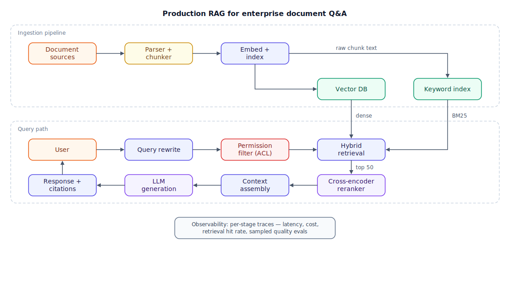

## The question

> "Design a production RAG system for enterprise document Q&A. Employees should be able to ask questions in plain language and get trustworthy answers from the company's internal documents."

This is the single most-asked AI system design question right now. It shows up in mid-level and senior loops for AI engineer, ML platform, and increasingly backend roles. Expect 35–45 minutes at a whiteboard or shared doc. RAG stands for Retrieval-Augmented Generation: fetch relevant documents first, then have a large language model (LLM) answer using only what was fetched.

The question looks friendly. It is a trap for people who memorized a tutorial. Production is the load-bearing word, and this walkthrough shows you the motion, step by step.

## What the interviewer is actually testing

- **Do you see two systems, not one?** An ingestion pipeline and a query path are separate systems with separate failure modes. Candidates who only draw the query path plateau early.
- **Do you know the retrieval quality levers?** Chunking, hybrid search, and reranking — and when each one earns its cost.
- **Do you treat permissions as architecture?** "Enterprise" is code for access control. A design that can leak the CEO's compensation memo to an intern is an automatic downlevel.
- **Can you evaluate the thing?** Anyone can wire up a demo. Production means a measurement story: golden sets, faithfulness checks, online signals.
- **Do you reason with numbers?** Latency budgets, cost per query, index size. Vague hand-waving reads as no production experience.

## Step 1 — Clarify and scope (≈5 min)

Never draw before you scope. Here is how a strong five minutes sounds:

> **You:** "Before I design anything — how big is the corpus, and where do the documents live?"
>
> **Interviewer:** "Around 4 million documents across SharePoint, Confluence, and Google Drive. Mostly PDFs and wiki pages."
>
> **You:** "Who uses it, and does it have to honor the source systems' permissions?"
>
> **Interviewer:** "20,000 employees. Yes — nobody should ever see an answer built from a document they can't open."
>
> **You:** "What's the latency and quality bar? Is a wrong answer embarrassing or dangerous?"
>
> **Interviewer:** "Sub-4-seconds at p95. Wrong answers are embarrassing, not catastrophic — but they must cite sources."
>
> **You:** "How fresh do answers need to be when a document changes?"
>
> **Interviewer:** "Wiki edits should show up within about 15 minutes. Everything else, same day is fine."
>
> **You:** "Last one: single-turn Q&A or full conversation with memory?"
>
> **Interviewer:** "Single-turn is fine for v1."
>
> **You:** "Great. So: 4M documents from three sources, 20K users, permission-true answers with citations, p95 under 4 seconds, 15-minute freshness for wikis, single-turn. If half the company uses this on a given day at about five questions each, that's ~50K queries a day — still only single-digit queries per second (QPS) at peak — so retrieval *quality* is the hard problem here, not throughput. I'll design for that."

That last line is the move: you converted the interviewer's answers into numbers, then named the real bottleneck out loud.

## Step 2 — Requirements (≈3 min)

**Functional (priority order):**

1. Answer natural-language questions grounded in internal documents, with citations linking back to sources.
2. Enforce source-system permissions on every answer — no exceptions, no stale grants.
3. Ingest and continuously sync documents from SharePoint, Confluence, and Drive.
4. Say "I couldn't find this in our documents" rather than guess when retrieval comes back thin.

**Non-functional (priority order):**

1. **Permission correctness** — zero cross-user leakage. This outranks everything, including uptime.
2. **Faithfulness** — answers must be supported by the retrieved text, not the model's imagination.
3. **Latency** — p95 under 4s end-to-end; first streamed token under ~1s so it *feels* fast.
4. **Freshness** — wiki edits searchable within 15 minutes; batch sources within 24 hours.
5. **Cost** — target a few cents per query at ~50K queries/day.

**Out of scope (say it explicitly):** multi-turn conversation memory, multilingual support, fine-tuning, and image/chart understanding. Name them in one breath and move on — it shows control, not laziness.

## Step 3 — Core entities and API (≈4 min)

Two entities carry the whole design. The key detail interviewers listen for: **chunks inherit their parent document's access-control list (ACL) tags**, because chunks — not documents — are what retrieval returns.

```json
// Document
{ "doc_id": "d_9f2", "source": "confluence", "source_id": "PAGE-4411",
  "title": "Q3 Pricing Playbook", "format": "html", "updated_at": "...",
  "acl": { "groups": ["sales-emea"], "users": [], "visibility": "restricted" } }

// Chunk (the retrieval unit)
{ "chunk_id": "d_9f2#07", "doc_id": "d_9f2", "text": "...",
  "embedding": "[1536 floats]", "section_path": "Discounts > Enterprise",
  "token_count": 460, "acl": "inherited-from-document" }
```

Keep the API surface small — three endpoints cover it:

```
POST /v1/ask            { query, user_id }        → streamed { answer, citations[], grounded: bool }
POST /v1/feedback       { answer_id, verdict }    → 204   (fuel for the eval loop)
POST /v1/ingest/events  { source, doc_id, change }→ 202   (webhooks from connectors)
```

Sketch these in 90 seconds. The API is table stakes; the interviewer wants your time spent on retrieval.

## Step 4 — High-level design (≈10 min)

Draw the two halves and the guardrail between user and data:



**Your 60-second narration at the whiteboard:**

> "Top half is ingestion. Connectors pull documents from SharePoint, Confluence, and Drive — webhooks for the wikis to hit our 15-minute freshness bar, nightly delta sync for the rest. A parser normalizes each format, then a chunker splits documents into retrieval-sized pieces that carry their ACL tags. The indexing stage writes each chunk to two stores: its embedding goes to the vector database for semantic search, and its raw text goes to a keyword index for exact-match search.
>
> Bottom half is the query path. A user's question gets a light rewrite — expanding acronyms, cleaning phrasing. Then the permission filter resolves the caller's groups and injects an ACL predicate *into* the retrieval query itself, so restricted chunks are excluded before similarity scoring ever runs. Hybrid retrieval runs dense and keyword search in parallel and fuses them. A cross-encoder reranks the top ~50 down to the 5–8 chunks that actually matter. Context assembly formats those with source labels, the LLM generates a cited answer, and we stream it back.
>
> Underneath everything: tracing on every stage — latency, cost, retrieval hits — because we'll need it for the eval story. Where would you like me to go deeper?"

Ending with that question hands the steering wheel back. Interviewers reward it every time.

## Step 5 — Deep dives (≈15 min)

Pick the areas where this question is actually won: chunking (quality is decided at ingestion), hybrid search + reranking (the retrieval engine itself), and permission-aware retrieval (the enterprise differentiator). Signal your choice: "I'd like to go deep on retrieval quality and permissions — sound good?"

### Deep dive 1: Chunking

**Why the interviewer probes here.** Chunking sets the ceiling on retrieval quality, and it happens before any query arrives — a bad choice is baked into millions of stored vectors. It's also where tutorial-followers get exposed: they know "512 tokens" but not why.

**The strong move.** Chunk by document *structure*, not by a fixed ruler. Split wikis and HTML on headings, keep PDFs layout-aware, and never sever a table from its caption. Target roughly 400–512 tokens with ~50 tokens of overlap, and prepend the section path ("Discounts > Enterprise") to each chunk so a fragment still knows where it came from. If precision matters more later, mention parent-child chunking: retrieve on small chunks, hand the LLM the larger parent section.

| Strategy | Retrieval precision | Cost/complexity | Breaks when |
|---|---|---|---|
| Fixed-size + overlap | Baseline | Trivial | Splits mid-thought, orphans tables |
| Structure-aware | Good | Moderate (per-format logic) | Messy scans, no clean structure |
| Semantic (similarity-split) | Good–great | Embedding compute at ingest | Budget-constrained ingestion |
| Parent-child | Great | Two-level storage + lookup | Storage and plumbing overhead |

**Likely follow-up:** "You change chunking strategy six months in. How do you migrate 4M documents?" Answer shape: build the new index alongside the old, backfill in the background, A/B the two on the golden set, cut traffic over, then delete — never re-chunk in place.

### Deep dive 2: Hybrid search + reranking

**Why the interviewer probes here.** Enterprise corpora are full of project codenames, SKUs, and acronyms. Embeddings are great at paraphrase and terrible at "PROJ-2291" — a query only a keyword match can save. Pure-vector designs quietly fail on exactly the queries employees care most about.

**The strong move.** Run two retrievers in parallel: dense search over the vector store, and BM25 (Best Match 25, the classic keyword-ranking function) over the text index. Fuse with Reciprocal Rank Fusion (RRF): each result scores `1/(k + rank)` in each list, summed, with k around 60. RRF uses ranks, not raw scores — which is the point, because cosine similarities and BM25 scores live on incomparable scales. Then rerank: feed the fused top ~50 through a cross-encoder, which reads query and chunk *together* instead of comparing precomputed vectors, and keep the top 5–8. Expect a meaningful precision lift — order of 10–15% on top-k — for roughly 100–150ms.

| Setup | Recall on exact terms | Recall on paraphrase | Added latency | Relative cost |
|---|---|---|---|---|
| Dense only | Weak | Strong | — | Baseline |
| BM25 only | Strong | Weak | — | Cheapest |
| Hybrid + RRF | Strong | Strong | ~20–50ms | + keyword index infra |
| Hybrid + cross-encoder rerank | Strong | Strong | +100–150ms | + reranker serving |

**Likely follow-up:** "When would you drop the reranker?" When the latency budget is brutally tight (sub-200ms retrieval), when first-stage precision already clears your bar on the golden set, or when per-query economics can't absorb it at volume. Say the quiet part: the reranker is a dial you justify with eval data, not a default.

### Deep dive 3: Permission-aware retrieval

**Why the interviewer probes here.** This is the difference between a demo and an enterprise product, and it's the deep dive with a *wrong* answer. Retrieving first and then discarding unauthorized chunks means restricted content was already fetched, scored, and possibly logged — one bug from a breach.

**The strong move.** Make the ACL predicate part of the database query. Every chunk carries permission tags synced from the source system; at query time you resolve the caller's identity to their group set (cached with a short TTL — around five minutes — since grants change slowly) and the vector and keyword stores both filter on it *before* similarity scoring. Chunks outside the caller's grants are never fetched, scored, or logged in the first place. Two details that separate senior answers: response-cache keys must include the caller's permission set, or one user's cached answer serves another user's restricted content; and permissions are enforced at query time, so a revoked grant takes effect on the next query — not at the next reindex.

| Approach | Leak risk | Latency | Ops burden |
|---|---|---|---|
| Filter inside the retrieval query | Lowest | Small predicate overhead | ACL sync pipeline |
| Retrieve-then-drop in app code | High — data already fetched | None saved | Looks easy, isn't safe |
| Separate index per group/tenant | Lowest | None | Explodes with group count |

**Likely follow-up:** "An employee is walked out at 2pm. When do they lose access?" Trace it: source system revokes → connector webhook updates ACL tags (minutes) → permission cache TTL expires (≤5 min) → their session token is killed by normal offboarding. Bound each hop with a number.

## Step 6 — Evals, reliability, and scale (≈5 min)

Never let the interviewer ask for this section first — volunteering it is the AI-specific seniority signal.

**Evals.** Build a golden set of 200+ real employee questions with labeled source documents. Offline, score retrieval (recall@10, mean reciprocal rank) separately from generation (faithfulness and answer relevance, judged by an LLM that you calibrate against human review monthly). Gate deploys on it: a change that drops faithfulness doesn't ship. Online, sample ~2–5% of production traffic for automated scoring, and watch behavioral tells — thumbs-down rate, how often users immediately rephrase, whether anyone clicks the citations.

**Reliability.** Decide the failure ladder up front: primary LLM provider down → fail over to a second provider with its own tested prompts. Retrieval returns nothing relevant → say so honestly instead of letting the model improvise. Reranker degraded → serve fused results directly, flagged in telemetry. Vector store down → that's an outage page, not a silent fallback.

**Latency budget (p95 target 4s):** rewrite ~100ms · hybrid retrieval ~150ms · rerank ~150ms · generation 1.5–2.5s, streamed so the first token lands near the 1s mark. The budget leaves headroom, which is the point of writing it down.

**Cost, back-of-envelope:** ~2K input + ~400 output tokens per query on a mid-tier model (order of $3/$15 per million tokens) is roughly $0.01–0.02 per query — about $15–25K/month at 50K queries/day, with the LLM dwarfing embedding, reranking, and index hosting. Then name the levers: response caching for repeated questions, routing easy queries to a cheaper model, trimming context by reranking harder.

## The bar

| Dimension | Mid-level | Senior | Staff |
|---|---|---|---|
| Scoping | Asks some questions | Converts answers into QPS, corpus size, latency budget | Also identifies the *real* bottleneck (quality, not scale) unprompted |
| Architecture | Query path with a vector DB | Both pipelines, hybrid retrieval, reranking | Same, plus freshness tiers and migration/reindex story |
| Permissions | Mentions them if prompted | Filters inside the retrieval query, unprompted | Also covers cache-key scoping and revocation timelines |
| Evals | "We'd test it" | Golden set, offline gates, online sampling | Ties evals to deploy gates and cost/quality tradeoff decisions |
| Tradeoffs | States choices | States choices with costs | Prices each choice and names when it flips |

## Pitfalls that sink candidates

- **Drawing before scoping.** Ten minutes into an architecture for the wrong scale is unrecoverable in a 40-minute loop.
- **The demo-grade pipeline.** Embed everything, cosine search, top-k into the prompt. It works in a notebook and collapses on acronyms, tables, and permissions — and interviewers know it.
- **Permission filtering after retrieval.** The single fastest way to fail an enterprise RAG question. If restricted data enters the candidate set, the design is broken, full stop.
- **Ignoring the ingestion half.** Freshness, connectors, ACL sync, and re-chunking migrations live there. Skipping it caps you at mid-level.
- **Context stuffing.** Shoving 20 chunks at the model hurts: LLMs attend poorly to the middle of long contexts. Rerank hard, send 5–8.
- **No honest-failure path.** If retrieval finds nothing and your system answers anyway, you designed a hallucination machine with citations.

## Rapid-fire follow-ups

1. Your embedding provider deprecates the model you indexed 20M chunks with. Walk through the migration.
2. How does this design change for a multi-tenant SaaS product instead of one enterprise?
3. Users complain answers ignore tables inside PDFs. What do you change, and where in the pipeline?
4. When would you recommend fine-tuning instead of — or alongside — this RAG system?
5. How do you detect that retrieval quality is degrading in production before users tell you?
6. The p95 latency budget is cut from 4s to 1.5s. What do you drop first, and what evidence do you want?
7. A director asks: "Why not just put all 4M documents in a long-context window?" Give the two-minute answer.

## Go deeper

- Factual basis (MIT-licensed): [Enterprise RAG case study](https://github.com/ombharatiya/ai-system-design-guide/blob/main/16-case-studies/01-enterprise-rag.md) · [Hybrid search](https://github.com/ombharatiya/ai-system-design-guide/blob/main/06-retrieval-systems/05-hybrid-search.md) · [Reranking strategies](https://github.com/ombharatiya/ai-system-design-guide/blob/main/06-retrieval-systems/06-reranking-strategies.md) — see [CREDITS.md](../../CREDITS.md).
