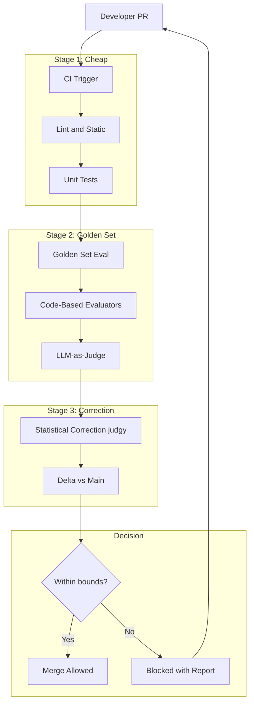
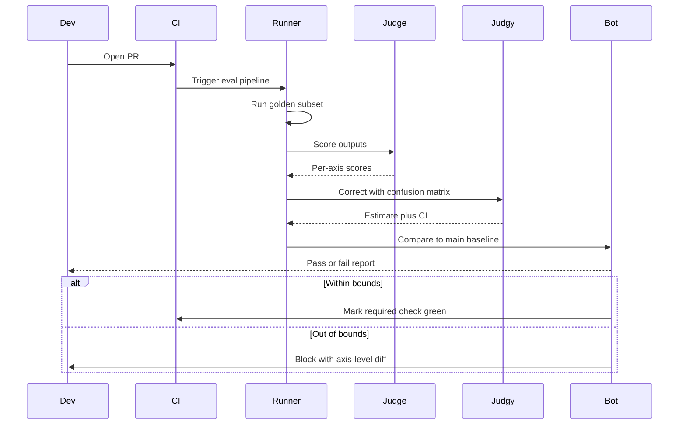

## The 30-second version

A 28-engineer AI product team replaces post-merge regression hunts with eval-gated CI: every PR runs golden sets, LLM-as-judge with statistical correction, and failure-mode taxonomies before a merge button appears.

## How it actually works

A 28-engineer AI product team replaces post-merge regression hunts with eval-gated CI: every PR runs golden sets, LLM-as-judge with statistical correction, and failure-mode taxonomies before a merge button appears.

## The Business Problem

An AI-first SaaS company ships a customer-facing answer-bot built on a RAG pipeline plus an agent loop. Six months ago the team shipped a "small" prompt change that regressed answer-quality on questions about a specific contract type, and lost a $4M renewal when the customer noticed. The post-incident review found three things: the change had not been evaluated against the contract-specific test set; the LLM-as-judge metric used in spot checks had drifted by 11 points and no one noticed; and a fix that needed a 2-day rollback took 9 days because no one had a safe-to-revert baseline.

Constraints from the May 2026 reality:

- 28 engineers across 4 teams; about 50 PRs per week touch the AI surface
- Customers in regulated industries refuse to accept regression on their domain-specific queries
- Per-PR eval budget: under $40 of model spend; full-run budget: under $1,200
- p95 PR-to-merge time goal: under 90 minutes including eval
- Quarterly auditor signoff on the eval methodology

The May 2026 reality is that eval-gated CI is no longer a nice-to-have. Hamel Husain's [eval blog series](https://hamel.dev/blog/posts/evals/), Eugene Yan's writings ([evals](https://eugeneyan.com/writing/evals/)), and the [judgy library](https://github.com/ai-evaluation/judgy) for statistical correction have all converged on a playbook. Phoenix, Langfuse, Braintrust, and Galileo all ship CI integrations. The question is no longer "should we do this" but "how do we do this without doubling cycle time."

## Architecture

### Components

| Layer | Tech | Purpose |
|-------|------|---------|
| Golden sets | YAML in repo, 1,200 to 4,000 cases per surface | Stable test base |
| Code evaluators | Pytest with custom assertions | Cheap, deterministic checks |
| LLM judges | Claude Sonnet 4.7 for judgment | Subjective quality |
| Statistical correction | [judgy](https://github.com/ai-evaluation/judgy) | Convert judge scores to estimates with CIs |
| Pipeline | GitHub Actions plus custom runner | CI orchestration |
| Trace store | Langfuse | Per-PR observability |
| Annotation | Argilla self-hosted | Human re-labeling for judge calibration |

### Data flow

1. PR opens; GitHub Actions fires; Stage 1 (lint, unit, type checks) runs in 2 minutes.
2. Stage 2 starts the golden-set eval against a representative subset (10 to 25 percent of the full set by default; 100 percent on protected branches or when labels say `full-eval`).
3. Each golden-set case runs through the new build, generates an output, and is scored by (a) code-based evaluators where deterministic checks apply (JSON schema, regex, factual lookups) and (b) an LLM judge for quality dimensions.
4. Stage 3 corrects the judge scores using `judgy` with the train/dev/test split for the judge prompt.
5. The corrected estimate (with confidence interval) is compared against `main`'s last green build; if the lower bound of the CI is within tolerance, the PR merges; otherwise it blocks with a detailed report.

## Key Design Decisions

### 1. Golden-set construction and rotation

Each golden set is built from three sources: production trace samples from the last 90 days (stratified by failure modes from error analysis), synthetic adversarial cases generated by a separate red-team LLM, and curated edge cases from customer support tickets. We rotate 10 to 15 percent of cases quarterly; we never delete cases (cases get archived to a frozen "historical regressions" set that runs only nightly). This avoids the over-fitting trap where the eval set drifts with the product.

Sizing: 1,200 cases per surface is the floor; below this, the corrected-score CI is too wide to detect a 2-point regression at 95 percent confidence. Eugene Yan covers this sizing math; we re-derived it for our metric.

### 2. Train/dev/test split for the judge

The LLM judge is itself a model with prompt parameters and few-shot examples. We treat the judge prompt as a model and apply train/dev/test discipline: 60 percent of human-labeled cases tune the judge prompt, 20 percent select the best prompt variant, 20 percent are a hold-out we only consult before a major judge-prompt change. This pattern is the core of the [judgy methodology](https://github.com/ai-evaluation/judgy) and Hamel's eval posts.

Re-calibration cadence: every 30 days, 50 fresh cases get re-labeled by 2 humans (Cohen's kappa over 0.7 required); if the judge's accuracy on dev set drops below 80 percent, we re-tune.

### 3. Statistical correction with judgy

Naive LLM-as-judge accuracy on subjective categories is around 75 to 88 percent in our domain. A raw judge score is biased. `judgy` computes a corrected estimate of the true pass rate using the judge's confusion matrix on the held-out set, and returns a confidence interval. We gate on the lower bound of the CI being within tolerance. This means we never block a PR on judge noise alone, and we never approve a regression that the judge merely failed to catch.

The math: if the judge has 85 percent precision and 92 percent recall on the held-out set, and the new build's judge-reported pass rate is 89 percent, the corrected estimate is about 87 percent with a 95 percent CI of roughly 83 to 91 percent. We allow merge if the CI lower bound is at most 2 points below `main`. ([Reference: judgy README math](https://github.com/ai-evaluation/judgy#statistical-correction)).

### 4. Failure-mode taxonomy as the assertion surface

We do not score "quality" as a single number. We score along axes drawn from our failure-mode taxonomy: hallucination, retrieval-miss, format violation, refusal, persona break, citation error. The taxonomy is the output of error analysis ([Hamel's open-coding + axial-coding pipeline](https://hamel.dev/blog/posts/field-guide/)) applied to 800 production failures over 6 months. Per-axis scores let us block on a hallucination regression even if overall quality improved.

### 5. Per-PR eval budget

A full eval-set run costs $80 to $200 depending on model spend. At 50 PRs per week, the naive cost is $4K to $10K per week. We bound this:

- Default PR runs 10 to 25 percent of the golden set, stratified by failure mode (so all failure modes are represented).
- The `full-eval` label triggers 100 percent.
- Nightly cron runs 100 percent on `main` to catch any drift we missed.
- A new judge-prompt change triggers a 100 percent run on a frozen historical set.

This bounds per-PR cost to under $40 and total per-week cost to under $1,200.

### 6. Judge-prompt drift detection

Even with calibration, judge prompts drift: the underlying model updates, the few-shot examples become less representative, the prompt's vocabulary feels dated to the model. We monitor drift by:

- Re-running the held-out set monthly and reporting accuracy delta vs the previous month.
- Tracking inter-judge agreement (we run two judge prompts in parallel; divergence over time signals drift in one).
- Versioning the judge prompt in git; rolling back is a 1-commit operation.

When drift exceeds 3 points or kappa drops below 0.65, we open a maintenance ticket.

### 7. Caching the eval pipeline

A typical golden-set case generates an output, which is then judged. The output is deterministic given the prompt and the model version. We cache (prompt-hash, model-version) to (output, judge-score) so that re-running the same eval is nearly free. Cache hit rate on PRs that touch only orchestration code (not prompts) is around 70 percent; this is a 3x cost reduction on this class of changes.

### 8. PR-level instrumentation

Each PR's eval report includes: per-axis pass-rate vs main, per-axis examples that newly failed, per-axis examples that newly passed, judge-correction CI bounds, total cost, and a link to the trace store so engineers can replay any failing case. The report is posted as a GitHub comment within 3 minutes of the run completing.

## CI Pipeline Sequence

## Failure Modes and Mitigations

### F1: Judge prompt drift goes unnoticed

The judge gradually under-detects hallucinations after a model upgrade. Mitigation: monthly held-out replay; inter-judge agreement tracking; a "freeze judge" mode for protected branches that pins the judge model version even when newer models are available. The drift incident that broke us before was caused by exactly this; we now catch drift within one cycle.

### F2: Eval set becomes overfit

A few cases get debugged repeatedly; the prompt is implicitly tuned to them. Mitigation: quarterly rotation; reserved adversarial cases that are never shown to engineers in failure reports (only outcomes). A separate red-team team owns the held-out set.

### F3: Single PR runs a corner of the eval that misses regressions

Stratified sampling: we ensure each PR's 10-percent sample includes at least 1 case from each of the 12 failure modes. The full nightly run still happens on `main`. Per-PR coverage is bounded but not zero.

### F4: Cost overrun from accidental full-runs

A `full-eval` label on every PR triples cost. Mitigation: the label requires an approval from a CODEOWNERS file; an automated reminder pings whoever applies it. We also cap monthly eval spend with a hard ceiling at $5K and refuse to start a job that would exceed it.

### F5: Block-rate too high; developers learn to ignore

If 35 percent of PRs are blocked, developers stop reading reports and look for ways around. Mitigation: we tune the gating tolerance to keep block-rate at 5 to 12 percent; we treat block-rate as an SLI; when it spikes we investigate why (often the judge is too strict on a new failure mode). The goal is to surface real regressions, not act as a gatekeeping toy.

### F6: Holdout set leakage into training or prompts

A held-out case ends up as a few-shot example. Mitigation: the held-out set is stored in a separate repo with a separate access list; engineers cannot read it; only the eval runner has a deploy key. Failure reports include hashes, not raw cases, for held-out failures.

### F7: Judge model deprecation

The vendor announces end-of-life for the judge model. Mitigation: we keep at least two judge models calibrated in parallel; when a deprecation lands, we have a 60-day window to swap with kappa thresholds preserved. The git history of judge prompts plus the calibration data make this routine.

### F8: Eval runner queue saturation

A surge of PRs around release time queues evals 30 minutes deep. Mitigation: dedicated eval-runner GPU pool with autoscaling; priority lanes for protected branches; if queue depth exceeds 20, we automatically downgrade non-protected PRs to a 5 percent sample to clear the backlog faster.

## Operational Considerations

### Monitoring

| SLO | Target |
|-----|--------|
| PR-to-merge p95 | under 90 minutes |
| Eval-cost per PR p95 | under $40 |
| Block-rate (false negatives + true regressions) | 5 to 12 percent |
| Judge inter-rater kappa | over 0.7 |
| Holdout-set replay accuracy delta month-over-month | under 3 points |
| Production regression escapes (post-deploy) | under 1 per quarter |

### Cost model

At 50 PRs per week:

- Default sampling: $25 per PR average; $1,250 per week
- Full-eval runs (about 8 per week): $100 each; $800 per week
- Nightly cron: $200 each; $1,400 per week
- Judge re-calibration: $50 per month
- Total: about $14K per month

This pays for itself with one prevented regression. Our post-incident estimate of the $4M renewal we lost suggests this is well-bounded by even one save per year.

### On-call playbook

- Block-rate spike: check if any recent change to judge prompt or golden set drove this; compare per-axis scores to baseline.
- Eval cost spike: check sample rate config; rate-limit `full-eval` label.
- Judge drift alert: trigger calibration cycle; rotate judge to backup model if drift is severe.
- Holdout breach (hash collision): immediately quarantine, regenerate the affected cases.
- Eval runner outage: PRs queue with a clear "eval pending" status; we never auto-merge while the runner is down; SRE pages within 15 minutes.

### Quarterly review

Every quarter the AI team reviews: failure-mode taxonomy (do the categories still match real production errors?), golden set rotation (which 10 to 15 percent are stale?), judge calibration history (is drift accelerating?), and block-rate trend (is the gate becoming theater?). This review feeds into the next quarter's eval roadmap. We use the [Hamel field-guide](https://hamel.dev/blog/posts/field-guide/) ritual: open-coding sessions on the most recent 50 failures, then axial coding to update the taxonomy.

### Auditor pack

The eval pipeline produces a quarterly auditor pack: methodology document (versioned in git), golden set summary (counts per failure mode), judge calibration results (Cohen's kappa over time), block-rate histogram, and a sample of failing PRs with the rationale. The pack is generated automatically and signed by the head of engineering.

### Why we do not use a single composite quality score

The temptation is to roll all axes into one number and gate on it. We do not. A composite hides regressions: a hallucination regression can be masked by a format-compliance improvement. We gate on per-axis scores so that each axis has its own confidence interval and its own block. The cost is more report noise; the benefit is that we never silently regress on a critical dimension.

## What Strong Interview Candidates Cover

- They distinguish code-based evaluators (cheap, deterministic) from LLM-as-judge (expensive, subjective) and use both in different stages.
- They name statistical correction explicitly; they understand that a raw judge score is a biased estimate and that confidence intervals are the right abstraction for gating.
- They define a failure-mode taxonomy from error analysis and gate on per-axis scores, not a single composite.
- They specify the train/dev/test discipline for the judge itself, including kappa thresholds for re-calibration.
- They bound eval cost explicitly; they know full runs cost too much for every PR and that stratified sampling is the lever.
- They have a story for judge-prompt drift: they monitor it, they version-control the prompt, they have a roll-back plan.
- They protect the held-out set with hashes and a separate access list to prevent leakage.

## References

- Hamel Husain, [Your AI product needs evals](https://hamel.dev/blog/posts/evals/)
- Hamel Husain, [A field guide to rapidly improving AI products](https://hamel.dev/blog/posts/field-guide/)
- Eugene Yan, [Evals: Constructed for LLM apps](https://eugeneyan.com/writing/evals/)
- Eugene Yan, [LLM-as-judge](https://eugeneyan.com/writing/llm-evaluators/)
- [judgy library](https://github.com/ai-evaluation/judgy)
- [Phoenix evals](https://docs.arize.com/phoenix/evaluation/concepts-evals)
- [Langfuse evaluations](https://langfuse.com/docs/scores/overview)
- [Braintrust](https://www.braintrust.dev/docs)
- [Galileo evaluate](https://www.rungalileo.io/blog/llm-evaluation)
- Zheng et al., [Judging LLM-as-a-Judge](https://arxiv.org/abs/2306.05685)
- [Argilla annotation platform](https://docs.argilla.io/)
- [pytest-html report integration](https://pytest-html.readthedocs.io/)

Related chapters: [Evaluation and Observability](../14-evaluation-and-observability/01-llm-evaluation.md), [Reliability and Safety](../13-reliability-and-safety/01-guardrails.md), [AI Evals Comprehensive Guide](../ai_evals_comprehensive_study_guide.md).

## Go deeper

- [Upstream chapter (Case Study: Eval-Gated CI/CD for an AI Product)](https://github.com/ombharatiya/ai-system-design-guide/blob/main/16-case-studies/18-eval-gated-cicd.md)
- Related questions in the [question bank](/questions)
- Practice with [SPIDER walkthrough](/practice) or [mock interview](/mock)
