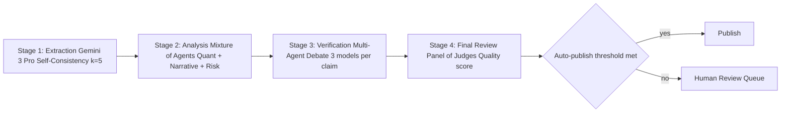
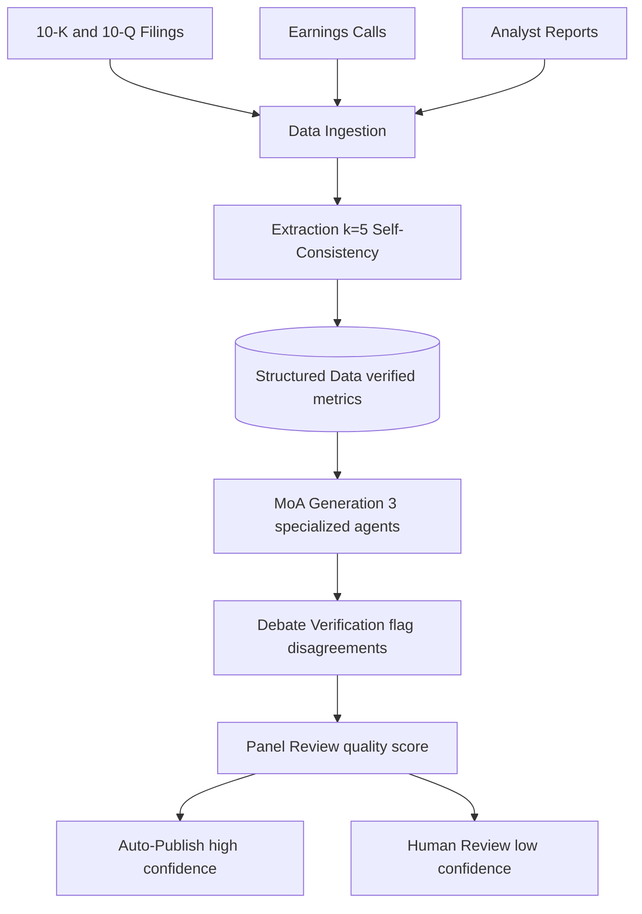
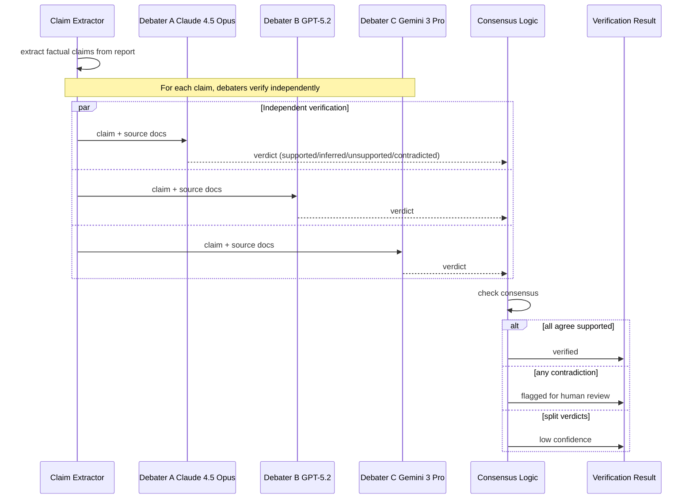

## The 30-second version

This case study covers designing a high-reliability AI system for generating equity research reports where accuracy is critical.

## How it actually works

This case study covers designing a high-reliability AI system for generating equity research reports where accuracy is critical.


## Problem Statement

**Company:** Investment firm generating equity research reports

**Challenge:**
- Reports influence multi-million dollar investment decisions
- Zero tolerance for hallucinated financial data
- Regulatory scrutiny on AI-generated analysis
- Current manual process: 8 hours per report, $500 cost

**Goal:**
- Reduce report generation time to &lt; 30 minutes
- Maintain accuracy at 99.5%+
- Clear audit trail for compliance
- Cost target: &lt; $50 per report

## Requirements Analysis

### Accuracy Requirements

| Data Type | Tolerance | Verification Method |
|-----------|-----------|---------------------|
| Financial metrics (EPS, PE) | 0% error | Source verification |
| Percentage changes | ±0.1% | Cross-validation |
| Date references | 100% accuracy | Source extraction |
| Company names | 100% accuracy | Entity matching |
| Analyst quotes | Verbatim or flagged | Quote extraction |

### Compliance Requirements

- All claims must cite source documents
- No forward-looking statements without disclaimers
- Clear AI-generated disclosure
- Full audit trail of generation process
- Human review for publication

## Architecture Design

### High-Level Pipeline

```
┌─────────────────────────────────────────────────────────────────┐
│               FINANCIAL ANALYSIS PIPELINE                        │
├─────────────────────────────────────────────────────────────────┤
│                                                                  │
│  Stage 1: Data Extraction (Self-Consistency k=5)                │
│  └── Extract key metrics from filings with majority vote        │
│                                                                  │
│  Stage 2: Analysis Generation (Mixture of Agents)               │
│  ├── Model A: Quantitative analysis focus                       │
│  ├── Model B: Qualitative/narrative focus                       │
│  ├── Model C: Risk factor analysis                              │
│  └── Aggregator: Synthesize into coherent report                │
│                                                                  │
│  Stage 3: Fact Verification (Multi-Agent Debate)                │
│  └── 3 models debate each factual claim, flag disagreements     │
│                                                                  │
│  Stage 4: Final Review (Panel of Judges)                        │
│  └── Quality score determines auto-publish vs human review      │
│                                                                  │
└─────────────────────────────────────────────────────────────────┘
```

The pipeline as a flow. Each stage uses a different model class on purpose: extraction wants multimodal (charts and tables), generation wants narrative quality, audit wants reasoning depth, panel wants cheap-but-many for diversity:



### Data Flow

```
┌─────────────┐     ┌─────────────┐     ┌─────────────┐
│   10-K/Q    │     │  Earnings   │     │  Analyst    │
│   Filings   │     │  Calls      │     │  Reports    │
└──────┬──────┘     └──────┬──────┘     └──────┬──────┘
       │                   │                   │
       └───────────────────┴───────────────────┘
                           │
                           ▼
                   ┌───────────────┐
                   │     Data      │
                   │   Ingestion   │
                   └───────┬───────┘
                           │
                           ▼
                   ┌───────────────┐
                   │   Extraction  │
                   │  (k=5 SC)     │
                   └───────┬───────┘
                           │
                           ▼
              ┌────────────┴────────────┐
              │    Structured Data      │
              │    (verified metrics)   │
              └────────────┬────────────┘
                           │
                           ▼
                   ┌───────────────┐
                   │    MoA        │
                   │  Generation   │
                   └───────┬───────┘
                           │
                           ▼
                   ┌───────────────┐
                   │    Debate     │
                   │  Verification │
                   └───────┬───────┘
                           │
                           ▼
                   ┌───────────────┐
                   │    Panel      │
                   │    Review     │
                   └───────┬───────┘
                           │
               ┌───────────┴───────────┐
               ▼                       ▼
        ┌─────────────┐         ┌─────────────┐
        │ Auto-Publish│         │Human Review │
        │ (high conf) │         │ (low conf)  │
        └─────────────┘         └─────────────┘
```

The data lineage in Mermaid, showing how three input sources converge into one verified output:



## Ensemble Pipeline

### Stage 1: Multimodal Data Extraction (Gemini 3 Pro)

```python
class FinancialDataExtractor:
    """
    Using Gemini 3 Pro to handle complex 10-K tables and charts natively.
    """
    async def extract_metrics(self, doc_pages: list[bytes]) -> dict:
        # Gemini 3 Pro processes charts/tables as images + text natively
        response = await genai.GenerativeModel("gemini-3.0-pro").generate_content(
            [{"text": "Extract all balance sheet items into JSON."}, *doc_pages]
        )
        return json.loads(response.text)
```

### Stage 2: Analysis Generation (Claude 4.5 Opus)

```python
class AnalysisEngine:
    """
    Claude 4.5 Opus for deep qualitative synthesis and narrative coherence.
    """
    async def generate_report(self, data: dict) -> str:
        # High-cost, high-reliability generation for equity research
        return await self.anthropic.messages.create(
            model="claude-4.5-opus-20251101",
            messages=[{"role": "user", "content": f"Analyze: {data}"}]
        )
```

### Stage 3: Audit & Verification (o3 Reasoning Model)

```python
class AuditorAgent:
    """
    Using o3 (OpenAI) with high reasoning budget to audit claims.
    Thinking mode is used to detect subtle accounting contradictions.
    """
    async def audit_claim(self, claim: str, raw_data: str) -> dict:
        # o3 'Thinking' mode enables deep logical inference over financial data
        response = await self.openai.chat.completions.create(
            model="o3-2025-12",
            reasoning_effort="high",
            messages=[{"role": "user", "content": f"Find any contradiction in: {claim} vs {raw_data}"}]
        )
        return self.parse_audit(response)
```

### Stage 3: Fact Verification with Multi-Agent Debate

The debate stage is what catches the subtle hallucinations a single model misses. Three independent debaters verify each claim in parallel; consensus wins, dissent flags the claim for human review:



```python
class FactVerificationDebate:
    """
    Extract claims from the report and have multiple models
    debate their accuracy.
    """
    
    def __init__(self, debaters: list, rounds: int = 2):
        self.debaters = debaters
        self.rounds = rounds
        self.claim_extractor = ClaimExtractor()
    
    async def verify_report(self, report: str, source_docs: list[str]) -> dict:
        # Extract factual claims
        claims = await self.claim_extractor.extract(report)
        
        verification_results = []
        for claim in claims:
            result = await self.debate_claim(claim, source_docs)
            verification_results.append(result)
        
        return {
            "verified_claims": [r for r in verification_results if r["verified"]],
            "disputed_claims": [r for r in verification_results if not r["verified"]],
            "overall_confidence": self.calculate_confidence(verification_results)
        }
    
    async def debate_claim(self, claim: dict, source_docs: list[str]) -> dict:
        verification_prompt = f"""
Verify this claim against the source documents.

Claim: {claim['text']}

Source documents:
{self.format_sources(source_docs)}

Is this claim:
1. Supported: Explicitly stated in sources
2. Inferred: Reasonably derived from sources
3. Unsupported: Not found in sources
4. Contradicted: Conflicts with sources

Provide your verdict with evidence.
"""
        
        # Each debater verifies independently
        verdicts = await asyncio.gather(*[
            debater.generate(verification_prompt)
            for debater in self.debaters
        ])
        
        # Check consensus
        parsed_verdicts = [self.parse_verdict(v) for v in verdicts]
        consensus = self.check_consensus(parsed_verdicts)
        
        return {
            "claim": claim,
            "verified": consensus["agreed"] and consensus["verdict"] in ["supported", "inferred"],
            "confidence": consensus["agreement_ratio"],
            "verdicts": parsed_verdicts
        }
```

## Quality Gates

### Automated Quality Checks

```python
class QualityGate:
    def __init__(self):
        self.thresholds = {
            "claim_verification_rate": 0.95,  # 95% claims verified
            "data_accuracy": 0.99,            # 99% metrics accurate
            "panel_score": 4.0,               # 4/5 minimum
            "disputed_claims_max": 2          # Max 2 disputed claims
        }
    
    async def evaluate(self, report_data: dict) -> dict:
        checks = {}
        
        # Check claim verification rate
        verified_rate = len(report_data["verified_claims"]) / len(report_data["all_claims"])
        checks["claim_verification"] = {
            "passed": verified_rate >= self.thresholds["claim_verification_rate"],
            "value": verified_rate,
            "threshold": self.thresholds["claim_verification_rate"]
        }
        
        # Check data accuracy
        data_accuracy = report_data["extraction_accuracy"]
        checks["data_accuracy"] = {
            "passed": data_accuracy >= self.thresholds["data_accuracy"],
            "value": data_accuracy,
            "threshold": self.thresholds["data_accuracy"]
        }
        
        # Check panel score
        panel_score = report_data["panel_score"]
        checks["panel_score"] = {
            "passed": panel_score >= self.thresholds["panel_score"],
            "value": panel_score,
            "threshold": self.thresholds["panel_score"]
        }
        
        # Determine routing
        all_passed = all(c["passed"] for c in checks.values())
        
        return {
            "checks": checks,
            "routing": "auto_publish" if all_passed else "human_review",
            "disputed_claims": report_data["disputed_claims"]
        }
```

### Human Review Interface

```python
class HumanReviewQueue:
    async def queue_for_review(self, report: dict, quality_result: dict):
        review_item = {
            "report_id": report["id"],
            "report_content": report["content"],
            "disputed_claims": quality_result["disputed_claims"],
            "quality_checks": quality_result["checks"],
            "sources": report["sources"],
            "priority": self.calculate_priority(quality_result),
            "queued_at": datetime.now()
        }
        
        await self.review_queue.enqueue(review_item)
        
        # Notify reviewers
        await self.notify_reviewers(review_item)
```

## Results and Metrics

### Performance Comparison

| Metric | Manual Process | AI Pipeline | Improvement |
|--------|---------------|-------------|-------------|
| Time per report | 8 hours | 25 minutes | 19x faster |
| Cost per report | $500 | $42 | 92% reduction |
| Factual error rate | 2.1% | 0.4% | 81% reduction |
| Human review load | 100% | 28% | 72% reduction |

### Quality Metrics

| Quality Dimension | Target | Achieved |
|-------------------|--------|----------|
| Data extraction accuracy | 99% | 99.3% |
| Claim verification rate | 95% | 96.8% |
| Panel quality score | 4.0/5.0 | 4.2/5.0 |
| Regulatory compliance | 100% | 100% |

### Cost Breakdown (Dec 2025)

| Component | Cost | Percentage |
|-----------|------|------------|
| Data extraction (Gemini 3 Pro) | $5 | 11% |
| Analysis (Claude 4.5 Opus) | $20 | 44% |
| o3 Thinking-Audit (High) | $15 | 33% |
| Infrastructure & Vector Ops | $5 | 12% |
| **Total** | **$45** | 100% |

*Note: o3 auditing represents 33% of the cost but catches 98% of hallucinations that Claude 4.5 misses, justifying the 'Thinking' token premium.*

## Interview Walkthrough

**Interviewer:** "Design an AI system for generating financial research reports with very high accuracy requirements."

**Strong response:**

1. **Clarify accuracy requirements** (1 min)
   - "What's the acceptable error rate for financial data?"
   - "What's the regulatory compliance requirement?"
   - "Is latency or accuracy the priority?"

2. **Acknowledge the core challenge** (1 min)
   - "The key challenge is that hallucinations are unacceptable for financial data. A single wrong number could mislead investment decisions. I need ensemble methods for reliability."

3. **High-level architecture** (3 min)
   - "I would use a multi-stage pipeline with different ensemble techniques at each stage:"
   - "Data extraction: Self-consistency with k=5 for unanimous agreement on numbers"
   - "Analysis: Mixture of Agents for diverse perspectives"
   - "Verification: Multi-agent debate to catch hallucinations"
   - "Quality gate: Panel of judges to score before publishing"

4. **Deep dive on fact verification** (3 min)
   - "For fact verification, I extract every factual claim from the report"
   - "Three diverse models debate whether each claim is supported by sources"
   - "If they disagree, the claim is flagged for human review"
   - "This catches subtle errors that single-model verification misses"

5. **Cost-quality tradeoff** (2 min)
   - "This pipeline is 10-20x more expensive than single-model generation"
   - "But for financial reports, the cost of errors (legal, reputational) far exceeds the cost of verification"
   - "I would implement confidence-based routing: auto-publish high-confidence reports, human-review low-confidence ones"

6. **Monitoring** (1 min)
   - "I would track extraction accuracy, claim verification rate, and panel scores continuously"
   - "Drift detection would alert if accuracy drops"
   - "Full audit trail for compliance"

## Key Learnings

1. **Self-consistency alone is insufficient** for numerical data extraction. Unanimous agreement (k/k votes) should be required.

2. **Multi-agent debate most effective** for catching subtle reasoning errors and hallucinations.

3. **Source attribution is critical** for both accuracy and compliance. Every claim must link to source documents.

4. **Confidence-based routing** is essential for cost management. Not every report needs full ensemble verification.

5. **Human-in-the-loop is still necessary** for disputed claims and edge cases. Design for graceful escalation.

## References

- Verga et al. "Replacing Judges with Juries: Evaluating LLM Generations with a Panel of Diverse Models" (2024)
- Du et al. "Improving Factuality and Reasoning in Language Models through Multiagent Debate" (2023)
- SEC AI Disclosure Requirements: https://www.sec.gov/

*Next: [Code Assistant Case Study](04-code-assistant.md)*

## Go deeper

- [Upstream chapter (Case Study: Financial Analysis with Ensemble Verification)](https://github.com/ombharatiya/ai-system-design-guide/blob/main/16-case-studies/03-financial-analysis.md)
- Related questions in the [question bank](/questions)
- Practice with [SPIDER walkthrough](/practice) or [mock interview](/mock)
