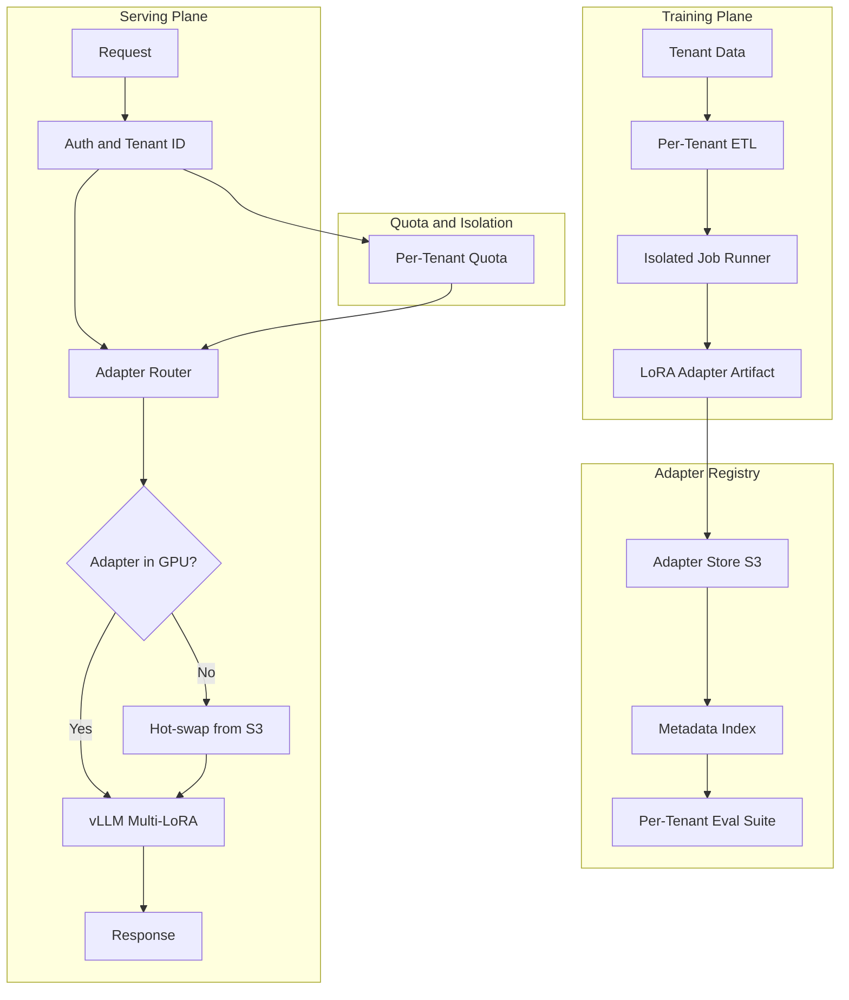
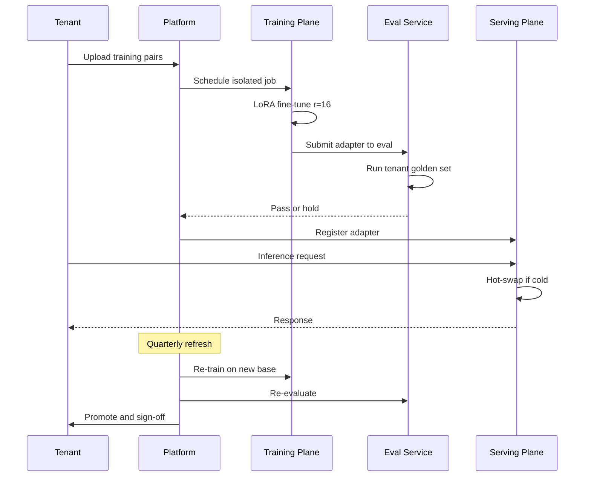

## The 30-second version

A vertical-AI vendor serves 280 customers from a single base model plus per-tenant LoRA adapters, with isolated training, eval-as-PRD per tenant, and noisy-neighbor mitigation that keeps p99 latency under 1.2 seconds.

## How it actually works

A vertical-AI vendor serves 280 customers from a single base model plus per-tenant LoRA adapters, with isolated training, eval-as-PRD per tenant, and noisy-neighbor mitigation that keeps p99 latency under 1.2 seconds.

## The Business Problem

A vertical SaaS vendor in legal-tech runs a contract-analysis product. Each of its 280 enterprise customers expects the model to respect their templates, their precedent corpus, and their preferred drafting style. Off-the-shelf prompting is not enough: customers run blind A/B tests against generic models and reject the product when output diverges from their house style. A separate fine-tuned model per tenant is also not viable: at 70B parameters, each model is 140 GB on disk and would require a dedicated H100 for serving, blowing the unit economics.

Constraints from the May 2026 reality:

- 280 paid tenants, doubling annually
- Each tenant has 1,000 to 250,000 historical contract pairs (input plus preferred edit)
- Tenants demand eval reports proving fit on their own test sets
- Per-query latency budget: under 1.2 seconds p99
- Tenants on different compliance regimes: SOC 2, ISO 27001, HIPAA, FedRAMP Moderate

The team picks per-tenant LoRA adapters on a shared base model. LoRA ([Hu et al., 2021](https://arxiv.org/abs/2106.09685)) and QLoRA ([Dettmers et al., 2023](https://arxiv.org/abs/2305.14314)) are mature; vLLM's multi-LoRA serving ([docs](https://docs.vllm.ai/en/latest/models/lora.html)) and SGLang's adapter swapping let many adapters share one base model in GPU memory. Anyscale and Together AI have both published production case studies on this pattern ([Anyscale 2024 post](https://www.anyscale.com/blog/fine-tuning-llms-lora-or-full-parameter-an-in-depth-analysis), [Together AI multi-LoRA serving](https://www.together.ai/blog/multi-lora-inference)).

## Architecture

### Components

| Layer | Tech | Purpose |
|-------|------|---------|
| Base model | Llama 4 70B int8 | Shared across all tenants |
| Adapter | LoRA r=16 on attention layers, ~120 MB per tenant | Per-tenant adaptation |
| Training | DeepSpeed ZeRO-3 on 8x H100 nodes | Tenant-isolated jobs |
| Serving | vLLM 0.7+ with PagedAttention and multi-LoRA | One base, many adapters |
| Adapter store | S3 with per-tenant KMS keys | Encrypted at rest |
| Eval store | Per-tenant golden set, run on every retrain | Eval-as-PRD per tenant |

### Data flow at training time

1. Customer uploads training pairs through a per-tenant S3 bucket with a dedicated IAM role; KMS keys are per-tenant.
2. The ETL job runs in a Kubernetes namespace scoped to that tenant; the node selector ensures it does not co-schedule with another tenant's job.
3. Training runs on an 8x H100 pod for typically 4 to 10 hours per tenant; LoRA at r=16 fits in 80 GB per H100, leaving room for activation memory.
4. Eval is run automatically against the tenant's golden set; if metrics regress beyond a threshold, the artifact is held in staging.
5. The adapter artifact (about 120 MB for a 70B base with r=16 attention adapters) is uploaded to the registry and the metadata index is updated.

### Data flow at serving time

1. Request hits the gateway with a tenant JWT.
2. The router resolves the adapter version for that tenant.
3. If the adapter is hot in GPU memory (LRU cache of 200 adapters per node), inference proceeds.
4. If cold, the adapter is hot-swapped from S3 in 200 to 600 ms. We hide this latency by pre-warming based on tenant traffic patterns.
5. vLLM runs the request with the adapter applied; PagedAttention shares KV cache across tenants safely because KV is request-scoped, not adapter-scoped.

## Key Design Decisions

### 1. LoRA r=16 over full fine-tuning

A full 70B fine-tune per tenant costs about $4,500 in compute, produces a 140 GB artifact, and pins one H100. LoRA at r=16 costs $80 to $400 per tenant per retrain, produces a 120 MB artifact, and shares the GPU. The accuracy gap on our internal contract-analysis eval is 1.6 points on a 100-point composite. We accept that gap because the cost differential is 50x and the operational story (hot-swap, ephemeral artifacts) is dramatically simpler. The Anyscale post linked above ran a similar comparison and reached the same conclusion.

### 2. Adapter swap budget and the noisy-neighbor problem

vLLM's multi-LoRA support keeps adapters in GPU memory but each adapter consumes a few hundred MB. On an 80 GB H100 running a 70B base in int8 (about 40 GB), we have roughly 30 GB for adapters and KV cache. That budgets to roughly 200 adapters resident at once. We use LRU with traffic-aware pre-warming and tail-tenant pinning: the 30 tenants with strict latency SLAs are pinned and never evicted; the rest rotate. A tenant whose adapter is cold pays a 200 to 600 ms tail penalty. We surface that explicitly in the tenant SLA as a cold-start budget.

The noisy-neighbor failure: one tenant suddenly bursts to 10x normal traffic, pushing other adapters out of cache. Mitigation: per-tenant token-bucket rate limit at the gateway, plus dynamic adapter eviction protection for any adapter that served traffic in the last 60 seconds.

### 3. Per-tenant eval suite as the gate

We treat the tenant's golden set as the product requirements document. The training pipeline runs the new adapter against that set after every retrain; if metrics regress more than 2 points on the composite, the artifact is held and a Slack ping goes to the tenant's CSM. This is the "eval-as-PRD" pattern Hamel Husain has written about ([How to construct domain-specific evals](https://hamel.dev/blog/posts/evals/)) and we extend it to be per-tenant. Each tenant's golden set is curated jointly with their legal team during onboarding (a 60- to 90-minute workshop) and refreshed quarterly.

### 4. Training-time isolation via Kubernetes namespaces plus network policy

Multi-tenancy is a defense-in-depth problem. Training jobs run in per-tenant namespaces; network policies prevent egress to anything other than that tenant's S3 prefix and the central metric service; node selectors prevent co-scheduling. We also use a dedicated KMS key per tenant for both bucket encryption and model artifact encryption. A leaked artifact decryption key would expose one tenant, not all.

### 5. Serving-time isolation: shared GPU is okay, KV cache is not

The base model is shared. The adapter is per-tenant. The KV cache is per-request. PagedAttention ([vLLM paper](https://arxiv.org/abs/2309.06180)) ensures KV blocks are isolated per request, so even though Tenant A and Tenant B share a GPU during a single inference batch, their attention computations and KV state do not mix. We audited this with red-team prompts: no cross-tenant leakage in 50K adversarial pairs.

### 6. Model lifecycle and base-model refresh

The base model is upgraded every 6 to 9 months. When the upgrade happens, all adapters must be re-trained against the new base. We run the re-train automatically using each tenant's stored training data; we run their eval suite; we ask the tenant to sign off before promoting. The full base-refresh cycle takes about 3 weeks for 280 tenants on 4 dedicated training nodes; we share the schedule publicly. Adapters that fail eval are flagged for manual review and the previous base+adapter pair stays in service until resolution.

### 7. Why r=16 specifically

Reading the LoRA paper carelessly suggests r=4 or r=8 is the standard choice. We did the sweep on our domain: r=4 underfits on tenants with 50K+ training pairs; r=8 is acceptable; r=16 captures 95 percent of the gain available from going to r=32. r=32 doubles artifact size and training cost for less than 1 point of metric. We standardized at r=16 across attention layers (Q, K, V, O) and skip the MLP layers. This is the same configuration the [Anyscale post](https://www.anyscale.com/blog/fine-tuning-llms-lora-or-full-parameter-an-in-depth-analysis) recommends for similar workloads.

### 8. Cold start engineering

Hot-swap from S3 takes 200 to 600 ms cold. We hide this with traffic-aware pre-warming: a sidecar process reads the previous 60 minutes of tenant traffic and pre-loads the top 50 cold adapters at minute boundaries. Pre-warm hit rate is 78 percent measured against tail latency; the remaining cold misses are usually new tenants or tenants returning from idle, both of which are acceptable to penalize.

## Tenant Lifecycle Sequence

## Failure Modes and Mitigations

### F1: Adapter quality regression after retrain

A retrain produces a worse model on the tenant's golden set than the previous version. Mitigation: the eval-gate blocks promotion; the previous adapter stays live; an alert goes to the team and the tenant. We retain the previous 3 adapter versions per tenant for rollback. Median time to rollback: 6 minutes.

### F2: Cross-tenant data bleed at training time

A bug in the ETL pipeline reads from the wrong tenant's S3 bucket. Mitigation: IAM roles scoped per tenant; the training job assumes the tenant's role on launch and has zero credentials to other buckets. A regression test verifies that a job running under Tenant A's role cannot list Tenant B's bucket; it runs on every CI build.

### F3: Adapter cache thrash under traffic spike

A trade-show drives 30 tenants to spike simultaneously, evicting most other adapters. p99 latency spikes from 1.1 s to 4.8 s. Mitigation: gateway rate-limits each tenant; the cache uses pinned slots for top-tier tenants; we keep 20 percent of cache capacity in reserve. When a known event is on the calendar, we pre-warm at off-peak.

### F4: Bad training data poisons the adapter

A tenant accidentally uploads contracts that contain customer PII or are from the wrong jurisdiction. The adapter overfits to bad patterns. Mitigation: an automated PII detector runs on inputs before training; eval suite catches drift on jurisdiction-specific cases; tenants can sample-inspect their training set in the dashboard before kicking off a retrain.

### F5: Base-model upgrade breaks legacy adapters

The new base model has a different tokenizer or layer naming, and the adapter's matrix shapes no longer apply. Mitigation: every base upgrade is treated as a mandatory retrain. We never serve an adapter against a base it was not trained on. A guard in the serving plane refuses to load an adapter without a matching base version.

### F6: Cost runaway in training plane

A misconfigured job loops in a training step and consumes 80 H100-hours without producing a checkpoint. Mitigation: per-tenant monthly training budget; per-job timeout (24 hours hard cap); a watchdog that pages SRE if loss plateau is detected for more than 2 hours. We have aborted 14 such jobs in the last 6 months.

### F7: GPU node failure mid-training

A hardware fault on one of the 8 H100s mid-training crashes the job. Mitigation: DeepSpeed checkpointing every 30 minutes; auto-resume on a fresh node; we maintain a small reserve pool of warm spare nodes. Mean recovery time: 18 minutes. Job-level retry budget: 3 attempts before alerting humans.

### F8: Adapter signing key rotation breaks legacy clients

We sign adapter manifests for tamper detection. Rotating the signing key without coordination breaks the serving plane's verification step. Mitigation: dual-signing during the rotation window; clients accept either old or new key for 7 days; only after all clients verify on the new key do we retire the old.

### F9: Tenant cross-contamination via shared eval infrastructure

The eval runner accidentally writes eval results to the wrong tenant's metric bucket. Mitigation: per-tenant credentials for eval result publishing; a write-time tenant-id check verifies the destination matches the running job's tenant; mismatches refuse the write and alert.

### F10: Adapter version sprawl

After 3 years and 280 tenants we have over 10,000 adapter versions in the registry. Storage is cheap but the metadata service grinds. Mitigation: tiered storage with old versions auto-archived to cold storage after 90 days; metadata service indexes only current plus previous-3 versions per tenant; cold-archive retrieval has a 1-minute SLA for rollback scenarios.

### F11: Adapter checksum mismatch on serving load

A network blip during S3 hot-swap corrupts the adapter bytes; vLLM loads it but inference produces nonsense. Mitigation: every adapter has a SHA-256 checksum in the metadata; the serving plane verifies the checksum on load and refuses to serve a mismatched adapter; an alert pages SRE and the load is retried.

## Operational Considerations

### Monitoring and SLOs

| SLO | Target | What we measure |
|-----|--------|-----------------|
| Serving p99 latency | under 1.2 s, warm | 95 percent of tenants warm-cached at any time |
| Cold-start p99 | under 1.0 s additive | adapter S3 load time |
| Train-job success rate | over 98 percent | jobs reaching adapter promotion |
| Eval gate pass rate | over 90 percent | adapters clearing tenant golden set |
| Cross-tenant audit findings | 0 | automated quarterly red-team |

### Cost model

Per-tenant economics at our blended traffic:

- Training: $80 to $400 per retrain; quarterly refresh
- Serving: shared GPUs; per-token cost $0.18 per million input, $0.36 per million output (close to vendor-equivalent on Llama 4)
- Adapter storage: $0.04 per tenant per month at 120 MB
- Eval: $5 per retrain
- Total per tenant: $80 to $800 per quarter, depending on traffic

At 280 tenants, monthly compute is approximately $180K, against gross revenue of $720K, which is on plan for a 75 percent gross margin.

### On-call playbook

- p99 spike across many tenants: check adapter cache hit rate; if low, throttle bursty tenants and pre-warm hot set.
- Single-tenant regression alert: check eval delta; if real, roll back to previous adapter; ping CSM.
- Training queue backlog: scale up training nodes (we keep 2 standby); if persistent, page platform team for capacity planning.
- Training job stuck: check checkpoint timestamps; if no progress in 2 hours, kill and resume from last checkpoint; loss-curve anomaly may indicate bad data.
- Tenant onboarding bottleneck: the eval workshop is the long pole; we schedule with 3-week lead time and keep a backlog of pre-built golden-set templates.

### Onboarding ritual

New tenant onboarding takes 4 to 6 weeks: 1 week for legal and DPA review, 1 week for the eval-set workshop, 2 weeks for first training, 1 week for canary rollout. We document each tenant's onboarding in a runbook and the CSM owns the calendar. The eval workshop is the highest-leverage hour: it is where the customer's domain experts encode their judgments into our test set.

### Tenant offboarding

Offboarding is a clean operation: we delete the tenant's training data, retire all adapter versions to a 90-day cold archive (in case of dispute), revoke their KMS keys after 90 days, and provide a deletion certificate. The pipeline is automated; the CSM signs off.

### Compliance posture

We hold SOC 2 Type II and are certified for ISO 27001. Customer audit packs include: per-tenant data residency proof, encryption-at-rest evidence with KMS key IDs, training-job logs, and eval reports. We auto-generate the pack from the platform monthly.

## What Strong Interview Candidates Cover

- They cite vLLM's multi-LoRA serving and PagedAttention by name, and explain why KV cache isolation is the linchpin for shared-GPU multi-tenancy.
- They distinguish eval-as-PRD per tenant from a single global eval; the former is mandatory for vertical AI.
- They size the LoRA-vs-full-FT tradeoff with concrete numbers (cost ratio, accuracy gap, artifact size).
- They name the noisy-neighbor problem and at least three mitigations (rate limit, pinning, eviction protection).
- They walk through the base-model refresh ritual; this is the unsexy operational reality that distinguishes shipped platforms from prototypes.
- They explicitly handle the rank-selection question (why r=16 and not r=4 or r=32) with empirical numbers, not folklore.

## References

- Hu et al., [LoRA: Low-Rank Adaptation of Large Language Models](https://arxiv.org/abs/2106.09685)
- Dettmers et al., [QLoRA: Efficient Finetuning of Quantized LLMs](https://arxiv.org/abs/2305.14314)
- [vLLM Multi-LoRA serving docs](https://docs.vllm.ai/en/latest/models/lora.html)
- Kwon et al., [Efficient Memory Management for LLM Serving with PagedAttention](https://arxiv.org/abs/2309.06180)
- Anyscale, [Fine-tuning LLMs: LoRA or full-parameter](https://www.anyscale.com/blog/fine-tuning-llms-lora-or-full-parameter-an-in-depth-analysis)
- Together AI, [Multi-LoRA inference at scale](https://www.together.ai/blog/multi-lora-inference)
- Hamel Husain, [How to construct domain-specific evals](https://hamel.dev/blog/posts/evals/)
- Eugene Yan, [Evals: Constructed for LLM Apps](https://eugeneyan.com/writing/evals/)
- Microsoft, [DeepSpeed ZeRO-3](https://www.deepspeed.ai/training/)
- [SGLang adapter swapping](https://github.com/sgl-project/sglang)
- [Kubernetes Multi-Tenancy WG patterns](https://github.com/kubernetes-sigs/multi-tenancy)

Related chapters: [LoRA and Fine-Tuning](../03-training-and-adaptation/03-lora-qlora-peft.md), [Multi-Tenant Isolation](../12-security-and-access/02-access-control.md), [Inference Optimization](../04-inference-optimization/01-inference-fundamentals.md).

## Go deeper

- [Upstream chapter (Case Study: Multi-Tenant Fine-Tuning Platform)](https://github.com/ombharatiya/ai-system-design-guide/blob/main/16-case-studies/17-multi-tenant-fine-tuning-platform.md)
- Related questions in the [question bank](/questions)
- Practice with [SPIDER walkthrough](/practice) or [mock interview](/mock)
